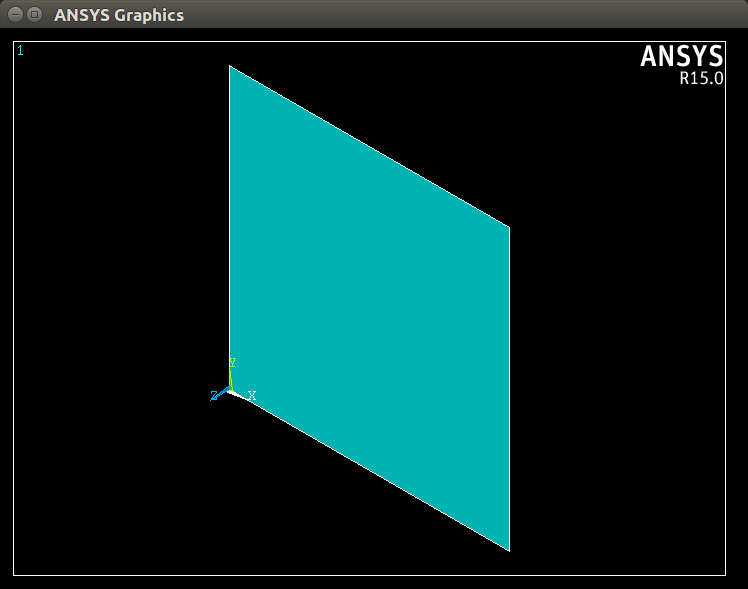

ANSYS APDL Interactive Control
==============================
ANSYS APDL allows for the direct scripting of ANSYS through ANSYS input files.  Unfortunately, APDL relies on an outdated scripting language that is difficult to read and control.  The weaknesses of this language are often compensated by generating APDL scripts using a secondary scripting tool like ``MATLAB`` or ``Python``.  However, this added layer of complexity means that the development feedback loop is quite long as the user must export and run an entire script before determining if it ran correctly or of the results are valid.  This module seeks to rectify that.

The interface control module requires ANSYS to be installed on the system running ``pyansys`` for it to operate.

Initial Setup and Example
-------------------------
The ``ANSYS`` control module within ``pyansys`` creates an instance of an interactive Shell of ``ANSYS`` in the background and sends commands to that shell.  Errors and warnings are processed Pythonically letting the user develop a script real-time without worrying about if it will function correctly when deployed in batch mode.

To run, ``pyansys`` needs to know the location of the ANSYS binary.  When running for the first time, ``pyansys`` will request the location of the ANSYS executable.  You can test your installation ``pyansys`` and set it up by running the following in python:

.. code:: python

    from pyansys import examples
    examples.CylinderANSYS()

Python will automatically attempt to detect your ANSYS binary based on enviornmental variables.  If it is unable to find a copy of ANSYS, you will be prompted for the location of the ANSYS executable.  Here is a sample input for Linux and Windows:

.. code::

    Enter location of ANSYS executable: /usr/ansys_inc/v182/ansys/bin/ansys182

.. code::

    Enter location of ANSYS executable: C:\Program Files\ANSYS Inc\v170\ANSYS\bin\winx64\ansys170.exe

The settings file is stored locally and do not need to enter it again.  If you need to change the file, you can find it and manually edit it with:

.. code:: python

   import appdirs
   settings_dir = appdirs.user_data_dir('pyansys')
   config_file = os.path.join(settings_dir, 'config.txt')
   print(config_file)

Running ANSYS from ``pyansys``
~~~~~~~~~~~~~~~~~~~~~~~~~~~~~~
ANSYS can be started from python using the ``pyansys.ANSYS`` class.  This starts in a temporary directory by default.  You can change this to your current directory with:

.. code:: python

    import os
    import pyansys

    path = os.getcwd()
    ansys = pyansys.ANSYS(run_location=path)

ANSYS is now active and you can send commands to it as if it was just a python class.

Using ANSYS from ``pyansys``
~~~~~~~~~~~~~~~~~~~~~~~~~~~~
For example, if we wanted to create a surface using keypoints we could run:

.. code:: python

    ansys.Run('/PREP7')
    ansys.Run('K, 1, 0, 0, 0')
    ansys.Run('K, 2, 1, 0, 0')
    ansys.Run('K, 3, 1, 1, 0')
    ansys.Run('K, 4, 0, 1, 0')
    ansys.Run('L, 1, 2')
    ansys.Run('L, 2, 3')
    ansys.Run('L, 3, 4')
    ansys.Run('L, 4, 1')
    ansys.Run('AL, 1, 2, 3, 4')

ANSYS interactively returns the result of each command and it is stored to the logging module.  Errors are caught immediately.  For example:

.. code:: python

    >>> ansys.Run('AL, 1, 2, 3')

   Exception: 
   AL, 1, 2, 3

   DEFINE AREA BY LIST OF LINES
   LINE LIST =     1    2    3
   (TRAVERSED IN SAME DIRECTION AS LINE     1)

   *** ERROR ***                           CP =       0.338   TIME= 09:45:36
   Keypoint 1 is referenced by only one line.  Improperly connected line   
   set for AL command.                                                     

This means that exceptions will be caught immediately.  This means that you can write your ANSYS scripts in python, run them interactively and then as a batch without worrying if the script will run correctly if you had instead outputted it to a script file.

Calling ANSYS Pythonically
~~~~~~~~~~~~~~~~~~~~~~~~~~
One advantage of writing scripts using ``pyansys`` is the ability to call ANSYS commands as python functions from the ``ANSYS`` class.  For example, instead of sending commands to ANSYS as in the area creation example, we can instead run:

.. code:: python

    # clear existing geometry
    ansys.Finish()
    ansys.Clear()

    # create a square area using keypoints
    ansys.Prep7()
    ansys.K(1, 0, 0, 0)
    ansys.K(2, 1, 0, 0)
    ansys.K(3, 1, 1, 0)
    ansys.K(4, 0, 1, 0)    
    ansys.L(1, 2)
    ansys.L(2, 3)
    ansys.L(3, 4)
    ansys.L(4, 1)
    ansys.Al(1, 2, 3, 4)

This approach has some obvious advantages, chiefly that it's a bit easier to script as ``pyansys`` takes care of the string formatting for you.  For example, inputting points from a numpy array:

.. code:: python

   import numpy as np

   # make 10 random keypoints in ANSYS
   points = np.random.random((10, 3))
   for i, (x, y, z) in enumerate(points):
       ansys.K(i + 1, x, y, z)

Additionally, each function with the ANSYS class has help associated within it.  For example:

.. code:: python

    >>> help(ansys.K)

    Help on method K in module pyansys.ansys:

    K(npt='', x='', y='', z='') method of pyansys.ansys.ANSYS instance
        APDL Command: K
        
        Defines a keypoint.
        
        Parameters
        ----------
        npt
            Reference number for keypoint.  If zero, the lowest available
            number is assigned [NUMSTR].
        
        x, y, z
            Keypoint location in the active coordinate system (may be R, θ, Z
            or R, θ, Φ).  If X = P, graphical picking is enabled and all other
            fields (including NPT) are ignored (valid only in the GUI).
        
        Notes
        -----
        Defines a keypoint in the active coordinate system [CSYS] for line,
        area, and volume descriptions.  A previously defined keypoint of the
        same number will be redefined.  Keypoints may be redefined only if it
        is not yet attached to a line or is not yet meshed.  Solid modeling in
        a toroidal system is not recommended.

Translating Scripts
-------------------
Existing ANSYS scripts can be translated using:

.. code:: python

    import pyansys

    inputfile = 'ansys_inputfile.inp'
    pyscript = 'pyscript.py'
    pyansys.ConvertFile(inputfile, pyscript)

For example, verification file vm1.dat:

.. code::
   
    /VERIFY,VM1
    /PREP7
    /TITLE, VM1, STATICALLY INDETERMINATE REACTION FORCE ANALYSIS
    C***      STR. OF MATL., TIMOSHENKO, PART 1, 3RD ED., PAGE 26, PROB.10
    ANTYPE,STATIC                  ! STATIC ANALYSIS
    ET,1,LINK180
    SECTYPE,1,LINK
    SECDATA,1  			       ! CROSS SECTIONAL AREA (ARBITRARY) = 1
    MP,EX,1,30E6
    N,1
    N,2,,4
    N,3,,7
    N,4,,10
    E,1,2                          ! DEFINE ELEMENTS

Translates to:

.. code:: python

    import pyansys
    ansys = pyansys.ANSYS(loglevel="debug")

    ansys.Run("/VERIFY,VM1")
    ansys.Run("/PREP7")
    ansys.Run("/TITLE, VM1, STATICALLY INDETERMINATE REACTION FORCE ANALYSIS")
    ansys.Run("C***      STR. OF MATL., TIMOSHENKO, PART 1, 3RD ED., PAGE 26, PROB.10")
    ansys.Antype("STATIC                  ! STATIC ANALYSIS")
    ansys.Et(1, "LINK180")
    ansys.Sectype(1, "LINK")
    ansys.Secdata("1  			       ! CROSS SECTIONAL AREA (ARBITRARY) = 1")
    ansys.Mp("EX", 1, 30E6)
    ansys.N(1)
    ansys.N(2, "", 4)
    ansys.N(3, "", 7)
    ansys.N(4, "", 10)
    ansys.E(1, "2                          ! DEFINE ELEMENTS")

Some of the commands with ``/`` are not directly translated to functions and are instead run as commands.  See the following Caveats and Notes section for more details.
    
Caveats and Notes
-----------------

Command Naming Conventions and Rules
~~~~~~~~~~~~~~~~~~~~~~~~~~~~~~~~~~~~

When calling ANSYS commands as functions, each command has been translated from its original ANSYS all caps format to a PEP8 format.  For example, ``ESEL`` is now ``Esel``.  Additionally, ANSYS commands containing a ``/`` or ``*`` have had those characters removed, unless this causes a conflict with an existing name.  Most notable is ``/SOLU`` which would conflict with ``SOLU``.  Therefore, the ``/SOLU`` has been renamed to ``Slashsolu`` to differentiate it from ``Solu``.  Out of the 1500 ANSYS commands, about 15 start with ``Slash``, 8 with ``Star``.  Check the ``ANSYS Object Methods`` reference below when necessary.

ANSYS commands that normally have an empty space, such as ``ESEL, S, TYPE, , 1`` must include an empty string when called by python:

.. code:: python

    ansys.Esel('s', 'type', '', 1)

None of these restrictions apply to commands run with ``Run``, and ``Run`` can be used alongside the python functions:

.. code:: python

    ansys.Run('/SOLU')
    ansys.Solve()

Warnings and Errors
~~~~~~~~~~~~~~~~~~~
Errors should be handled pythonically.  For example:

.. code:: python

    try:
        ansys.Solve()
    except:
        pass  # or do something else with ansys

Commands that are ignored within ANSYS are flagged as errors.  This is different than ANSYS's default behavior where commands that are ignored are treated as warnings.  For example, in ``pyansys`` running a command in the wrong session raises an error:

.. code:: python

    >>> ansys.K()

    Exception: 
    K, , , , 

     *** WARNING ***                         CP =       0.307   TIME= 11:05:01
     K is not a recognized BEGIN command, abbreviation, or macro.  This      
     command will be ignored.

You can change this behavior so ignored commands can be logged as warnings not raised as an exception by setting:

.. code:: python

   ansys.allow_ignore = True
   ansys.K()  # error ignored
   ansys.Clear()

Prompts
~~~~~~~
Prompts from ANSYS are normally handled by continuing with ``'y'`` just as if APDL is in ``/BATCH`` mode.

Plotting Non-Interactively
--------------------------
This section applies

It is often useful to plot geometry and meshes as they are generated.  This can be easily done within the graphical user interface, but for debugging (or scripting) purposes it can be useful to plot within ``pyansys`` as well.  This example shows how to create a plot using ``matplotlib``.  This script generates is a standard ``matplotlib`` figure.

.. code:: python

    import pyansys

    # run ansys at a temporary location with interactive plotting enabled (default)
    ansys = pyansys.ANSYS()

    # create a square area using keypoints
    ansys.Prep7()
    ansys.K(1, 0, 0, 0)
    ansys.K(2, 1, 0, 0)
    ansys.K(3, 1, 1, 0)
    ansys.K(4, 0, 1, 0)    
    ansys.L(1, 2)
    ansys.L(2, 3)
    ansys.L(3, 4)
    ansys.L(4, 1)
    ansys.Al(1, 2, 3, 4)

    # sets the view to "isometric"
    ansys.View(1, 1, 1, 1)
    ansys.Pnum('kp', 1)  # enable keypoint numbering
    ansys.Pnum('line', 1)  # enable line numbering

    # each of these will create a matplotlib figure and pause execution
    ansys.Aplot()
    ansys.Lplot()
    ansys.Kplot()

    Non-Interactive Area Plot from ANSYS using ``pyansys`` and ``matplotlib``

Running a Batch
---------------
Instead of running an ANSYS batch by calling ANSYS with an input file, define a function that runs ansys.  This example runs a mesh convergence study based on the maximum stress of a cylinder with torsional loading.

.. code:: python

    import numpy as np
    import pyansys

    def CylinderBatch(elemsize, plot=False):
        """ Report the maximum von Mises stress of a Cantilever supported cylinder"""

        # clear
        ansys.Finish()
        ansys.Clear()

        # cylinder parameters
        radius = 2
        h_tip = 2
        height = 20
        force = 100/radius
        pressure = force/(h_tip*2*np.pi*radius)

        ansys.Prep7()
        ansys.Et(1, 186)
        ansys.Et(2, 154)
        ansys.R(1)
        ansys.R(2)

        # Aluminum properties (or something)
        ansys.Mp('ex', 1, 10e6)
        ansys.Mp('nuxy', 1, 0.3)
        ansys.Mp('dens', 1, 0.1/386.1)
        ansys.Mp('dens', 2, 0)

        # Simple cylinder
        for i in range(4):
            ansys.Cylind(radius, '', '', height, 90*(i-1), 90*i)

        ansys.Nummrg('kp')            

        # mesh cylinder
        ansys.Lsel('s', 'loc', 'x', 0)
        ansys.Lsel('r', 'loc', 'y', 0)
        ansys.Lsel('r', 'loc', 'z', 0, height - h_tip)
        # ansys.Lesize('all', elemsize*2)
        ansys.Mshape(0)
        ansys.Mshkey(1)
        ansys.Esize(elemsize)
        ansys.Allsel('all')
        ansys.Vsweep('ALL')
        ansys.Csys(1)
        ansys.Asel('s', 'loc', 'z', '', height - h_tip + 0.0001)
        ansys.Asel('r', 'loc', 'x', radius)
        ansys.Local(11, 1)
        ansys.Csys(0)
        ansys.Aatt(2, 2, 2, 11)
        ansys.Amesh('all')
        ansys.Finish()

        if plot:
            ansys.View(1, 1, 1, 1)
            ansys.Eplot()

        # new solution
        ansys.Slashsolu()
        ansys.Antype('static', 'new')
        ansys.Eqslv('pcg', 1e-8)

        # Apply tangential pressure
        ansys.Esel('s', 'type', '', 2)
        ansys.Sfe('all', 2, 'pres', '', pressure)

        # Constrain bottom of cylinder/rod
        ansys.Asel('s', 'loc', 'z', 0)
        ansys.Nsla('s', 1)

        ansys.D('all', 'all')
        ansys.Allsel()
        ansys.Psf('pres', '', 2)
        ansys.Pbc('u', 1)
        ansys.Solve()
        ansys.Finish()

        # access results using ANSYS object
        result = ansys.result

        # to access the results you could have run:
        # resultfile = os.path.join(ansys.path, '%s.rst' % ansys.jobname)
        # result = pyansys.ResultReader(result file)

        # Get maximum von Mises stress at result 1
        nodenum, stress = result.PrincipalNodalStress(0)  # 0 as it's zero based indexing

        # von Mises stress is the last column
        # must be nanmax as the shell element stress is not recorded
        maxstress = np.nanmax(stress[:, -1])

        # return number of nodes and max stress
        return nodenum.size, maxstress

    # initialize ANSYS
    ansys = pyansys.ANSYS(override=True, loglevel='error')

    result_summ = []
    for elemsize in np.linspace(0.6, 0.15, 15):
        # run the batch and report the results
        nnode, maxstress = CylinderBatch(elemsize, plot=False)
        result_summ.append([nnode, maxstress])
        print('Element size %f: %6d nodes and maximum vom Mises stress %f'
              % (elemsize, nnode, maxstress))

    # Exit ANSYS
    ansys.Exit()

This is the result from the script:

.. code::

    Element size 0.600000:   9657 nodes and maximum vom Mises stress 142.623505
    Element size 0.567857:  10213 nodes and maximum vom Mises stress 142.697800
    Element size 0.535714:  10769 nodes and maximum vom Mises stress 142.766510
    Element size 0.503571:  14177 nodes and maximum vom Mises stress 142.585388
    Element size 0.471429:  18371 nodes and maximum vom Mises stress 142.825684
    Element size 0.439286:  19724 nodes and maximum vom Mises stress 142.841202
    Element size 0.407143:  21412 nodes and maximum vom Mises stress 142.945984
    Element size 0.375000:  33502 nodes and maximum vom Mises stress 142.913437
    Element size 0.342857:  37877 nodes and maximum vom Mises stress 143.033401
    Element size 0.310714:  59432 nodes and maximum vom Mises stress 143.328842
    Element size 0.278571:  69106 nodes and maximum vom Mises stress 143.176086
    Element size 0.246429: 110547 nodes and maximum vom Mises stress 143.499329
    Element size 0.214286: 142496 nodes and maximum vom Mises stress 143.559128
    Element size 0.182143: 211966 nodes and maximum vom Mises stress 143.953430
    Element size 0.150000: 412324 nodes and maximum vom Mises stress 144.275406

ANSYS Object Methods
--------------------
.. autoclass:: pyansys.ANSYS
    :members:

