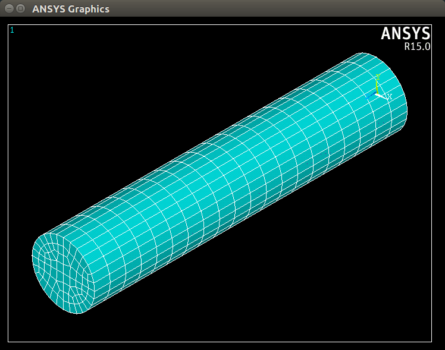

ANSYS APDL Interactive Control Examples
=======================================
These examples are used to demonstrate how to convert an existing ANSYS APDL script to a python ``pyansys`` script.  You could also simply use the built-in ``convert_script`` function within pyansys:

.. code:: python

    import pyansys

    inputfile = 'ansys_inputfile.inp'
    pyscript = 'pyscript.py'
    pyansys.convert_script(inputfile, pyscript)

Torsional Load on a Bar using SURF154 Elements
----------------------------------------------
This ANSYS APDL script builds a bar and applies torque to it using SURF154 elements.  This is a static analysis example.

Script Initialization
~~~~~~~~~~~~~~~~~~~~~
Beginning of ANSYS script:

.. code::

    !----------------------------------------
    ! Input torque applied (moment)
    ! Input radius, height, element size...
    !----------------------------------------
    TORQUE = 100
    RADIUS = 2
    H_TIP = 2
    HEIGHT = 20
    ELEMSIZE = 1
    PI = acos(-1)
    FORCE = 100/RADIUS
    PRESSURE = FORCE/(H_TIP*2*PI*RADIUS)

Corresponding ``pyansys`` script including the initialization of pyansys:

.. code:: python

    import numpy as np
    import os
    import pyansys
    
    # start ANSYS in the current working directory with default jobname "file"
    ansys = pyansys.ANSYS(run_location=os.getcwd(), interactive_plotting=True)
        
    # define cylinder and mesh parameters
    torque = 100
    radius = 2
    h_tip = 2
    height = 20
    elemsize = 0.5
    pi = np.arccos(-1)
    force = 100/radius
    pressure = force/(h_tip*2*np.pi*radius)

Model Creation
~~~~~~~~~~~~~~    
APDL Script:

.. code::

    !----------------------------------------
    ! Define higher-order SOLID186
    ! Define surface effect elements SURF154
    ! which is used to apply torque
    ! as a tangential pressure
    !----------------------------------------
    /prep7
    et, 1, 186
    et, 2, 154
    r,1,
    r,2,
    
    !----------------------------------------
    ! Aluminum properties (or something)
    !----------------------------------------
    mp,ex,1,10e6
    mp,nuxy,1,.3
    mp,dens,1,.1/386.1
    mp,dens,2,0
    
    !----------------------------------------
    ! Simple cylinder
    !----------------------------------------
    *do, ICOUNT, 1, 4
    cylind,RADIUS,,HEIGHTH_TIP,HEIGHT,90*(ICOUNT-1),90*ICOUNT
    *enddo
        
    nummrg,kp
    lsel,s,loc,x,0
    
    lsel,r,loc,y,0
    lsel,r,loc,z,0,HEIGHT-H_TIP
    lesize,all,ELEMSIZE*2
    mshape,0
    mshkey,1
    esize,ELEMSIZE
    allsel,all
    VSWEEP, ALL
    csys,1
    asel,s,loc,z,HEIGHT-H_TIP+0.0001,HEIGHT0.0001
    asel,r,loc,x,RADIUS
    local,11,1
    csys,0
    aatt,2,2,2,11
    amesh,all
    finish

Corresponding ``pyansys`` script:

.. code:: python

    # Define higher-order SOLID186
    # Define surface effect elements SURF154 to apply torque
    # as a tangential pressure
    ansys.Prep7()
    ansys.Et(1, 186)
    ansys.Et(2, 154)
    ansys.R(1)
    ansys.R(2)
    
    # Aluminum properties (or something)
    ansys.Mp('ex', 1, 10e6)
    ansys.Mp('nuxy', 1, 0.3)
    ansys.Mp('dens', 1, 0.1/386.1)
    ansys.Mp('dens', 2, 0)
    
    # Simple cylinder
    for i in range(4):
        ansys.Cylind(radius, '', '', height, 90*(i-1), 90*i)
    
    ansys.Nummrg('kp')
    
    # non-interactive volume plot (optional)
    ansys.Show()
    ansys.Menu('grph')
    ansys.View(1, 1, 1, 1)
    ansys.Vplot()
    ansys.Wait(1)
    
    # mesh cylinder
    ansys.Lsel('s', 'loc', 'x', 0)
    ansys.Lsel('r', 'loc', 'y', 0)
    ansys.Lsel('r', 'loc', 'z', 0, height - h_tip)
    ansys.Lesize('all', elemsize*2)
    ansys.Mshape(0)
    ansys.Mshkey(1)
    ansys.Esize(elemsize)
    ansys.Allsel('all')
    ansys.Vsweep('ALL')
    ansys.Csys(1)
    ansys.Asel('s', 'loc', 'z', '', height - h_tip + 0.0001)
    ansys.Asel('r', 'loc', 'x', radius)
    ansys.Local(11, 1)
    ansys.Csys(0)
    ansys.Aatt(2, 2, 2, 11)
    ansys.Amesh('all')
    ansys.Finish()

    # plot elements and wait one second (optional)
    ansys.Eplot()
    ansys.Wait(1)

    Element plot from ``pyansys`` using ``matplotlib``

Solution
~~~~~~~~
APDL script:

.. code::

    /solu
    antype,static,new
    eqslv,pcg,1e-8
    
    !----------------------------------------
    ! Apply tangential pressure
    !----------------------------------------
    esel,s,type,,2
    sfe,all,2,pres,,PRESSURE
    
    !----------------------------------------
    ! Constrain bottom of cylinder/rod
    !----------------------------------------
    asel,s,loc,z,0
    nsla,s,1
    d,all,all
    allsel,all
    /psf,pres,,2
    /pbc,u,1
    /title, Simple torsional example
    solve
    finish
    /post1
    set,last
    fsum
    esel,u,type,,2
    SAVE

Corresponding ``pyansys`` script:

.. code:: python

    # new solution
    ansys.Slashsolu()  # Using Slash instead of / due to duplicate SOLU command
    # ansys('/solu')  # could also use this line
    ansys.Antype('static', 'new')
    ansys.Eqslv('pcg', 1e-8)

    # Apply tangential pressure
    ansys.Esel('s', 'type', '', 2)
    ansys.Sfe('all', 2, 'pres', '', pressure)

    # Constrain bottom of cylinder/rod
    ansys.Asel('s', 'loc', 'z', 0)
    ansys.Nsla('s', 1)

    ansys.D('all', 'all')
    ansys.Allsel()
    ansys.Psf('pres', '', 2)
    ansys.Pbc('u', 1)
    ansys.Solve()
    ansys.Exit()  # Finishes, saves, and exits

Access and plot the results within python using pyansys:

.. code:: python

    # open the result file using the path used in ANSYS
    resultfile = os.path.join(ansys.path, 'file.rst')
    result = pyansys.ResultReader(resultfile)

    # access element results as arrays
    nnum, stress = result.nodal_stress(0)
    element_stress, elemnum, enode = result.element_stress(0)
    nodenum, stress = result.nodal_stress(0)

    # plot interactively
    result.PlotNodalResult(0, cmap='bwr')
    result.plot_nodal_stress(0, 'Sx', cmap='bwr')
    result.plot_principal_nodal_stress(0, 'SEQV', cmap='bwr')

    # plot and save non-interactively
    cpos = [(20.992831318277517, 9.78629316586435, 31.905115108541928),
            (0.35955395443745797, -1.4198191001571547, 10.346158032932495),
            (-0.10547549888485548, 0.9200673323892437, -0.377294345312956)]

    result.PlotNodalResult(0, interactive=False, cpos=cpos,
                           screenshot=os.path.join(path, 'cylinder_disp.png'))

    result.plot_nodal_stress(0, 'Sx', cmap='bwr', interactive=False, cpos=cpos,
                           screenshot=os.path.join(path, 'cylinder_sx.png'))

    result.plot_principal_nodal_stress(0, 'SEQV', cmap='bwr', interactive=False, cpos=cpos,
                                    screenshot=os.path.join(path, 'cylinder_vonmises.png'))

.. figure:: ./images/cylinder_disp.png
    :width: 300pt

    Non-interactive Screenshot of Displacement from ``pyansys``

.. figure:: ./images/cylinder_sx.png
    :width: 300pt

    Non-interactive Screenshot of X Stress from ``pyansys``

.. figure:: ./images/cylinder_vonmises.png
    :width: 300pt

    Non-interactive Screenshot of von Mises Stress from ``pyansys``

Spotweld SHELL181 Example
-------------------------
This ANSYS APDL example demonstrates how to model spot welding on three thin sheets of metal.  This example has yet to be translated to a ``pyansys`` script.

.. code::

    !----------------------------------------
    ! Example problem for demonstrating 
    ! Spotweld technology 
    !----------------------------------------
    ! 
    !----------------------------------------
    ! Originated in 9.0 JJDoyle 2004/09/01
    !----------------------------------------
    /prep7
    /num,0
    /pnum,area,1
    
    k,1,2,10,
    k,2,10,10
    k,3,10,0.15
    k,4,14,0.15
    !
    l,1,2
    l,2,3
    l,3,4
    lfillt,1,2,3
    lfillt,2,3,2
    !
    k,9,,
    k,10,11,
    k,11,15,
    l,9,10
    l,10,11
    
    k,12,,10
    lsel,s,,,6,7
    AROTAT,all,,,,,,9,12,12,1,
    
    lsel,s,,,1,5
    AROTAT,all,,,,,,9,12,12,1,
    areverse,1
    areverse,2
    
    asel,s,,,3,7
    ARSYM,Y,all, , , ,0,0 
    allsel
    
    !********
    !define weld location with hardpoint
    !********
    HPTCREATE,AREA,7,0,COORD,12.9,0.15,-1.36,  
    
    /view,1,1,1,1
    gplo
    !
    et,1,181
    r,1,0.15
    r,2,0.1
    !
    mp,ex,1,30e6
    mp,prxy,1,0.3
    !
    esize,0.25
    real,1
    amesh,1
    amesh,2
    real,2
    asel,s,,,3,12
    amesh,all
    !
    lsel,s,,,1,9
    lsel,a,,,12,17
    lsel,a,,,26,38,3
    lsel,a,,,24,36,3
    nsll,s,1
    wpstyle,0.05,0.1,-1,1,0.003,0,0,,5  
    WPSTYLE,,,,,,,,1
    wpro,,-90.000000,
    CSWPLA,11,1,1,1, 
    csys,11 
    nrotat,all
    d,all,uy
    d,all,rotx
    
    csys,0
    
    lsel,s,,,23
    nsll,s,1
    d,all,uz
    
    lsel,s,,,17
    nsll,s,1
    d,all,uz,4
    
    ALLSEL
    /view,1,1,1,1
    /eshape,1
    ksel,s,,,33
    nslk,s,1
    *get,sw_node,node,,num,max
    
    /solu
    allsel
    nlgeom,on
    time,4
    nsubst,10,25,5
    outres,all,all
    fini
    
    !------------------------------------
    !build flex spotweld with BEAM188, run the solution,
    !and post process results
    !------------------------------------
    fini
    allsel
    /prep7
    mp,ex,2,28e6
    mp,prxy,2,0.3
    !
    SECTYPE,2,beam,csolid
    SECDATA,0.25
    !
    et,2,188
    type,2
    mat,2
    secnum,2
    
    SWGEN,sweld1,0.50,7,2,sw_node,,	
    SWADD,sweld1,,12
    
    /solu
    allsel
    nlgeom,on
    time,4
    nsubst,10,25,5
    outres,all,all
    solve
    FINISH

Here's the Python script using ``pyansys`` to access the results after running the ANSYS analysis.

.. code:: python
    
    import pyansys
    
    # Open the result file and plot the displacement of time step 3
    resultfile = os.path.join('file.rst')
    result = pyansys.ResultReader(resultfile)
    result.PlotNodalResult(2)

.. figure:: ./images/spot_disp.png
    :width: 300pt

    Spot Weld: Displacement

Get the nodal and element component stress at time step 0.  Plot the stress in the Z direction.

.. code:: python

    nodenum, stress = result.nodal_stress(0)
    element_stress, elemnum, enode = result.element_stress(0)
    
    # plot the Z direction stress (the stress at the contact element simulating
    # the spot weld)
    result.plot_nodal_stress(0, 'Sz')

.. figure:: ./images/spot_sz.png
    :width: 300pt

    Spot Weld: Z Stress

.. code:: python

    # Get the principal nodal stress and plot the von Mises Stress
    nnum, pstress = result.principal_nodal_stress(0)
    result.plot_principal_nodal_stress(0, 'SEQV')

.. figure:: ./images/spot_seqv.png
    :width: 300pt

    Spot Weld: von Mises Stress
