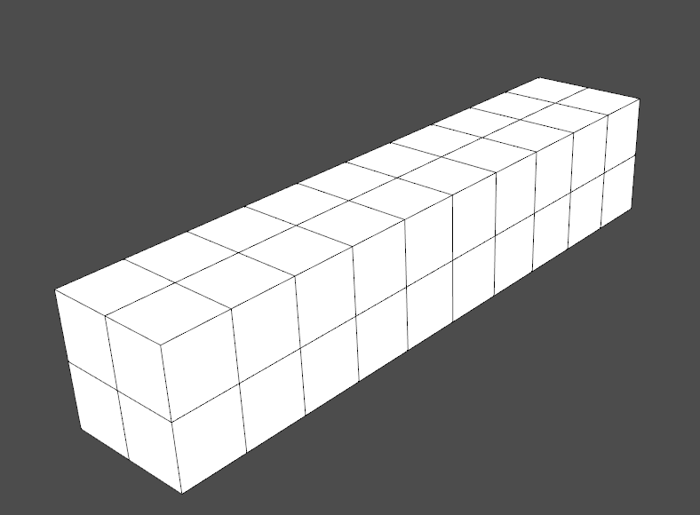
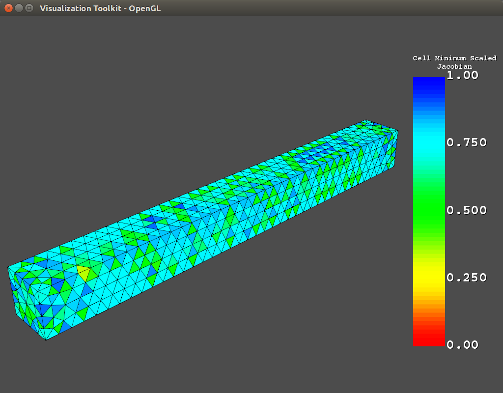

Examples
========

These examples show how ANSYS binary and ASCII files can be read and displayed
using pyansys.

Loading and Plotting an ANSYS Archive File
------------------------------------------

.. _examples_ref:

ANSYS archive files containing solid elements (both legacy and current), can
be loaded using ReadArchive and then converted to a vtk object.

.. code:: python

    import pyansys
    from pyansys import examples
    
    # Sample *.cdb
    filename = examples.hexarchivefile
    
    # Read ansys archive file
    archive = pyansys.ReadArchive(filename)
    
    # Print raw data from cdb
    for key in archive.raw:
       print "%s : %s" % (key, archive.raw[key])
    
    # Create a vtk unstructured grid from the raw data and plot it
    archive.ParseFEM()
    archive.uGrid.Plot()
    
    # write this as a vtk xml file 
    archive.SaveAsVTK('hex.vtu')
    

You can then load this vtk file using vtkInterface or another program that uses
VTK.
    
.. code:: python

    # Load this from vtk
    import vtkInterface
    grid = vtkInterface.LoadGrid('hex.vtk')
    grid.Plot()

Loading and Plotting an ANSYS Result File
-----------------------------------------

This example reads in binary results from a modal analysis of a beam from
ANSYS.  This section of code does not rely on vtk and can be used solely with
numpy installed.

.. code:: python

    # Load the reader from pyansys
    import pyansys
    from pyansys import examples
    
    # Sample result file and associated archive file
    rstfile = examples.rstfile
    hexarchivefile = examples.hexarchivefile
    
    
    # Create result reader object by loading the result file
    result = pyansys.ResultReader(rstfile)
    
    # Get beam natural frequencies
    freqs = result.GetTimeValues()
    
    # Get the node numbers in this result file
    nnum = result.nnum
    
    # Get the 1st bending mode shape.  Nodes are ordered according to nnum.
    disp = result.GetResult(0, True) # uses 0 based indexing 
    print disp
    
.. code::

    [[  0.           0.           0.        ]
     [  0.           0.           0.        ]
     [  0.           0.           0.        ]
     ..., 
     [ 21.75315943 -14.01733637  -2.34010126]
     [ 26.60384371 -17.14955041  -2.40527841]
     [ 31.50985156 -20.31588852  -2.4327859 ]]

You can then load in the archive file associated with the result file and then 
plots a nodal result.

.. code:: python
    
    # Load CDB (necessary for display)
    result.LoadArchive(hexarchivefile)
    
    # Plot the displacement of Mode 0 in the x direction
    result.PlotNodalResult(0, 'x', label='Displacement')

.. image:: hexbeam_disp.png

Reading a Full File
-------------------
This example reads in the mass and stiffness matrices associated with the above
example.

.. code:: python

    # Load the reader from pyansys
    import pyansys
    
    # Create result reader object and read in full file
    fobj = pyansys.FullReader('file.full')
    fobj.LoadFullKM()
    

Data from the full file can now be accessed from the object.  If you have 
``scipy`` installed, you can construct a sparse matrix and solve it.

.. code:: python

    import numpy as np
    from scipy.sparse import csc_matrix, linalg
    ndim = fobj.nref.size
    k = csc_matrix((fobj.kdata, (fobj.krows, fobj.kcols)), shape=(ndim, ndim))
    m = csc_matrix((fobj.mdata, (fobj.mrows, fobj.mcols)), shape=(ndim, ndim))
    
    # Solve
    w, v = linalg.eigsh(k, k=20, M=m, sigma=10000)
    # System natural frequencies
    f = (np.real(w))**0.5/(2*np.pi)
    
    print('First four natural frequencies')
    for i in range(4):
        print '{:.3f} Hz'.format(f[i])
    
.. code:: 

    First four natural frequencies
    1283.200 Hz
    1283.200 Hz
    5781.975 Hz
    6919.399 Hz

Built-In Examples
=================

Display Cell Quality
--------------------

This built in example displays the minimum scaled jacobian of each element of a tetrahedral beam:

.. code:: python

    from pyansys import examples
    examples.DisplayCellQual()

This is the source code for the example:

.. code:: python

    # load archive file and parse for subsequent FEM queries
    if meshtype == 'hex':
        archive = pyansys.ReadArchive(hexarchivefile)
    else:
        archive = pyansys.ReadArchive(tetarchivefile)
            
    # create vtk object
    archive.ParseFEM()

    # get cell quality
    qual = pyansys.CellQuality(archive.uGrid)
    
    # plot cell quality
    archive.uGrid.Plot(scalars=qual, stitle='Cell Minimum Scaled\nJacobian',
                       rng=[0, 1])