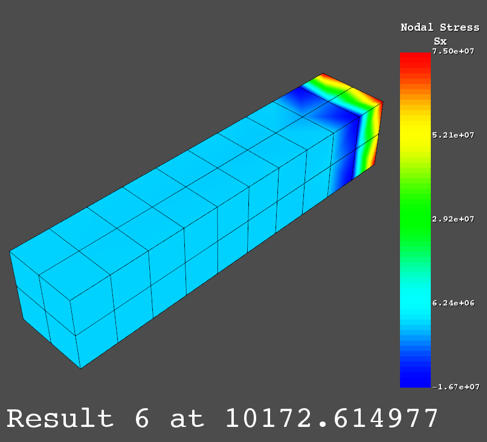
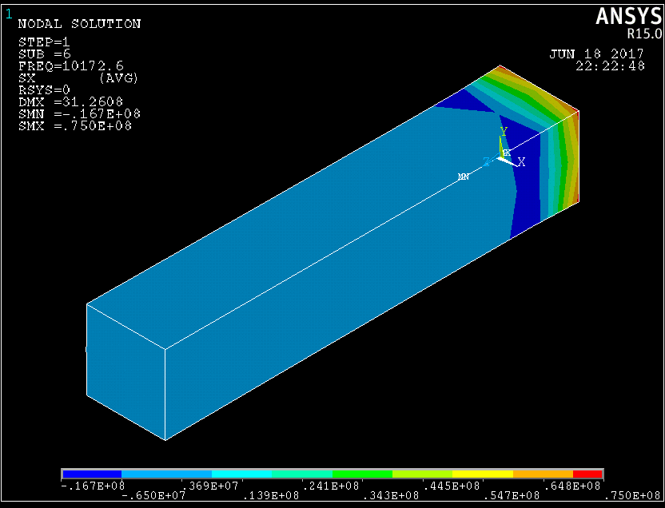

Examples
========

These examples show how ANSYS binary and ASCII files can be read and displayed
using pyansys.  These examples are meant to demonstrate the capabilities of 
pyansys.  For more details see the other reference pages.

Loading and Plotting an ANSYS Archive File
------------------------------------------

.. _examples_ref:

ANSYS archive files containing solid elements (both legacy and current) can
be loaded using ReadArchive and then converted to a vtk object.

.. code:: python

    import pyansys
    from pyansys import examples
    
    # Sample *.cdb
    filename = examples.hexarchivefile
    
    # Read ansys archive file
    archive = pyansys.ReadArchive(filename)
    
    # Print raw data from cdb
    for key in archive.raw:
       print "%s : %s" % (key, archive.raw[key])
    
    # Create a vtk unstructured grid from the raw data and plot it
    archive.ParseFEM()
    archive.uGrid.Plot()
    
    # write this as a vtk xml file 
    archive.SaveAsVTK('hex.vtu')
    

.. image:: hexbeam.png

You can then load this vtk file using vtkInterface or another program that uses
VTK.
    
.. code:: python

    # Load this from vtk
    import vtkInterface
    grid = vtkInterface.LoadGrid('hex.vtk')
    grid.Plot()

Loading and Plotting Results from an ANSYS Result File
------------------------------------------------------

Loading the Result File
~~~~~~~~~~~~~~~~~~~~~~~

This example reads in binary results from a modal analysis of a beam from
ANSYS.  This section of code does not rely on ``VTK`` and can be used solely with
numpy installed.

.. code:: python

    # Load the reader from pyansys
    import pyansys
    from pyansys import examples
    
    # Sample result file
    rstfile = examples.rstfile
    
    # Create result object by loading the result file
    result = pyansys.ResultReader(rstfile)
    
    # Get beam natural frequencies
    freqs = result.GetTimeValues()
    
    # Get the node numbers in this result file
    nnum = result.nnum
    
    # Get the 1st bending mode shape.  Results are ordered based on the sorted 
    # node numbering (by default and same as `nnum` above).
    disp = result.GetNodalResult(0) # uses 0 based indexing 
    print disp
    
.. code::

    [[  0.           0.           0.        ]
     [  0.           0.           0.        ]
     [  0.           0.           0.        ]
     ..., 
     [ 21.75315943 -14.01733637  -2.34010126]
     [ 26.60384371 -17.14955041  -2.40527841]
     [ 31.50985156 -20.31588852  -2.4327859 ]]

Plotting Nodal Results
~~~~~~~~~~~~~~~~~~~~~~

As the geometry of the model is contained within the result file, you can plot
the result without having to load any additional geometry.  Below, displacement
for the first bending mode of the beam is plotted using ``VTK``.  To use this functionality,
``VTK`` must be installed.

.. code:: python
    
    # Plot the displacement of Mode 0 in the x direction
    result.PlotNodalResult(0, 'x', label='Displacement')
    

.. image:: hexbeam_disp.png

Stress can be plotted as well using the below code.  The nodal stress is 
computed in the same manner that ANSYS uses by to determine the stress at each
node by averaging the stress evaluated at that node for all attached elements.
For now, only component stresses can be displayed.

.. code:: python
    
    # Display node averaged stress in x direction for result 6
    result.PlotNodalStress(5, 'Sx')
    

Here's the same result as viewed from ANSYS.

Built-In Examples
-----------------

The following examples can be run natively from pyansys by importing the 
examples subpackage.

Plot Cell Quality
~~~~~~~~~~~~~~~~~

This built in example displays the minimum scaled jacobian of each element of a tetrahedral beam:

.. code:: python

    from pyansys import examples
    examples.DisplayCellQual()

.. image:: cellqual.png

This is the source code for the example:

.. code:: python

    import pyansys

    # load archive file and parse for subsequent FEM queries
    from pyansys import examples
    if meshtype == 'hex':
        archive = pyansys.ReadArchive(examples.hexarchivefile)
    else:
        archive = pyansys.ReadArchive(examples.tetarchivefile)
            
    # create vtk object
    archive.ParseFEM()

    # get cell quality
    qual = pyansys.CellQuality(archive.uGrid)
    
    # plot cell quality
    archive.uGrid.Plot(scalars=qual, stitle='Cell Minimum Scaled\nJacobian',
                       rng=[0, 1])
    

Plot Nodal Stress
~~~~~~~~~~~~~~~~~
This built in example plots the x component stress from a hexahedral beam.
    
.. code:: python

    from pyansys import examples
    examples.DisplayStress()

This is the source code for the example:

.. code:: python

    import pyansys

    # get location of the example file
    from pyansys import examples
    rstfile = examples.rstfile
    
    # Create rsult object
    result = pyansys.ResultReader(rstfile)
    
    # Plot node averaged stress in x direction for result 6
    result.PlotNodalStress(5, 'Sx')
    
    
    