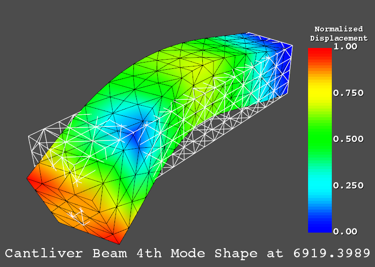

Working with a ANSYS Full File (full)
======================================

The ANSYS full file is a fortran formatted binary file containing the mass and
stiffness from an ANSYS analysis.  Using pyansys it can be loaded into memory
as either a sparse or full matrix.

Reading a Full File
-------------------
This example reads in the mass and stiffness matrices associated with the above
example.  ``LoadKM`` sorts degrees of freedom such that the nodes are
ordered from minimum to maximum, and each degree of freedom (i.e. X, Y, Z), are
sorted within each node.  The matrices ``k`` and
``m`` are sparse by default, but if ``scipy`` is not installed, or if the
optional parameter ``as_sparse=False`` then they will be full numpy arrays.

By default ``LoadKM`` outputs the upper triangle of both matrices, to output the
full matrix, set ``utri=False``.  Additionally, the constrained nodes of the
analysis can be identified by accessing ``fobj.const`` where the constrained
degrees of freedom are True and all others are False.  This corresponds to
the degrees of reference in ``dof_ref``.

.. code:: python

    # Load pyansys
    import pyansys
    
    # Create result reader object and read in full file
    full = pyansys.FullReader(pyansys.examples.fullfile)
    dof_ref, k, m = fobj.LoadKM(triu=False) # return the full matrix 

If you have ``scipy`` installed, you can solve solve for the natural 
frequencies and mode shapes of a system.  Realize that constrained degrees of 
freedom must be removed from the ``k`` and ``m`` matrices for the correct solution.

.. code:: python

    # remove the constrained degrees of freedom
    # NOTE: There are more efficient way to remove these indices
    free = np.logical_not(full.const).nonzero()[0]
    k = k[free][:, free]
    m = m[free][:, free]

    from scipy.sparse import linalg

    # Solve
    w, v = linalg.eigsh(k, k=20, M=m, sigma=10000)

    # System natural frequencies
    f = (np.real(w))**0.5/(2*np.pi)
    
    print('First four natural frequencies')
    for i in range(4):
        print '{:.3f} Hz'.format(f[i])
    
.. code:: 

    First four natural frequencies
    1283.200 Hz
    1283.200 Hz
    5781.975 Hz
    6919.399 Hz

Plotting a Mode Shape
---------------------

You can also plot the mode shape of this finite element model.  Since the constrained degrees of
freedom have been removed from the solution, you have to account for these when
displaying the displacement.

.. code::
    
    import vtkInterface

    # Get the 4th mode shape
    mode_shape = v[:, 3] # x, y, z displacement for each node
    
    # create the full mode shape including the constrained nodes
    full_mode_shape = np.zeros(dofref.shape[0])
    full_mode_shape[np.logical_not(full.const)] = mode_shape
    
    # reshape and compute the normalized displacement
    disp = full_mode_shape.reshape((-1, 3))
    n = (disp*disp).sum(1)**0.5
    n /= n.max() # normalize
    
    # load an archive file and create a vtk unstructured grid
    archive = pyansys.ReadArchive(pyansys.examples.hexarchivefile)
    grid = archive.ParseVTK()
    
    # plot the normalized displacement
    # grid.Plot(scalars=n)
    
    # Fancy plot the displacement
    plobj = vtkInterface.PlotClass()
    
    # add two meshes to the plotting class.  Meshes are copied on load
    plobj.AddMesh(grid, style='wireframe')
    plobj.AddMesh(grid, scalars=n, stitle='Normalized\nDisplacement',
                  flipscalars=True)
    
    # Update the coordinates by adding the mode shape to the grid
    plobj.UpdateCoordinates(grid.GetNumpyPoints() + disp/80, render=False)
    plobj.AddText('Cantliver Beam 4th Mode Shape at {:.4f}'.format(f[3]),
                  fontsize=30)
    plobj.Plot(); del plobj
    

This example is built into ``pyansys`` and can be run from 
``examples.SolveKM()``.
