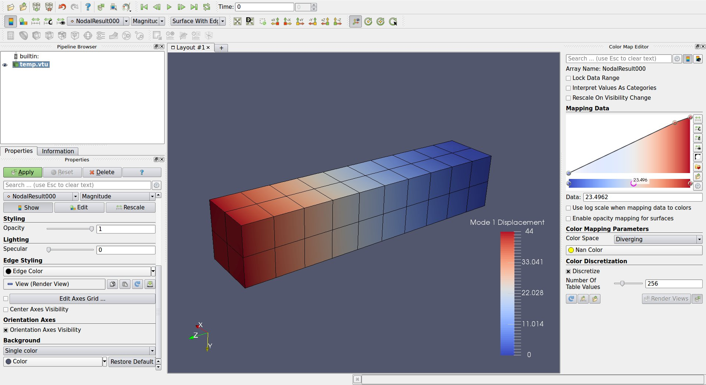

Working with a ANSYS Result File (rst)
======================================
The ANSYS result file is a FORTRAN formatted binary file containing the results written from an ANSYS analysis.  The results, at a minimum, contain the geometry of the model analyzed along with the nodal and element results.  Depending on the analysis, these results could be anything from modal displacements to nodal temperatures.  At this time, only the following results are supported by this code:

    - Nodal DOF results from a static analysis or modal analysis.
    - Nodal DOF results from a cyclic static or modal analysis.
    - Nodal averaged component stresses (i.e. x, y, z, xy, xz, yz)
    - Nodal principal stresses (i.e. S1, S2, S3, SEQV, SINT)

We're working on adding additional plotting and retrieval functions to the code If you would like us to add an additional result type to be loaded, please open an issue in `GitHub <https://github.com/akaszynski/pyansys>`_  and include result file for the result type you wish to load.

Loading the Result File
-----------------------
As the ANSYS result files are binary files, the entire file does not need to be loaded into memory in order to retrieve results.  This module accesses the results through a python object `result` which you can create with:

.. code:: python

    import pyansys
    result = pyansys.ResultReader('file.rst')
    
Upon initialization the ``ResultReader`` object contains several properties to include the time values from the analysis, node numbering, element numbering, etc.

ResultReader Properties
-----------------------
The properties of the ``ResultReader`` are contained in the result header.

.. code:: python

    result.resultheader

To obtain the time or frequency values of an analysis use:
    
.. code:: python

    tval = result.time_values
    
The sorted node and element numbering of a result can be obtained with:

.. code:: python

    # sorted node numbering
    nnum = result.nnum
    
    # sorted element numbering
    enum = result.enum

Geometry
--------
The geometry of the model can be accessed directly from the dictionary by 
accessing:

.. code:: python

    result.geometry
    
Which contains the following keys:

    - ``'nnum'`` (sorted node numbering )
    - ``'nodes'`` (node positions)
    - ``'etype'`` (element type)
    - ``'enum'`` (non-sorted element numbers associated with elem array)
    - ``'elem'`` (numpy array showing nodes associated with each element, -1 indicates unused entry)
    - ``'ekey'`` (2xn element type reference array)
    - ``'coord systems'`` (dictionary of coordinate systems)

Coordinate Systems
~~~~~~~~~~~~~~~~~~
Non default coordinate systems are always saved to an ANSYS result file.  The coordinate system is zero indexed and individual coordinate systems can be accessed with:

.. code:: python

    >>> coord_idx = 12
    >>> result.geometry['coord systems'][coord_idx]
    {'transformation matrix': array([[ 0.0, -1.0,  0.0],
                                     [ 0.0,  0.0, -1.0],
                                     [ 1.0,  0.0,  0.0]]),
     'origin': array([0., 0., 0.]),
     'PAR1': 1.0,
     'PAR2': 1.0,
     'euler angles': array([ -0., -90.,  90.]),
     'theta singularity': 0.0,
     'phi singularity': 0.0,
     'type': 1,
     'reference num': 12}

A 4x4 transformation matrix can be constructed by concatenating the transformation matrix and the origin into one array.  For example:

.. code:: python

    >>> cs = result.geometry['coord systems'][coord_idx]
    >>> trans = cs['transformation matrix']
    >>> origin = cs['origin']
    >>> bottom = np.zeros(4)
    >>> bottom[3] = 1
    >>> tmat = np.hstack((trans, origin.reshape(-1 ,1)))
    >>> tmat = np.vstack((tmat, bottom))

See the doc string for ``parse_coordinate_system`` for more details regarding the contents of the coordinate systems stored in the result file.

.. autofunction:: pyansys.binary_reader.parse_coordinate_system

Accessing Solution Results
--------------------------
The DOF solution for an analysis for each node in the analysis can be obtained using the code block below.  These results correspond to the node numbers in the result file.  This array is sized by the number of nodes by the number of degrees of freedom.

.. code:: python    

    # Return an array of results (nnod x dof)
    nnum, disp = result.nodal_solution(0) # uses 0 based indexing 
    
    # where nnum is the node numbers corresponding to the displacement results

    # The same results can be plotted using 
    result.plot_nodal_solution(0, 'x', label='Displacement') # x displacement

    # normalized displacement can be plotted by excluding the direction string
    result.plot_nodal_solution(0, label='Normalized')

Stress can be obtained as well using the below code.  The nodal stress is computed in the same manner as ANSYS by averaging the stress evaluated at that node for all attached elements.

.. code:: python
    
    # obtain the component node averaged stress for the first result
    # organized with one [Sx, Sy Sz, Sxy, Syz, Sxz] entry for each node
    nnum, stress = result.nodal_stress(0) # results in a np array (nnod x 6)

    # Display node averaged stress in x direction for result 6
    result.plot_nodal_stress(5, 'Sx')

    # Compute principal nodal stresses and plot SEQV for result 1
    nnum, pstress = result.principal_nodal_stress(0)
    result.plot_principal_nodal_stress(0, 'SEQV')

Element stress can be obtained using the following segment of code.  Ensure that the element results are expanded for a modal analysis within ANSYS with::

    /SOLU
    MXPAND, ALL, , , YES

This block of code shows how you can access the non-averaged stresses for the first result from a modal analysis.

.. code:: python
    
    import pyansys
    result = pyansys.ResultReader('file.rst')
    estress, elem, enode = result.element_stress(0)

    
These stresses can be verified using ANSYS using:

.. code:: python

    >>> estress[0]
    [[ 1.0236604e+04 -9.2875127e+03 -4.0922625e+04 -2.3697146e+03
      -1.9239732e+04  3.0364934e+03]
     [ 5.9612605e+04  2.6905924e+01 -3.6161423e+03  6.6281304e+03
       3.1407712e+02  2.3195926e+04]
     [ 3.8178301e+04  1.7534495e+03 -2.5156013e+02 -6.4841372e+03
      -5.0892783e+03  5.2503605e+00]
     [ 4.9787645e+04  8.7987168e+03 -2.1928742e+04 -7.3025332e+03
       1.1294199e+04  4.3000205e+03]]

    >>> elem[0]
        32423

    >>> enode[0]
        array([ 9012,  7614,  9009, 10920], dtype=int32)

.. code::

  POST1:
  ESEL, S, ELEM, , 32423
  PRESOL, S

  ***** POST1 ELEMENT NODAL STRESS LISTING *****                                
 
  LOAD STEP=     1  SUBSTEP=     1                                             
   FREQ=    47.852      LOAD CASE=   0                                         
 
  THE FOLLOWING X,Y,Z VALUES ARE IN GLOBAL COORDINATES                         
 
  ELEMENT=   32423        SOLID187
    NODE    SX          SY          SZ          SXY         SYZ         SXZ     
    9012   10237.     -9287.5     -40923.     -2369.7     -19240.      3036.5    
    7614   59613.      26.906     -3616.1      6628.1      314.08      23196.    
    9009   38178.      1753.4     -251.56     -6484.1     -5089.3      5.2504    
   10920   49788.      8798.7     -21929.     -7302.5      11294.      4300.0    

Animiating a Modal Solution
~~~~~~~~~~~~~~~~~~~~~~~~~~~
Solutions from a modal analysis can be animated using ``animate_nodal_solution``.  For example:

.. code:: python

    from pyansys import examples
    import pyansys

    result = pyansys.ResultReader(examples.rstfile)
    result.animate_nodal_solution(3)

Results from a Cyclic Analysis
------------------------------
``pyansys`` can load and display the results of a cyclic analysis:

.. code:: python

    import pyansys

    # load the result file    
    result = pyansys.ResultReader('rotor.rst')
    
You can reference the load step table and harmonic index tables by printing the result header dictionary keys ``'ls_table'`` and ``'hindex'``:

.. code:: python

    >>> print(result.resultheader['ls_table'])
    # load step, sub step, cumulative index
    array([[ 1,  1,  1], 
           [ 1,  2,  2],
           [ 1,  3,  3],
           [ 1,  4,  4],
           [ 1,  5,  5],
           [ 2,  1,  6],

    >>> print(result.resultheader['hindex'])
    array([0, 0, 0, 0, 0, 1, 1, 1, 1, 1, 2, 2, 2, 2, 2, 3, 3, 3, 3, 3, 4, 4, 4,
           4, 4, 5, 5, 5, 5, 5, 6, 6, 6, 6, 6, 7, 7, 7, 7, 7], dtype=int32)

Where each harmonic index entry corresponds a cumulative index.  For example, result number 11 is the first mode for the 2nd harmonic index:

.. code:: python

    >>> result.resultheader['ls_table'][10] # Result 11 (using zero based indexing)
    array([ 3,  1, 11], dtype=int32)
    
    >>> result.resultheader['hindex'][10]
    2

Alternatively, the result number can be obtained by using:

.. code:: python

    >>> mode = 1
    >>> harmonic_index = 2
    >>> result.harmonic_index_to_cumulative(mode, harmonic_index)
    24

    Using this indexing method, repeated modes are indexed by the same mode index.  To access the other repeated mode, use a negative harmonic index.  Should a result not exist, pyansys will return which modes are available:

.. code:: python

    >>> mode = 1
    >>> harmonic_index = 20
    >>> result.harmonic_index_to_cumulative(mode, harmonic_index)
    Exception: Invalid mode for harmonic index 1
    Available modes: [0 1 2 3 4 5 6 7 8 9]

Results from a cyclic analysis require additional post processing to be interperted correctly.  Mode shapes are stored within the result file as unprocessed parts of the real and imaginary parts of a modal solution.  ``pyansys`` combines these values into a single complex array and then returns the real result of that array.

.. code:: python

    >>> nnum, ms = result.nodal_solution(10) # mode shape of result 11
    >>> print(ms[:3])
    [[ 44.700, 45.953, 38.717]
     [ 42.339, 48.516, 52.475]
     [ 36.000, 33.121, 39.044]]

Sometimes it is necessary to determine the maximum displacement of a mode.  To do so, return the complex solution with:

.. code:: python

    nnum, ms = result.nodal_solution(0, as_complex=True)
    norm = np.abs((ms*ms).sum(1)**0.5)
    idx = np.nanargmax(norm)
    ang = np.angle(ms[idx, 0])

    # rotate the solution by the angle of the maximum nodal response
    ms *= np.cos(ang) - 1j*np.sin(ang)

    # get only the real response
    ms = np.real(ms)
    
See ``help(result.nodal_solution)`` for more details.

The real displacement of the sector is always the real component of the mode shape ``ms``, and this can be varied by multiplying the mode shape by a complex value for a given phase.  To change the phase by 90 degrees simply:

The results of a single sector can be displayed as well using the ``plot_nodal_solution``

.. code:: python

    # Plot the result from the first mode of the 2nd harmonic index
    rnum = result.harmonic_index_to_cumulative(0, 2)
    result.plot_nodal_solution(rnum, label='Displacement', expand=False)
    
.. image:: ./images/rotor.jpg

The phase of the result can be changed by modifying the ``phase`` option.  See ``help(result.plot_nodal_solution)`` for details on its implementation.

Exporting to ParaView
---------------------
ParaView is a visualization application that can be used for rapid generation of plots and graphs using VTK through a GUI.  ``pyansys`` can translate the ANSYS result files to ParaView compatible files containing the geometry and nodal results from the analysis:

.. code:: python

    import pyansys
    from pyansys import examples

    # load example beam result file
    result = pyansys.ResultReader(examples.rstfile)
    
    # save as a binary vtk xml file
    result.save_as_vtk('beam.vtu')

The vtk xml file can now be loaded using ParaView.  This screenshot shows the nodal displacement of the first result from the result file plotted within `ParaView <https://www.paraview.org/>`_.  Within the vtk file are two point arrays (``NodalResult`` and ``nodal_stress``) for each result in the result file.  The nodal result values will depend on the analysis type, while nodal stress will always be the node average stress in the Sx, Sy Sz, Sxy, Syz, and Sxz directions.

ResultReader Object Methods
---------------------------

.. autoclass:: pyansys.Result
    :members:

.. autoclass:: pyansys.CyclicResult
    :members:
