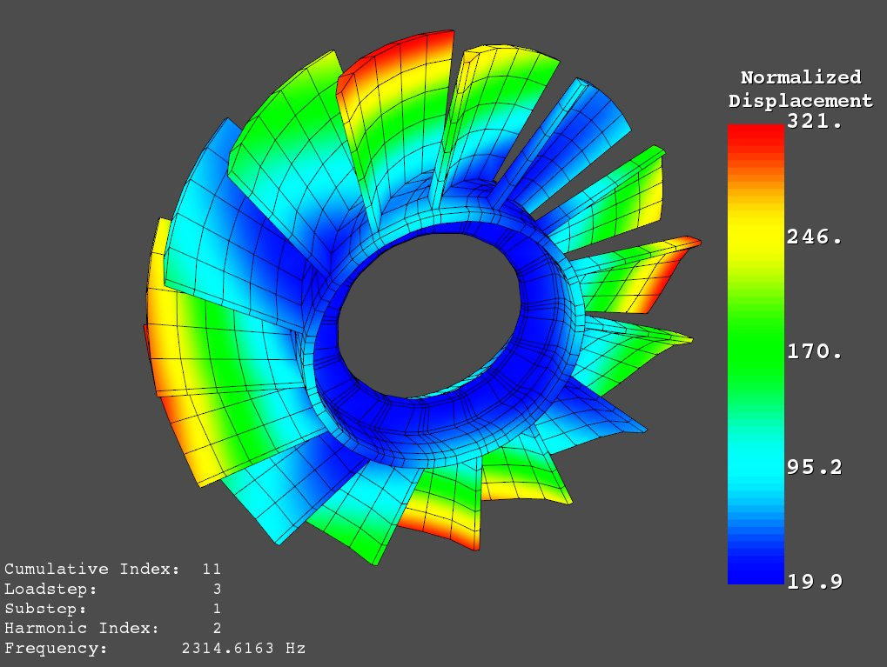

Working with a ANSYS Result File (rst)
======================================

The ANSYS result file is a fortran formatted binary file containing the results
written from an ANSYS analysis.  The results, at a minimum, contain the geometry
of the model analyzed along with the nodal and element results.  Depending on
the analysis, these results could be anything from modal displacements to 
nodal temperatures.  At this time, only the following results are supported by
this code
    - Nodal DOF results from a static analysis or harmonic analysis.
    - Nodal averaged component stresses (i.e. x, y, z, xy, xz, yz)

We're working on adding additional plotting and retrival functions to the code 
If you would like us to add an additional result type to be loaded, 
please open an issue in `GitHub <https://github.com/akaszynski/pyansys>`_  and 
include result file for the result type you wish to load.


Loading the Result File
~~~~~~~~~~~~~~~~~~~~~~~

As the ANSYS result files are binary files, the entire file does not need to be
loaded into memory in order to retrieve results.  This module
accesses the results through a python object `result` which you can create with

.. code:: python

    import pyansys
    result = pyansys.ResultReader('file.rst')
    
Upon initialization this result file contains several properties to include the
time values from the analysis, node numbering, element numbering, etc.


Result File Properties
~~~~~~~~~~~~~~~~~~~~~~

The properties of the result file can be listed the below code.  At the moment,
the property listing is limited to only the number of results in the file.

.. code:: python

    result_dic = result.ResultsProperties()

To obtain the time or frequency values of an analysis use:
    
.. code:: python

    tval = result.GetTimeValues()
    
The sorted node and element numbering of a result can be obtained with:

.. code:: python

    # sorted node numbering
    nnum = result.nnum
    
    # sorted element numbering
    enum = result.enum
    
Geometry
~~~~~~~~
    
The geometry of the model can be accessed directly from the dictionary by 
accessing

.. code:: python

    result.geometry
    
Which contains the following keys

    - ``'nnum'`` (sorted node numbering )
    - ``'nodes'`` (node positions)
    - ``'etype'`` (element type)
    - ``'enum'`` (non-sorted element numbers associated with elem array)
    - ``'elem'`` (numpy array showing nodes associated with each element, -1 indicates unused entry)
    - ``'ekey'`` (2xn element type reference array)
    

Accessing Solution Results
~~~~~~~~~~~~~~~~~~~~~~~~~~

The DOF solution for an analysis for each node in the analysis can be obtained
using the code block below.  These results correspond to the node numbers in
the result file.  This array is sized by the number of nodes by the number of 
degrees of freedom.

.. code:: python    

    # Create an array of results (nnod x dof)
    disp = result.GetNodalResult(0) # uses 0 based indexing 
    
    # which corresponds to the sorted node numbers from
    nnum = result.nnum

    # The same results can be plotted using 
    display_string = 'Displacement' # optional string
    result.PlotNodalResult(0, 'x', label=display_string) # x displacement

    # normalized displacement can be plotted by excluding the direction string
    result.PlotNodalResult(0, label='Normalized')

Stress can be obtained as well using the below code.  The nodal stress is 
computed in the same manner that ANSYS uses by to determine the stress at each
node by averaging the stress evaluated at that node for all attached elements.
For now, only component stresses can be displayed.

.. code:: python
    
    # obtain the component node averaged stress for the first result
    # organized with one [Sx, Sy Sz, Sxy, Syz, Sxz] entry for each node
    stress = result.NodalStress(0) # results in a np array (nnod x 6)

    # Display node averaged stress in x direction for result 6
    result.PlotNodalStress(5, 'Sx')


Results from a Cyclic Analysis
~~~~~~~~~~~~~~~~~~~~~~~~~~~~~~

``pyansys`` can load and display the results of a cyclic analysis:

.. code:: python

    import pyansys

    # load the result file    
    result = pyansys.ResultReader('rotor.rst')
    
You can reference the load step table and harmonic index tables by printing the
result header dictionary keys ``'ls_table'`` and ``'hindex'``:

.. code:: python

    >>> print(result.resultheader['ls_table'])
    # load step, sub step, cumulative index
    array([[ 1,  1,  1], 
           [ 1,  2,  2],
           [ 1,  3,  3],
           [ 1,  4,  4],
           [ 1,  5,  5],
           [ 2,  1,  6],

    >>> print(result.resultheader['hindex'])
    array([0, 0, 0, 0, 0, 1, 1, 1, 1, 1, 2, 2, 2, 2, 2, 3, 3, 3, 3, 3, 4, 4, 4,
           4, 4, 5, 5, 5, 5, 5, 6, 6, 6, 6, 6, 7, 7, 7, 7, 7], dtype=int32)

Where each harmonic index entry corresponds a cumulative index.  For example,
result number 10 is the first mode for the 2nd harmonic index:

.. code:: python

    >>> result.resultheader['ls_table'][10]
    array([ 3,  1, 11], dtype=int32)
    
    >>> result.resultheader['hindex'][10]
    2

Results from a cyclic analysis require additional post processing to be  displayed correctly.  Mode shapes are stored within the result file as 
unprocessed parts of the real and imaginary parts of a modal solution.  ``pyansys`` combines these values into a single complex array and varies the 
phase of the solution when plotting.  Running ``GetCyclicNodalResult`` returns 
the unprocessed complex solution for a sector for a given cumulative index:

.. code:: python

    >>> ms = result.GetCyclicNodalResult(10) # mode shape of result 11
    >>> print(ms[:3])
    [[ 44.700-19.263j, 45.953+44.856j, 38.717+23.216]
     [ 42.339-14.645j, 48.516+43.742j, 52.475+24.255]
     [ 36.000-12.764j, 33.121+40.970j, 39.044+22.881j]]

These results correspond to the nodes of the master sector, whose node numbers 
can be found in the ``cyc_nnum`` array:

.. code:: python

    >>> result.cyc_nnum # sorted node numbers from the master cyclic sector
    array([  1,   2,   4,   6,   9,  10,  12, ...


The real displacement of the sector is always the real
component of the mode shape ``ms``, and this can be varied by multiplying the 
mode shape by a complex value for a given phase.  To change the phase by 
90 degrees simply:

.. code::
    
    >>> from math import sin, cos
    >>> angle = 3.1415/2 # 90 degrees
    >>> ms *= cos(angle) + 1j*sin(angle)


The results of a single sector can be displayed as well using the
``PlotCyclicNodalResult`` command with the ``expand=False``

.. code::

    # Plot the result from the 11th cumulative result
    result.PlotCyclicNodalResult(10, label='Displacement', expand=False)
    
.. image:: sector.jpg
    
By default the phase of the sector results is changed such that the normalized
displacement of the mode shape will be maximized at the highest responding node.
The full rotor can be shown by running:
    
.. code::

    >>> result.PlotCyclicNodalResult(10, label='Displacement')



The phase of the result can be changed by modifying the ``phase`` option.  See
``help(result.PlotCyclicNodalResult)``` for details on its implementation.
        


