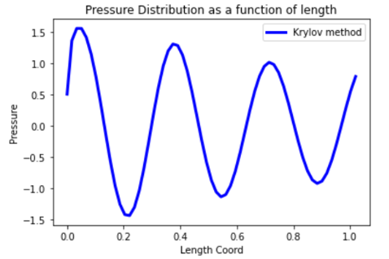

.. _krylov_example:

Harmonic analysis using the frequency sweep Krylov method
=========================================================

This example shows how to use the Krylov method in `PyMAPDL <https://mapdl.docs.pyansys.com/>`_ for harmonic
analysis.

These are the main steps required:

-  Generate a Krylov subspace for model reduction in the harmonic analysis using
   the :func:`KrylovSolver.krygensub() <ansys.mapdl.core.krylov.KrylovSolver.krygensub>`
   method.

-  Reduce the system of equations and solve at each frequency using the
   :func:`KrylovSolver.krysolve() <ansys.mapdl.core.krylov.KrylovSolver.krysolve>` method.

-  Expand the reduced solution back to the FE space using the :func:`KrylovSolver.kryexpand() 
  <ansys.mapdl.core.krylov.KrylovSolver.kryexpand>` method.

Problem description
-------------------

To perform an harmonic analysis on a cylindrical acoustic duct using the
`Krylov method <https://en.wikipedia.org/wiki/Krylov_subspace>`_ 
and study the response of the system over a range of
frequencies.

The model is a cylindrical acoustic duct with pressure load on one end
and output impedance on the other end.

.. code:: ipython3

    import os
    import numpy as np
    import math
    import matplotlib.pyplot as plt
    from ansys.mapdl.core import launch_mapdl

    mapdl = launch_mapdl(additional_switches='-smp', nproc=4)
    mapdl.clear()
    mm = mapdl.math

.. warning:: Launching MAPDL in ``'-smp'`` mode to avoid distributing processing
   because it is not supported by the MAPDL Math module.
    

Parameters definition
~~~~~~~~~~~~~~~~~~~~~

.. code:: ipython3

    # Constants
    pi = np.arccos(-1)
    c0 = 340                         # Speed of Sound (m/s)

    # Materials
    rho = 1.2                        # density
    visco = 0.9                      # viscosity

    # Excitation
    frq = 1000                       # excitation freq   Hz

    # FE analysis settings
    nelem_wl = 10                    # no of elements per wavelength

    # Derived parameters
    TP = 1/frq
    WL = c0 * TP
    no_wl = 3                        # no of wavelengths in space

    cyl_L = no_wl * WL               # length of duct
    cyl_r = 0.025 * cyl_L            # cross section of duct
    
    tol_elem = nelem_wl * no_wl  # total number of elements across length

Element and Material definition
~~~~~~~~~~~~~~~~~~~~~~~~~~~~~~~

.. code:: ipython3

    mapdl.prep7()
    
    mapdl.et(1,'FLUID220', kop2=1)   # Uncoupled acoustic element without FSIs
    mapdl.mp("DENS", 1, rho)
    mapdl.mp("SONC", 1, c0)
    mapdl.mp("VISC", 1, visco)

Geometry definition
~~~~~~~~~~~~~~~~~~~

.. code:: ipython3

    mapdl.allsel()
    mapdl.csys(0)
    mapdl.wpcsys(-1)
    mapdl.wprota(thzx=90)
    mapdl.asel('NONE')
    mapdl.vsel('NONE')
    mapdl.cyl4(0, 0, cyl_r)
    mapdl.wpcsys(-1)
    mapdl.vext("ALL", dx=cyl_L)
    mapdl.vsbw("ALL", keep='DELETE')
    mapdl.wprota(thzx=90)
    mapdl.vsbw("ALL", keep='DELETE')
    mapdl.wpcsys(-1)
    mapdl.cm('cm1', 'volu')

Create mesh:

.. code:: ipython3

    mapdl.mat(1)
    mapdl.type(1)
    mapdl.cmsel("S", "cm1")
    mapdl.aslv()
    mapdl.lsla()
    mapdl.lsel("U", 'loc', 'x', 0)
    mapdl.lsel("U", 'loc', 'x', cyl_L)
    mapdl.lesize('ALL',ndiv = tol_elem)
    mapdl.lsla()
    mapdl.vsweep('ALL')
    mapdl.allsel()

Plot FE model:

.. code:: ipython3

    mapdl.eplot()

.. image:: ../../../examples/extended_examples/Krylov/Harmonic_Analysis_using_krylov_pymapdl_files/Harmonic_Analysis_using_krylov_pymapdl_15_1.png

Boundary Condition Definition
~~~~~~~~~~~~~~~~~~~~~~~~~~~~~

.. code:: ipython3

    # Select areas to apply pressure to
    mapdl.cmsel("S", "cm1")
    mapdl.aslv()
    mapdl.asel('R',"EXT")  # Select external areas
    mapdl.asel('R',"LOC","x",0)
    mapdl.nsla('S',1)
    
    # Apply pressure
    mapdl.d('ALL','PRES', 1)
    
    # Select nodes on the areas where impedance is to be applied
    mapdl.cmsel("S", "cm1")
    mapdl.aslv()
    mapdl.asel('R',"EXT")
    mapdl.asel('R',"LOC","x",cyl_L)
    mapdl.nsla("S",1)

    # Apply impedance
    mapdl.sf("ALL","IMPD",1000)
    mapdl.allsel()

Perform Modal Analysis to study the natural modes of the system
---------------------------------------------------------------

.. code:: ipython3

    # Modal Analysis
    mapdl.slashsolu()
    nev = 10 # Get the first 10 modes
    output = mapdl.modal_analysis("DAMP", nmode=nev)
    mapdl.finish()
    mm.free()

    k = mm.stiff(fname=f"{mapdl.jobname}.full")
    M = mm.mass(fname=f"{mapdl.jobname}.full")
    A = mm.mat(k.nrow, nev)
    ev = mm.eigs(nev, k, M, phi=A, fmin=1.0)

    for i in range(nev):
        f = ev[i]  # Eigenfrequency (Hz)
         print(f"[{i}] : Freq = {f:8.2f} Hz")

.. parsed-literal::

    Freq =    83.33 Hz
    Freq =   250.00 Hz
    Freq =   416.67 Hz
    Freq =   583.34 Hz
    Freq =   750.03 Hz
    Freq =   916.74 Hz
    Freq =  1083.49 Hz
    Freq =  1250.32 Hz
    Freq =  1417.26 Hz
    Freq =  1584.36 Hz
    

Run harmonic analysis using Krylov method
-----------------------------------------

**Step 1**: Generate full file

.. code:: ipython3

    # mapdl.run('/SOLU')
    mapdl.antype('HARMIC')  # HARMONIC ANALYSIS
    mapdl.hropt('KRYLOV')
    mapdl.eqslv('SPARSE')
    mapdl.harfrq(0,1000)   # Set beginning and ending frequency
    mapdl.nsubst(100)      # Set the number of frequency increments
    mapdl.wrfull(1)        # GENERATE .FULL FILE AND STOP
    mapdl.solve()
    mapdl.finish()

Initialize Krylov class object

.. code:: ipython3

    dd = mapdl.krylov

**Step 2**: Generate a Krylov subspace of size/dimension 10 at frequency
500 Hz for model reduction

.. code:: ipython3

    Qz = dd.krygensub(10, 500, True, True)

.. code:: ipython3

    # The shape of the Subspace generated
    print(Qz.shape)

.. parsed-literal::

    (3240, 10)
    

**Step 3**: Reduce the system of equations and solve at each frequency
from 0 Hz to 1000 Hz with ramped loading.

.. code:: ipython3

    Yz = dd.krysolve(0, 1000, 100, 0, True)

.. code:: ipython3

    # Reduced solution over Frequency range
    print(Yz.shape)

.. parsed-literal::

    (10, 100)
    

**Step 4**: Expand reduced solution back to the FE space.

.. code:: ipython3

    results = dd.kryexpand(True, 3)

Results: Pressure distribution as a function of length
------------------------------------------------------

.. code:: ipython3

    # Select all nodes with Z and Y coordinate 0
    mapdl.nsel("S", "LOC", "Z", 0)
    mapdl.nsel("R", "LOC", "Y", 0)
    mapdl.cm("node_comp", "NODES")
    comp = mapdl.cmsel("S", "node_comp")
    nodes = mapdl.db.nodes
    ind, coords, angles = nodes.all_asarray()

Load the last result substep to get the pressure for each of the selected nodes.

.. code:: ipython3

    x_data = []
    y_data = []
    substep_index = 99

    for each_node, loc in zip(ind, coords):
        index_num = np.where(res[substep_index]['node'] == each_node)
        pressure = res[substep_index][index_num]['x'][0]

        #Calculate amplitude at 60 deg
        magnitude = abs(pressure)
        phase = math.atan2(pressure.imag,pressure.real)
        pressure_a = magnitude * np.cos(np.deg2rad(60)+phase)

        x_data.append(loc[0])
        y_data.append(pressure_a)

Sort the results according to the X-coordinate:

.. code:: ipython3

    sorted_x_data, sorted_y_data = zip(*sorted(zip(x_data, y_data)))

Plot the calculated data:

.. code:: ipython3

    plt.plot(sorted_x_data, sorted_y_data, linewidth= 3.0, color='b', label='Krylov method')
    
    # Name the graph and the x-axis and y-axis
    plt.title("Pressure distribution as a function of length")
    plt.xlabel("Length coordinate")
    plt.ylabel("Pressure")
    
    # Add legend
    plt.legend()
    
    # Load the display window
    plt.show()

Results: Plot frequency response function
------------------------------------------

.. code:: ipython3

    # Pick node closest to 0.2 in X direction, Y&Z = 0
    node_number = mapdl.queries.node(0.2, 0, 0)
    
    # Get the response of the system for the selected node
    # over a range of frequency [0-1000 Hz]
    start_freq = 0
    end_freq = 1000
    num_steps = 100
    step_val = (end_freq - start_freq) / num_steps
    dic = {}

    for freq in range (0,num_steps):
        index_num = np.where(res[freq]['node'] == node_number)
        pressure = res[freq][index_num]['x']
        abs_pressure = abs(pressure)

        dic[start_freq] = abs_pressure
        start_freq += step_val

Sort the results:

.. code:: python3

    frf_List = dic.items()
    frf_List = sorted(frf_List)
    frf_x, frf_y = zip(*frf_List) 
        
        

Plot the frequency response function for the selected node: 

.. code:: python3
    
    plt.plot(frf_x, frf_y, linewidth= 3.0, color='b')

    # Plot the natural frequency as vertical lines on the FRF graph
    for itr in range(0,6):
        plt.axvline(x=ev[itr], ymin=0,ymax=2, color='r', linestyle='dotted', linewidth=1)
        
    # Name the graph and the x-axis and y-axis
    plt.title("Frequency Response Function")
    plt.xlabel("Frequency (HZ)")
    plt.ylabel("Pressure")

    # Load the display window
    plt.show()

.. image:: ../../../examples/extended_examples/Krylov/Harmonic_Analysis_using_krylov_pymapdl_files/Harmonic_Analysis_using_krylov_pymapdl_38_0.png