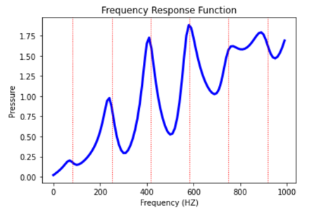

.. _krylov_example:

Harmonic analysis using the frequency-sweep Krylov method
=========================================================

This example shows how to use the frequency-sweep Krylov method
implemented in PyMAPDL. For more information, including the
theory behind this method, see `Frequency-Sweep Harmonic Analysis via the Krylov Method 
<ansys_krylov_sweep_harmonic_analysis_>`_
in the **Structural Analysis** guide for Mechanical APDL.

Overview
--------

This example uses the frequency-sweep Krylov method to perform a harmonic analysis
on a cylindrical acoustic duct and study the response of the system over
a range of frequencies.

The model is a cylindrical acoustic duct with pressure load on one end
and output impedance on the other end.

These are the main steps required:

- Use the :func:`KrylovSolver.gensubspace() <ansys.mapdl.core.krylov.KrylovSolver.gensubspace>`
  method to generate a Krylov subspace for model reduction in the harmonic analysis.

- Use the :func:`KrylovSolver.solve() <ansys.mapdl.core.krylov.KrylovSolver.solve>`
  method to reduce the system of equations and solve at each frequency.

- Use the :func:`KrylovSolver.expand() <ansys.mapdl.core.krylov.KrylovSolver.expand>` method
  to expand the reduced solution back to the FE space.

Perform required imports
------------------------
Perform required imports and launch MAPDL.

.. code:: ipython3

    import os
    import numpy as np
    import math
    import matplotlib.pyplot as plt
    from ansys.mapdl.core import launch_mapdl
    from ansys.math.core.math import AnsMath

    mapdl = launch_mapdl(nproc=4)
    mapdl.clear()

    # Importing and connecting PyAnsys Math with PyMAPDL
    mm = AnsMath(mapdl)

  
Define parameters
-----------------

Define some geometry parameters and analysis settings. As mentioned earlier, the geometry
is a cylinder defined by its radius (``cyl_r``) and its length (``cyl_L``). The length
of the duct is such that three complete wavelengths (``no_wl``) can fit in its length
and can have ten elements per wavelength.

.. code:: ipython3

    # Constants
    pi = np.arccos(-1)
    c0 = 340                         # speed of Sound (m/s)

    # Materials
    rho = 1.2                        # density
    c0 = 340                         # speed of Sound
    frq = 1000                       # excitation freq   Hz
    visco = 0.9                      # viscosity
    
    TP = 1/frq
    WL = c0 * TP
    no_wl = 3                        # no of wavelengths in space

    cyl_L = no_wl * WL               # length of duct
    cyl_r = 0.025 * cyl_L            # cross section of duct
    
    nelem_wl = 10                    # no of elements per wavelength
    tol_elem = nelem_wl * no_wl      # total number of elements across length

Define element type and materials
---------------------------------
Assign fluid medium (air) properties to the duct. This example
uses Fluid 220 (``Keyopt(2)=1``) with one degree of freedom per node (pressure),
with no FSI interface in the element.

.. code:: ipython3

    mapdl.prep7()
    
    mapdl.et(1,'FLUID220', kop2=1)   # uncoupled acoustic element without FSIs
    mapdl.mp("DENS", 1, rho)
    mapdl.mp("SONC", 1, c0)
    mapdl.mp("VISC", 1, visco)

Define geometry
---------------

Create a cylinder of the required dimensions and split it into
four segments for uniform generation of the mesh in each segment.

.. code:: ipython3

    # Set back to default
    mapdl.csys(0)
    
    # Rotate working plane for the cylinder generation
    mapdl.wpcsys(-1)
    mapdl.wprota(thzx=90)

    # Generate a circular area with a specified radius 
    mapdl.cyl4(0, 0, cyl_r)

    mapdl.wpcsys(-1)

    # Extrude the circular area to generate a cylinder of specified length 
    mapdl.vext("ALL", dx=cyl_L)

    # Split the cylinder into four segments to create a more uniform mesh
    mapdl.vsbw("ALL", keep='DELETE')
    mapdl.wprota(thzx=90)
    mapdl.vsbw("ALL", keep='DELETE')

    mapdl.wpcsys(-1)
    
    # Create a component with the created volume
    mapdl.cm('cm1', 'volu')

Create mesh
-----------

Create the mesh and plot the FE model.

.. code:: ipython3

    # Select material and type
    mapdl.mat(1)
    mapdl.type(1)

    # Select volume to mesh    
    mapdl.cmsel("S", "cm1")

To ensure that the volume is divided in ``tot_elem`` across its length, assign
a length element size constraint to the longitudinal lines.

.. code:: ipython3

    # Select lines belonging to the volume
    mapdl.aslv()
    mapdl.lsla()

    # Unselect lines at the top and bottom faces
    mapdl.lsel("U", 'loc', 'x', 0)
    mapdl.lsel("U", 'loc', 'x', cyl_L)

    # Apply length constraint
    mapdl.lesize('ALL',ndiv = tol_elem)
    mapdl.lsla()

    # Mesh
    mapdl.vsweep('ALL')
    mapdl.allsel()
    
    # Plot the FE model
    mapdl.eplot()

.. image:: files/file_15_1.png

Define boundary conditions
--------------------------

Apply pressure load on one end and output impedance on other end of the acoustic duct.

.. code:: ipython3

    # Select areas to apply pressure to
    mapdl.cmsel("S", "cm1")
    mapdl.aslv()
    mapdl.asel('R',"EXT")  # select external areas
    mapdl.asel('R',"LOC","x",0)
    mapdl.nsla('S',1)
    
    # Apply pressure
    mapdl.d('ALL','PRES', 1)
    
    # Select nodes on the areas where impedance is to be applied
    mapdl.cmsel("S", "cm1")
    mapdl.aslv()
    mapdl.asel('R',"EXT")
    mapdl.asel('R',"LOC","x",cyl_L)
    mapdl.nsla("S",1)

    # Apply impedance
    mapdl.sf("ALL","IMPD",1000)
    mapdl.allsel()

Perform modal analysis
----------------------

Get the first 10 natural frequency modes of the acoustic duct.

.. code:: ipython3

    # Modal Analysis
    mapdl.slashsolu()
    nev = 10 # Get the first 10 modes
    output = mapdl.modal_analysis("DAMP", nmode=nev)
    mapdl.finish()
    mm.free()

    k = mm.stiff(fname=f"{mapdl.jobname}.full")
    M = mm.mass(fname=f"{mapdl.jobname}.full")
    A = mm.mat(k.nrow, nev)
    eigenvalues = mm.eigs(nev, k, M, phi=A, fmin=1.0)

The first ten modes are:

+-------------+----------------+
| Mode number | Frequency (Hz) |
+=============+================+
|      1      |     83.33      |
+-------------+----------------+
|      2      |     250.00     |
+-------------+----------------+
|      3      |     416.67     |
+-------------+----------------+
|      4      |     583.34     |
+-------------+----------------+
|      5      |     750.03     |
+-------------+----------------+
|      6      |     916.74     |
+-------------+----------------+
|      7      |    1083.49     |
+-------------+----------------+
|      8      |    1250.32     |
+-------------+----------------+
|      9      |    1417.26     |
+-------------+----------------+
|     10      |    1584.36     |
+-------------+----------------+

    

Run harmonic analysis using Krylov method
-----------------------------------------
Perform the following steps to run the harmonic analysis using the
frequency-sweep Krylov method.

**Step 1**: Generate FULL file and initialize the ``Krylov`` class object.

.. code:: ipython3

    mapdl.run('/SOLU')
    mapdl.antype('HARMIC')  # Set options for harmonic analysis
    mapdl.hropt('KRYLOV')
    mapdl.eqslv('SPARSE')
    mapdl.harfrq(0,1000)    # Set beginning and ending frequency
    mapdl.nsubst(100)       # Set the number of frequency increments
    mapdl.wrfull(1)         # Generate FULL file and stop
    mapdl.solve()
    mapdl.finish()

    dd = mapdl.krylov       # Initialize Krylov class object

**Step 2**: Generate a Krylov subspace of size/dimension 10 at frequency
500 Hz for model reduction.

.. code:: ipython3

    Qz = dd.gensubspace(10, 500, check_orthogonality=True)

Obtain the shape of the generated subspace.

.. code:: pycon

    >>> print(Qz.shape)
    (3240, 10)

**Step 3**: Reduce the system of equations and solve at each frequency
from 0 Hz to 1000 Hz with ramped loading.

.. code:: ipython3

    Yz = dd.solve(0, 1000, 100, ramped_load=True)

Obtain the shape of the reduced solution generated.

.. code:: pycon

    >>> print(Yz.shape)
    (10, 100)

**Step 4**: Expand the reduced solution back to the FE space.

.. code:: ipython3

    result = dd.expand(residual_computation=True, residual_algorithm="l2", return_solution = True)

Plot the pressure distribution as a function of length
------------------------------------------------------

Plot the pressure distribution over the length of the duct on nodes where Y, Z coordinates are zero.

.. code:: ipython3

    # Select all nodes with Z and Y coordinate 0
    mapdl.nsel("S", "LOC", "Z", 0)
    mapdl.nsel("R", "LOC", "Y", 0)
    mapdl.cm("node_comp", "NODES")
    comp = mapdl.cmsel("S", "node_comp")
    nodes = mapdl.db.nodes
    ind, coords, angles = nodes.all_asarray()

Load the last result substep to get the pressure for each of the selected nodes.

.. code:: ipython3

    x_data = []
    y_data = []
    substep_index = 99

    def get_pressure_at(node, step=1):
        """Get pressure at a given node at a given step (by default first step)"""
        index_num = np.where(result[step]['node'] == node)
        return result[step][index_num]

    for each_node, loc in zip(ind, coords):
        # Get pressure at the node
        pressure = get_pressure_at(each_node, substep_index)['x'][0]

        # Calculate amplitude at 60 deg
        magnitude = abs(pressure)
        phase = math.atan2(pressure.imag, pressure.real)
        pressure_a = magnitude * np.cos(np.deg2rad(60)+phase)

        # Store result for later plotting
        x_data.append(loc[0])  # X-Coordenate
        y_data.append(pressure_a)  # Nodal pressure at 60 degrees

Sort the results according to the X coordinate.

.. code:: ipython3

    sorted_x_data, sorted_y_data = zip(*sorted(zip(x_data, y_data)))

Plot the calculated data.

.. code:: ipython3

    plt.plot(sorted_x_data, sorted_y_data, linewidth= 3.0, color='b', label='Krylov method')
    
    # Name the graph and the x-axis and y-axis
    plt.title("Pressure distribution as a function of length")
    plt.xlabel("Length coordinate")
    plt.ylabel("Pressure")
    
    # Add legend
    plt.legend()
    
    # Load the display window
    plt.show()

.. image:: files/file_36_1.png

Plot the frequency response function
------------------------------------

Plot the frequency response function of any node along the length of the cylindrical duct.
This code plots the frequency response function for a node along 0.2 in the X direction of the duct.

.. code:: ipython3

    # Pick node closest to 0.2 in X direction, Y&Z = 0
    node_number = mapdl.queries.node(0.2, 0, 0)
    

Get the response of the system for the selected node
over a range of frequencies, such as 0 to 1000 Hz.

.. code:: python

    start_freq = 0
    end_freq = 1000
    num_steps = 100
    step_val = (end_freq - start_freq) / num_steps
    dic = {}

    for freq in range(0, num_steps):
        pressure = get_pressure_at(node_number, freq)["x"]
        abs_pressure = abs(pressure)

        dic[start_freq] = abs_pressure
        start_freq += step_val

Sort the results.

.. code:: python

    frf_List = dic.items()
    frf_List = sorted(frf_List)
    frf_x, frf_y = zip(*frf_List)

Plot the frequency response function for the selected node. 

.. code:: python

    plt.plot(frf_x, frf_y, linewidth=3.0, color="b")

    # Plot the natural frequency as vertical lines on the FRF graph
    for itr in range(0, 6):
        plt.axvline(
            x=eigenvalues[itr], ymin=0, ymax=2, color="r", linestyle="dotted", linewidth=1
        )

    # Name the graph and the x-axis and y-axis
    plt.title("Frequency Response Function")
    plt.xlabel("Frequency (HZ)")
    plt.ylabel("Pressure")

    # Load the display window
    plt.show()

