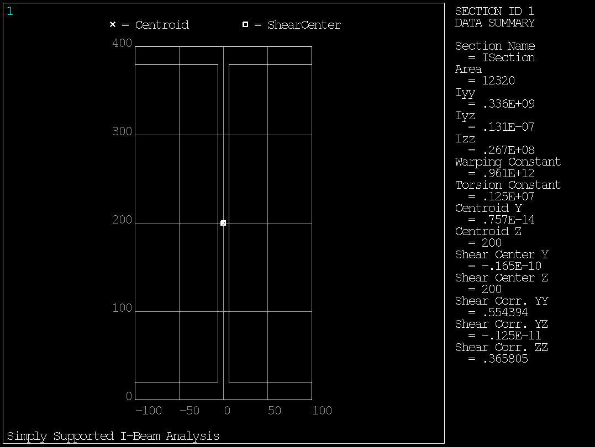
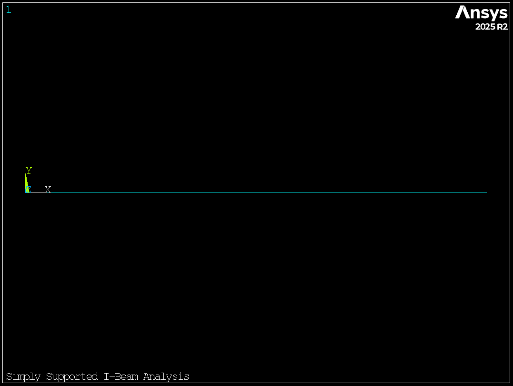
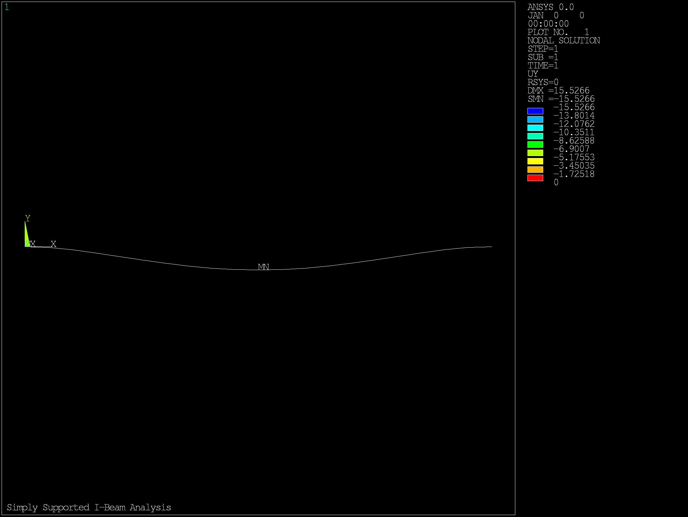
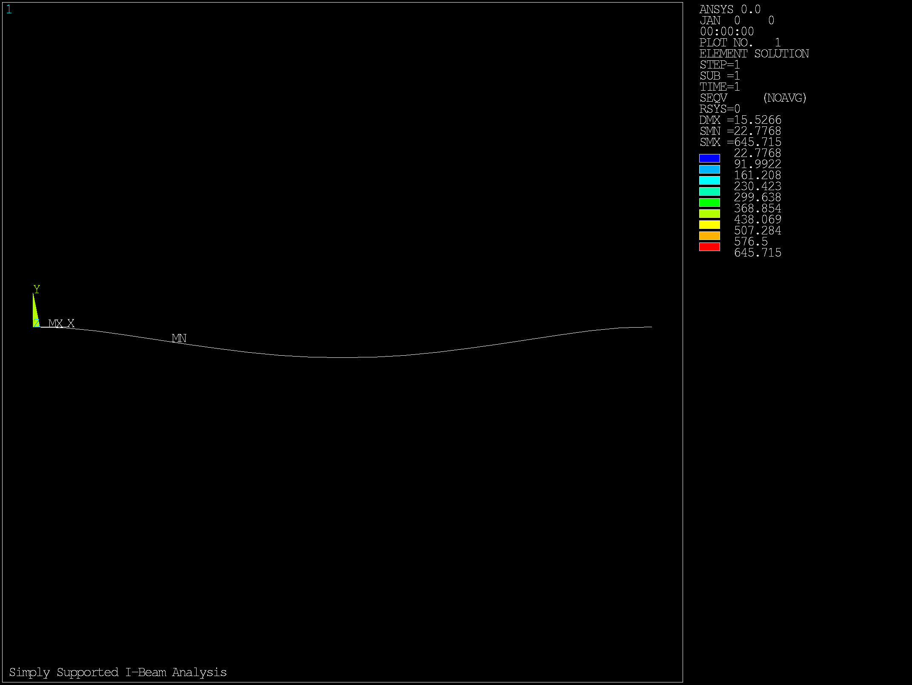

# I-Beam Structural Analysis Report

**Generated:** 2025-07-29 16:26:27
**Analysis Type:** Static Structural Analysis
**Software:** PyMAPDL (Ansys MAPDL)

## Executive Summary

This report presents the results of a static structural analysis of a simply supported I-beam subjected to a uniformly distributed load. The analysis was performed using finite element methods via PyMAPDL.

### Key Results
- **Maximum Displacement:** 15.53 mm
- **Maximum Stress:** 388.9 MPa
- **Safety Factor:** 0.91
- **Total Applied Load:** 250.0 kN

## Model Description

### Geometry
The analyzed structure is an I-beam with the following dimensions:

| Parameter | Value | Unit |
|-----------|-------|------|
| Length | 5000 | mm |
| Flange Width | 200 | mm |
| Web Height | 400 | mm |
| Flange Thickness | 20 | mm |
| Web Thickness | 12 | mm |

*Figure 1: I-beam cross-section showing key dimensions*

*Figure 2: Beam showing elements*

### Material Properties
The beam is modeled using structural steel with the following properties:

| Property | Value | Unit |
|----------|-------|------|
| Elastic Modulus | 200000 | MPa |
| Poisson's Ratio | 0.30 | - |
| Density | 7850000 | kg/m³ |
| Yield Strength | 355 | MPa |

### Loading and Boundary Conditions
- **Support Type:** Simply supported (pin and roller)
- **Load Type:** Uniformly distributed load
- **Load Magnitude:** 50 N/mm

## Analysis Results

### Displacement Results
- **Maximum vertical displacement:** 15.53 mm
- **Location:** Node 11 (approximately mid-span)

### Stress Results
- **Maximum bending stress:** 388.9 MPa
- **Location:** Extreme fibers at mid-span
- **Safety factor:** 0.91

### Section Properties
| Property | Value | Unit |
|----------|-------|------|
| Cross-sectional Area | 12320 | mm² |
| Moment of Inertia (Iyy) | 335720000 | mm⁴ |
| Section Modulus | 1678600 | mm³ |

### Analysis Plots

The following plots visualize the analysis results:

#### Displacement Contours

*Figure 3: Y-direction displacement contours showing maximum deformation at mid-span*

#### Stress Distribution

*Figure 4: Equivalent stress distribution showing maximum stress at beam extreme fibers*

## Conclusions

1. **Structural Adequacy:** The beam safely carries the applied load with a safety factor of 0.91.

2. **Displacement:** The maximum displacement of 15.53 mm is within acceptable limits for most structural applications.

3. **Recommendation:** The I-beam design is adequate for the specified loading conditions.

## Analysis Details

- **Element Type:** BEAM188 (3D linear finite strain beam)
- **Number of Elements:** 20
- **Solution Type:** Static linear analysis
- **Convergence:** Solution converged successfully

---
*This report was automatically generated using PyMAPDL*
