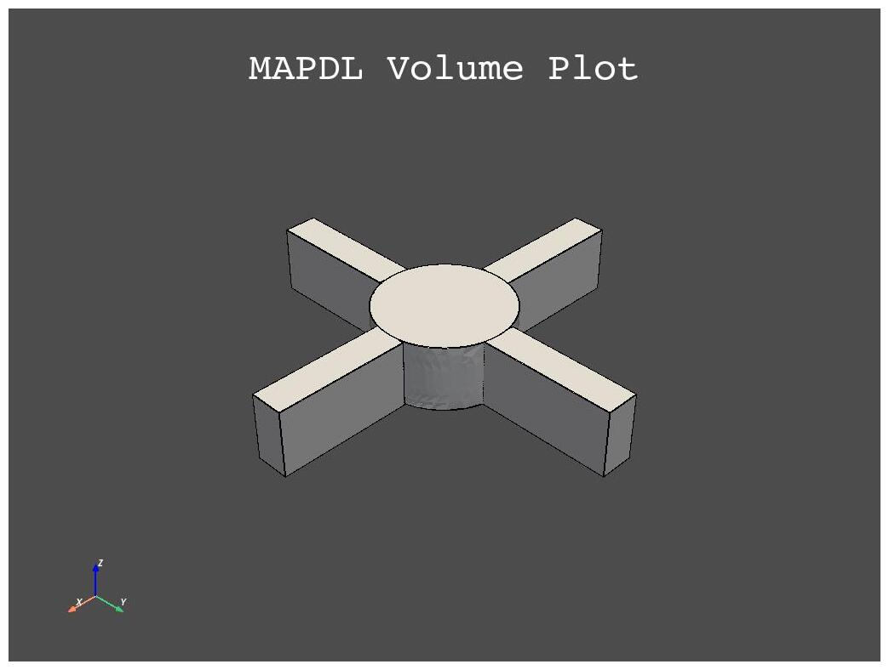
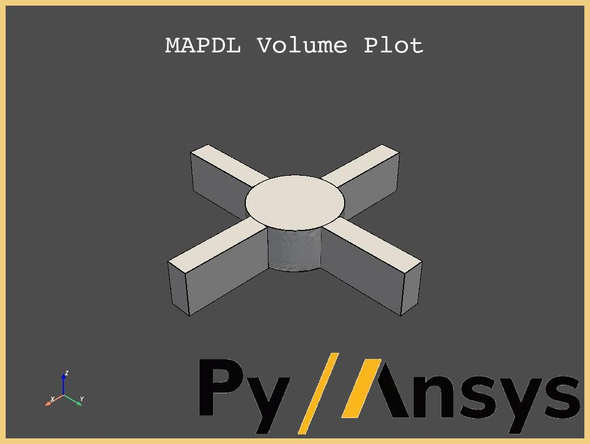

.. _executable_example:

===============================================
Create your own Python command line application
===============================================

This example shows how to create your own command line interface (CLI)
Python application which uses PyMAPDL to perform some simulations.
This usage is quite convenient when aiming to automate workflows.
One could build different PyMAPDL applications which can be called
from the CLI with different arguments.

Simulation configuration
========================

Using the following script called :download:`rotor.py <rotor.py>`
which calculates the first natural frequency of a simplied rotor with
a given number of blades and a specific material configuration, 
a command line interface is implemented.

.. literalinclude:: rotor.py

Converting a script to a Python application
===========================================

The above script needs to be converted to a Python application in order
to be used from the terminal.
In this case, this application uses a CLI to provide the options to PyMAPDL.
To specify the options, the package `Click <https://click.palletsprojects.com>`_
is used. Another suitable package is the builtin package
`argparse <https://docs.python.org/3/library/argparse.html>`_.

Firstly, we need to convert the script into a function.
This can be easily accomplished by using the input arguments
in a function signature. 
In our case, we want to specify the following arguments:

* ``n_blades``: Number of blades.
* ``blade_length``: Length of each blade.
* ``elastic_modulus``: Elastic modulus of the material.
* ``density``: Density of the material.

The function is then defined as:

.. literalinclude:: cli_rotor.py
   :lines: 4-7, 17-22

The value of these parameters are introduced by adding the following code
right before the function definition:

.. literalinclude:: cli_rotor.py
   :lines: 1-3,8-23

.. warning:: Note that the package *Click* uses decorators (`@click.XXX`), hence
   it is necessary you specify the *Click* commands right before the function definition.

In addition you need to add the call to the newly created function at the end
of the script in the following way:

.. literalinclude:: cli_rotor.py
   :lines: 109-

This ensure the new function is called when we are executing the Python script.

Now you can call your function from the command line using:

.. code:: bash

   $ python rotor.py 4
   Initializing script with values:
   Number of blades: 4
   Blade length: 0.2 m
   Elastic modulus: 200.0 GPa
   Density: 7850 Kg/m3
   Solving...
   The first natural frequency is 728.57 Hz.

Here ``4`` is the number of blades.
You can also input other arguments such as:

.. code:: bash

   $ python cli_rotor.py 4 --density 7000
   Initializing script with values:
   Number of blades: 4
   Blade length: 0.2 m
   Elastic modulus: 200.0 GPa
   Density: 7000 Kg/m3
   Solving...
   The first natural frequency is 771.54 Hz.

Advanced usage
==============

You can use these concepts to make Python create files with specific
results that can be later used in other applications.

Post-processing images using ImageMagick
----------------------------------------

For example, you could create an image with PyMAPDL by adding the following
code to the ``rotor.py`` file:

.. code:: python

   mapdl.vplot(savefig="volumes.jpg")

and use `ImageMagick <https://www.imagemagick.org>`_ to add a frame:

.. code:: bash

   mogrify -mattecolor white -frame 10x10 volumes.jpg

and a watermark:

.. code:: bash

   COMPOSITE=/usr/bin/composite
   $COMPOSITE -gravity SouthEast watermark.jpg volumes.jpg volumes_with_watermark.jpg

where ``-gravity`` is the location of the watermark is case of the watermark is smaller
than the image, ``COMPOSITE`` is the path to the ImageMagick ``composite`` function,
``watermark.png`` is the watermark image, and ``volumes_with_watermark.jpg`` is
the output file.

The final results should look like:

   Volumes image with watermark

Usage on the cloud
------------------

You can also use this concept to deploy your own apps to the cloud.

For example, you can execute the previous example on a GitHub runner
using the following approach (non-tested):

.. code:: yaml
  
   my_job:
      name: 'Generating watermarked images'
      runs-on: ubuntu-latest

      steps:
         - name: "Install Git and checkout project"
           uses: actions/checkout@v3

         - name: "Setup Python"
           uses: actions/setup-python@v4

         - name: "Install ansys-mapdl-core"
           run: |
               python -m pip install ansys-mapdl-core
         
         - name: "Install ImageMagic"
           run: |
            sudo apt install imagemagick

         - name: "Generating images with PyMAPDL"
           run: |
            python rotor.py 4 --density 7000

         - name: "Post processing images"
           run: |
              COMPOSITE=/usr/bin/composite
              mogrify -mattecolor white -frame 10x10 volume.jpg
              $COMPOSITE -gravity SouthEast watermark.jpg volumes.jpg volumes_with_watermark.jpg

Additional files
================

You can download the example files from the following links:

* Original :download:`rotor.py <rotor.py>` script
* Application :download:`cli_rotor.py <cli_rotor.py>` script