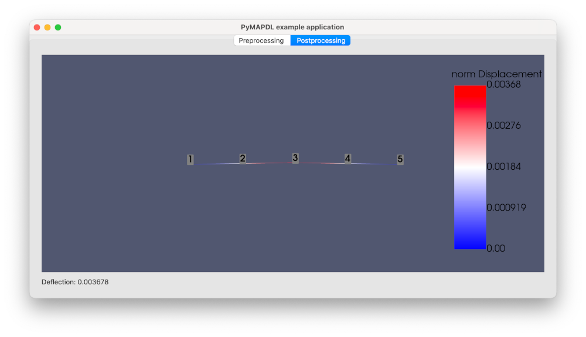

.. _gui_example:

=======================================
Create a GUI app in Python with PySide6
=======================================

This example shows how to create a graphical user interface (GUI) app in Python that uses PyMAPDL to compute the deflection of a square beam.

Application layout
==================

The :download:`gui_app.py <gui_app.py>` script launches a graphical app using PySide6.

The **Preprocessing** tab contains input fields for Poisson's ratio, Young modulus, beam length, and a number of simulation nodes.

.. image:: final_app_preprocessing.png

The **Postprocessing** tab shows the deformation plot.

Add a PyVista plotting frame to the window
==========================================

Start by importing the `QtInteractor <https://qtdocs.pyvista.org/api_reference.html#qtinteractor>`_
class from the `pyvistaqt <https://github.com/pyvista/pyvistaqt>`_ package and
the :class:`MapdlTheme <ansys.mapdl.core.plotting.theme.MapdlTheme>`
class from the `ansys-mapdl-core <pymapdl_repo_>`_ package:

.. code:: python

    from pyvistaqt import QtInteractor
    from ansys.mapdl.core import MapdlTheme

Then, add a plotter on the first tab:

.. vale off

.. code:: python

    def _setup_tab_preprocessing(self) -> None:
        ...
        # PyVista frame in the window
        self._preprocessing_plotter = QtInteractor(theme=MapdlTheme())
        container_layout.addWidget(self._preprocessing_plotter, 0, 4, 6, 50)

.. vale on

Add another plotter on the second tab:

.. code:: python

    def _setup_tab_postprocessing(self) -> None:
        ...
        self._postprocessing_plotter = QtInteractor(theme=MapdlTheme())
        container_layout.addWidget(self._postprocessing_plotter)

The plotter can be updated with a PyMAPDL plotter object as follow:

.. code:: python

    # Getting PyMAPDL plotter object
    nodal_disp_plotter = self._mapdl.post_processing.plot_nodal_displacement(
        "norm", show_node_numbering=True, cpos="xy", return_plotter=True
    )

    # Updating widget
    self._postprocessing_plotter.GetRenderWindow().AddRenderer(
        nodal_disp_plotter.scene.renderer
    )

Finally, make sure to correctly close the VTK widgets when closing the app:

.. code:: python

    def closeEvent(self, event) -> None:
        self._preprocessing_plotter.close()
        self._postprocessing_plotter.close()
        event.accept()  # let the window close

Launch an MAPDL instance in your window
=======================================

In this example, the MAPDL instance is launched outside the ``MainWindow`` object,
and it passed to it as an argument.

.. code:: python

    if __name__ == "__main__":
        app = QApplication(sys.argv)
        mapdl = launch_mapdl()
        window = MainWindow(mapdl)
        window.show()
        sys.exit(app.exec())

The ``MainWindow`` object stores the :class:`Mapdl <ansys.mapdl.core.mapdl.MapdlBase>` object internally:

.. code:: python

    class MainWindow(QMainWindow):
        def __init__(self, mapdl: Mapdl, parent=None) -> None:
            super().__init__(parent)
            self._mapdl = mapdl
            self._setup_ui()

Simulation setup
================

The model is built in ``build_model`` method:

.. literalinclude:: gui_app.py
    :lines: 189-216

And solved in ``run_solver``:

.. literalinclude:: gui_app.py
    :lines: 218-246

Develop the logic
=================

Connect each button to a function that contains the logic:

.. vale off

.. code-block:: python
    :emphasize-lines: 5

    def _setup_tab_preprocessing(self) -> None:
        ...
        # Solve button
        self._solve_button = QPushButton(text="Solve")
        self._solve_button.clicked.connect(self.run_solver)
        container_layout.addWidget(self._solve_button, 5, 0, 1, 3)
        ...

.. vale on

Run the app
===========

You can run the app as a normal python script:

.. code:: console

    $ python gui_app.py

Additional files
================

The example files can be downloaded using this link:

* :download:`gui_app.py <gui_app.py>`: Complete Python script.
* :download:`requirements.txt <requirements.txt>`: Python libraries requirements.
