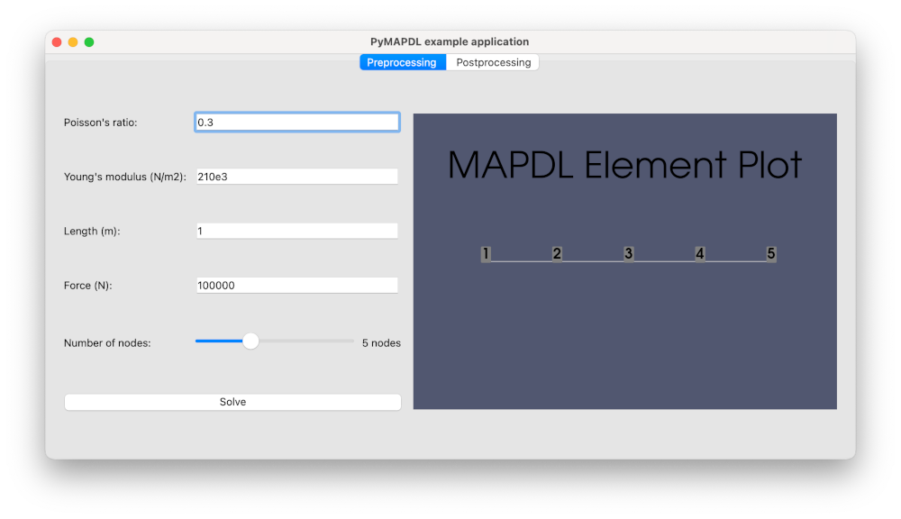

.. _gui_example:

=======================================
Create a GUI app in Python with PySide6
=======================================

This example shows how to create a graphical user interface (GUI) app in Python that uses PyMAPDL to compute the deflection of a square beam.

Simulation setup
================

The :download:`gui.py <gui.py>` script launches a graphical app using PySide6.
The **Preprocessing** tab contains input fields for Poisson's ratio, Young modulus, beam length, and a number of simulation nodes.

.. image:: base_app.png

Add a PyVista plotting frame in the window
==========================================

Start by importing the `QtInteractor <https://qtdocs.pyvista.org/api_reference.html#qtinteractor>`_ class from the ``pyvistaqt`` package and the :class:`MapdlTheme <ansys.mapdl.core.theme.MapdlTheme>` class from the ``ansys-mapdl-core`` package:

.. code:: python

    from pyvistaqt import QtInteractor
    from ansys.mapdl.core import MapdlTheme

Then, add a plotter on the first tab:

.. code:: python

    def _setup_tab_preprocessing(self) -> None:
        ...
        container_layout.addWidget(self._run_preprocessor_button, 5, 0, 1, 3)

        # PyVista frame in the window
        self._preprocessing_plotter = QtInteractor(theme=MapdlTheme())
        container_layout.addWidget(self._preprocessing_plotter, 0, 4, 6, 50)

Add another plotter on the second tab:

.. code:: python

    def _setup_tab_postprocessing(self) -> None:
        container_layout = QtWidgets.QVBoxLayout()
        self._tab_postprocessing.setLayout(container_layout)
        self._postprocessing_plotter = QtInteractor(theme=MapdlTheme())
        container_layout.addWidget(self._postprocessing_plotter)
        self._deflection_label = QLabel("Deflection: ")
        container_layout.addWidget(self._deflection_label)

Finally, make sure to correctly close the VTK widgets when closing the app:

.. code:: python

    def closeEvent(self, event) -> None:
        self._preprocessing_plotter.close()
        self._postprocessing_plotter.close()
        event.accept()  # let the window close

Launch an MAPDL instance in your window
=======================================

Add an attribute to your MainWindow for the MAPDL instance and import the ``launch_mapdl`` package.

.. literalinclude:: gui_app.py
    :lines: 19, 22-26, 231-236

Develop the logic
=================

Connect each button to a function that contains the logic:

.. code-block:: python
    :emphasize-lines: 5,14

    def _setup_tab_preprocessing(self) -> None:
        ...
        # Button to run the preprocessor
        self._run_preprocessor_button = QPushButton(text="Run preprocessor")
        self._run_preprocessor_button.clicked.connect(self._run_preprocessor)
        ...

    def _setup_tab_solver(self) -> None:
        container_layout = QGridLayout()
        self._tab_solver.setLayout(container_layout)

        self._solve_button = QPushButton(text="Solve")
        self._solve_button.clicked.connect(self._run_solver)

        container_layout.addWidget(self._solve_button)

You can now write the related functions:

.. literalinclude:: gui_app.py
    :lines: 137-223

.. image:: final_app_solver.png

.. image:: final_app_postprocessing.png

Additional files
================

The example files can be downloaded using these links:

* Original :download:`gui.py <gui.py>` script
* Original :download:`gui_app.py <gui_app.py>` script
