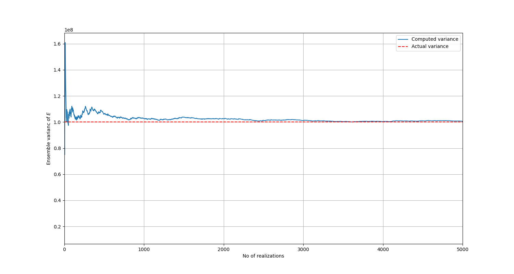

.. _stochastic_fem_example:

Stochastic finite element method with PyMAPDL
=============================================

This example leverages PyMAPDL for stochastic finite element method (SFEM) analysis using the Monte Carlo simulation.
This extended example demonstrates numerous advantages and workflow possibilities that PyMAPDL
provides. It explains important theoretical concepts before presenting the example.

Introduction
------------
Often in a mechanical system, system parameters (such as geometry, materials, and loads) and response parameters
(such as displacement, strain, and stress) are taken to be deterministic. This simplification, while sufficient for a
wide range of engineering applications, results in a crude approximation of actual system behavior.

To obtain a more accurate representation of a physical system, it is essential to consider the randomness
in system parameters and loading conditions, along with the uncertainty in their estimation and their
spatial variability. The finite element method is undoubtedly the most widely used tool for solving deterministic
physical problems today. To account for randomness and uncertainty in the modeling of engineering systems,
the SFEM was introduced.

SFEM extends the classical deterministic finite element approach
to a stochastic framework, offering various techniques for calculating response variability. Among these,
Monte Carlo simulation (MCS) stands out as the most prominent method. Renowned for its versatility and
ease of implementation, MCS can be applied to virtually any type of problem in stochastic analysis.

Random variables versus stochastic processes
--------------------------------------------
This section explains how random variables and stochastic processes differ. Because these
concepts are used for modeling the system randomness, explaining them is important. Random variables are easier to
understand from elementary probability theory, which isn't the case for stochastic processes. If the following
explanations are too brief, consult books on SFEM. Both [1]_ and [2]_ are recommended resources.

Random variables
~~~~~~~~~~~~~~~~
**Definition:** A random variable is a rule for assigning to every possible outcome :math:`\theta` of an experiment a
number :math:`X(\theta)`. For notational convenience, the dependence on :math:`\theta` is usually dropped and the
random variable is written as :math:`X`.

Practical example
+++++++++++++++++
Imagine a beam with a concentrated load :math:`P` applied at a specific point. The value of :math:`P`
is uncertain. It could vary due to manufacturing tolerances, loading conditions, or measurement errors. Here is a mathematical representation:

.. math:: P : \Theta \longrightarrow \mathbb{R}

In the preceding equation, :math:`\Theta` is the sample space of all possible loading scenarios, and :math:`\mathbb{R}` represents the set of
possible load magnitudes. For example, :math:`P` could be modeled as a random variable with a probability density
function (PDF):

.. math:: f_P(p) = \frac{1}{\sqrt{2\pi\sigma^2}}e^{-\frac{(p-\mu)^2}{2\sigma^2}},

Here :math:`\mu` is the mean load, and :math:`\sigma^2` is its variance.

Stochastic processes
~~~~~~~~~~~~~~~~~~~~
**Definition:**
Recall that a random variable is defined as a rule that assigns a number :math:`X` to every outcome :math:`\theta`
of an experiment. However, in some applications, the experiment evolves with respect to a deterministic parameter :math:`t`,
which belongs to an interval :math:`I`. For example, this occurs in an engineering system subjected to random dynamic loads
over a time interval :math:`I \subseteq \mathbb{R}^+`. In such cases, the system's response at a specific material point is
described not by a single random variable but by a collection of random variables :math:`\{X(t)\}` indexed by :math:`t \in I`. 

This `infinite` collection of random variables over the interval :math:`I` is called a stochastic process and is denoted as
:math:`\{X(t), t \in I\}` or simply :math:`X`. In this way, a stochastic process generalizes the concept of a random variable
as it assigns to each outcome :math:`\theta` of the experiment a function :math:`X(t, \theta)`, known as a realization or sample
function. Lastly, if :math:`X` is indexed by some spatial coordinate :math:`s \in D \subseteq \mathbb{R}^n` rather than time :math:`t`,
then :math:`\{X(s), s \in D\}` is called a random field.

Practical example
+++++++++++++++++
Consider the material property of the beam, such as Young's modulus :math:`E(x)`, which may vary randomly along
the length of the beam :math:`x`.  Instead of being a single random value, :math:`E(x)` is a random field. Its value
is uncertain at each point along the domain, and it changes continuously across the beam. Mathematically, :math:`E(x)`
is a random field:

.. math:: E(x) : x \in [0,L] \longrightarrow \mathbb{R}

Here:

* :math:`x` is the spatial coordinate along the length of the beam (:math:`x \in [0,L]`).
* :math:`E(x)` is a random variable at each point :math:`x`, and its randomness is described
  by a covariance function or an autocorrelation function.

For example, :math:`E(x)` could be a Gaussian random field, in which case it has the stationarity
property, making its statistics completely defined by its mean (:math:`\mu_E`), standard deviation
(:math:`\sigma_E`), and covariance function :math:`C_E(x_i,x_j)`. This `stationarity` simply means
that the mean and standard deviation of every random variable :math:`E(x)` is constant and equal to
:math:`\mu_E` and :math:`\sigma_E` respectively. :math:`C_E(x_i,x_j)` describes how random variables
:math:`E(x_i)` and :math:`E(x_j)` are related. For a zero-mean Gaussian random field, the covariance function is given by
this equation:

.. math:: C_E(x_i,x_j) = \sigma_E^2e^{-\frac{\lvert x_i-x_j \rvert}{\ell}}

Here :math:`\sigma_E^2` is the variance, and :math:`\ell` is the correlation length parameter.

To aid understanding, the figure following diagram depicts two equivalent ways of visualizing a
stochastic process or random field, that is, as an infinite collection of random variables or as a
realization or sample function assigned to each outcome of an experiment.

.. figure:: realizations.png

   A random field :math:`E(x)` viewed as a collection of random variables or as realizations.

.. note::
  The concepts in the preceding topics generalize to more dimensions, for example, a random vector instead of a random
  variable, or an :math:`\mathbb{R}^d`-valued stochastic process. A detailed discussion of these generalizations can be
  found in [1]_ and [2]_.

Series expansion of stochastic processes
----------------------------------------
Since a stochastic process involves an infinite number of random variables, most engineering applications
involving stochastic processes are mathematically and computationally intractable if there isn't a way of
approximating them with a series of a finite number of random variables. The next topic explains
the series expansion method used in this example.

Karhunen-Loève (K-L) series expansion for a Gaussian process
~~~~~~~~~~~~~~~~~~~~~~~~~~~~~~~~~~~~~~~~~~~~~~~~~~~~~~~~~~~~
The K-L expansion of any process is based on a spectral decomposition of its covariance function. Analytical
solutions are possible in a few cases, and such is the case of a Gaussian process.

For a zero-mean stationary Gaussian process, :math:`X(t)`, with covariance function
:math:`C_X(t_i,t_j)=\sigma_X^2e^{-\frac{\lvert t_i-t_j \rvert}{b}}` defined on a symmetric domain :math:`\mathbb{D}=[-a,a]`,
the K-L series expansion is given by this equation:

.. math:: X(t) = \sum_{n=1}^\infty \sqrt{\lambda_{c,n}}\cdot\varphi_{c,n}(t)\cdot\xi_{c,n} + \sum_{n=1}^\infty \sqrt{\lambda_{s,n}}\cdot\varphi_{s,n}(t)\cdot\xi_{s,n},\quad t\in\mathbb{D}
   :label: K-L expansion

The terms in the first summation are given by

.. math:: 
   :label: cosine terms

   \lambda_{c,n} = \frac{2b}{1+\omega_{c,n}^2\cdot b^2},\quad \varphi_{c,n}(t) = k_{c,n}\cos(\omega_{c,n}\cdot t)

   k_{c,n} = \frac{1}{\sqrt{a+\frac{\sin(2\omega_{c,n}\cdot a)}{2\omega_{c,n}}}}

In the preceding terms, :math:`\omega_{c,n}` is obtained as the solution of

.. math:: \frac{1}{b} - \omega_{c,n}\cdot\tan(\omega_{c,n}\cdot a) = 0 \quad \text{in the range} \quad \biggl[(n-1)\frac{\pi}{a}, (n-\frac{1}{2})\frac{\pi}{a}\biggr]
   :label: cosine equation

The terms in the second summation are given by

.. math:: 
   :label: sine terms

   \lambda_{s,n} = \frac{2b}{1+\omega_{s,n}^2\cdot b^2},\quad \varphi_{s,n}(t) = k_{s,n}\sin(\omega_{s,n}\cdot t)
 
   k_{s,n} = \frac{1}{\sqrt{a-\frac{\sin(2\omega_{s,n}\cdot a)}{2\omega_{s,n}}}}

In the preceding terms, :math:`\omega_{s,n}` is obtained as the solution of

.. math:: \frac{1}{b}\cdot\tan(\omega_{s,n}\cdot a) + \omega_{s,n} = 0 \quad \text{in the range} \quad \biggl[(n-\frac{1}{2})\frac{\pi}{a}, n\frac{\pi}{a}\biggr]
   :label: sine equation

It is worth mentioning that :math:`\lambda` and :math:`\omega` in the series expansion are referred to as eigenvalue and frequency respectively.

.. note::
  In the case of an asymmetric domain, such as :math:`\mathbb{D}=[-t_{min},t_{max}]`, a shift parameter :math:`T = (t_{min}+t_{max})/2` is required and the corresponding
  symmetric domain becomes defined by this equation:

  .. math:: D' = D - T = \biggl[\frac{t_{min}-t_{max}}{2}, \frac{t_{max}-t_{min}}{2} \biggr]

  The series expansion is then defined by this equation:

  .. math:: X(t) = \sum_{n=1}^\infty \sqrt{\lambda_{c,n}}\cdot\varphi_{c,n}(t-T)\cdot\xi_{c,n} + \sum_{n=1}^\infty \sqrt{\lambda_{s,n}}\cdot\varphi_{s,n}(t-T)\cdot\xi_{s,n},\quad t\in\mathbb{D}

The K-L expansion of a Gaussian process has the property that :math:`\xi_{c,n}` and :math:`\xi_{s,n}` are independent
standard normal variables, that is they follow the :math:`\mathcal{N}(0,1)` distribution. Another property is
that :math:`\lambda_{c,n}` and :math:`\lambda_{s,n}` converge to zero fast (in the mean square sense). For practical implementation,
this means that the infinite series of the K-L expansion is truncated after a finite number of terms, giving the approximation:

.. math:: X(t) \approx \hat{X}(t) = \sum_{n=1}^P \sqrt{\lambda_{c,n}}\cdot\varphi_{c,n}(t)\cdot\xi_{c,n} + \sum_{n=1}^Q \sqrt{\lambda_{s,n}}\cdot\varphi_{s,n}(t)\cdot\xi_{s,n}
   :label: approximation

Equation :math:numref:`approximation` is computationally feasible to handle. A summary of how to use it to generate realizations of :math:`X(t)` follows:

1. To generate the j-th realization, draw a random value for each :math:`\xi_{c,n}, n=1,\dots ,P, \quad \xi_{s,n}, n=1,\dots ,Q` from the standard
   normal distribution :math:`\mathcal{N}(0,1)` and obtain :math:`\xi_{c,1}^j,\dots ,\xi_{c,P}^j, \quad \xi_{s,1}^j,\dots ,\xi_{s,P}^j`

2. Insert these values into equation :math:numref:`approximation` in other to obtain the j-th realization:

.. math:: \hat{X}^j(t) = \sum_{n=1}^P \sqrt{\lambda_{c,n}}\cdot\varphi_{c,n}(t)\cdot\xi_{c,n}^j + \sum_{n=1}^Q \sqrt{\lambda_{s,n}}\cdot\varphi_{s,n}(t)\cdot\xi_{s,n}^j

3. To generate additional realizations, simply draw new random values for :math:`\xi_{c,n}, n=1,\dots ,P, \quad \xi_{s,n}, n=1,\dots ,Q` each from :math:`\mathcal{N}(0,1)`.

.. note::
  In this case of a field, the preceding discussion applies as the only difference is a change in notation (for example :math:`t` to :math:`x`).

Monte Carlo simulation
----------------------
For linear static problems in the context of FEM, the system equations that must be solved change. The well-known deterministic equation defined by:

.. math:: \pmb{K}\pmb{U} = \pmb{F}

changes to

.. math:: \pmb{K}(\pmb{\xi})\pmb{U}(\pmb{\xi}) = \pmb{F}(\pmb{\xi})

Here :math:`\pmb{\xi}` collects sources of system randomness. The Monte Carlo simulation for solving the preceding equation
consists of generating a large number of :math:`N_{sim}` of samples :math:`\pmb{\xi}, i=1,\dots ,N_{sim}` from their probability
distribution and for each of these samples solving the deterministic problem:

.. math:: \pmb{K}(\pmb{\xi}_{(i)})\pmb{U}(\pmb{\xi}_{(i)}) = \pmb{F}(\pmb{\xi}_{(i)})

The next step is to collect the :math:`N_{sim}` response vectors :math:`\pmb{U_i} := \pmb{U}(\pmb{\xi}_{(i)})` and perform a statistical
postprocessing to extract useful information such as mean value, variance, histogram, and
empirical PDF.

Problem description
-------------------
The following plane stress problem shows a two-dimensional cantilever structure under a point load.

.. figure:: problem.png

   A two-dimensional cantilever structure under a point load.

:math:`P` is a random variable following the Gaussian distribution :math:`\mathcal{N}(10,2)` (kN), and the modulus of elasticity is a
random field given by this expression:

.. math:: E(x) = 10^5(1+0.10f(x)) (kN/m^2)

Here :math:`f(x)` is a zero mean stationary Gaussian field with unit variance. The covariance function for :math:`f` is :math:`C_f(x_r,x_s)=e^{-\frac{\lvert x_r-x_s \rvert}{3}}`.

1. Using the K-L series expansion, generate 5000 realizations for :math:`E(x)` and perform Monte 
   Carlo simulation to determine the PDF of the response :math:`u`, at the bottom right corner 
   of the cantilever. 

2. If some design code stipulates that the displacement :math:`u` must not exceed :math:`0.2 \: m`, how confident can
   you be that the structure meets this requirement?

.. note::
  This example strongly emphasizes how PyMAPDL can help to supercharge workflows. At a very high level, subsequent topics
  use Python libraries to handle computations related to the stochasticity of the problem and use MAPDL to
  run the necessary simulations all within the comfort of a Python environment.

Evaluating the Young's modulus
~~~~~~~~~~~~~~~~~~~~~~~~~~~~~~
Code that allows representation of the zero-mean Gaussian field :math:`f` is implemented. This simply means solving 
the :math:numref:`cosine equation` and :math:numref:`sine equation` and then substituting calculated values into
:math:numref:`cosine terms` and :math:numref:`sine terms` to obtain the constant terms in those equations. The
number of retained terms :math:`P` and :math:`Q` in :math:numref:`approximation` can be automatically determined
by structuring the code to stop computing values when :math:`\lambda_{c,n}, \lambda_{s,n}` become lower than a
desired accuracy level. The implementation follows:

.. literalinclude:: sfem.py
  :language: python
  :lines: 23-202

The next step is to put this all together in a function that expresses the :math:`f` using the :math:numref:`approximation` equation:

.. literalinclude:: sfem.py
  :language: python
  :lines: 205-265

The function for evaluating the Young's modulus itself is straight forward:

.. literalinclude:: sfem.py
  :language: python
  :lines: 268-295

Realizations of the Young's modulus
+++++++++++++++++++++++++++++++++++
You can now generate sample realizations of the Young's modulus to see what they look like:

.. literalinclude:: sfem.py
  :language: python
  :lines: 298-348

.. figure:: young_modulus_realizations.png
   
   10 realizations of the Young's modulus depict randomness from one realization to another.

Verification of the implementation
++++++++++++++++++++++++++++++++++
You can compute the theoretical mean and variance of the Young's modulus and then use
them to verify the correctness of the implemented code.

For the mean:

.. math::
  :label: theoretical mean

  \mathbb{E}(E) = \mathbb{E}(10^5(1+0.10f))

  \mathbb{E}(E) = 10^5(1 + 0.1\mathbb{E}(f))

  \mathbb{E}(E) = 10^5(1 + 0.1(0)) = 10^5 \: kN/m^2

For the variance:

.. math::
  :label: theoretical variance

  Var(E) = \mathbb{E}(E^2) - [\mathbb{E}(E)]^2

  Var(E) = \mathbb{E}[10^{10}(1 + 0.2f + 0.01f^2)] - 10^{10}

  Var(E) = 10^{10}[1 + 0.2\mathbb{E}(f) + 0.01\mathbb{E}(f^2)] - 10^{10}

  Var(E) = 10^{10}[0.2(0) + 0.01(1)]

  Var(E) = 10^8 \: {kN}^2/m^4

It is expected that as the number of realizations increase indefinitely, the ensemble mean and
variance should converge towards theoretical values calculated in :math:numref:`theoretical mean` and :math:numref:`theoretical variance`.

Firstly, several realizations are generated. 5000 is enough, which is the same as the number of simulations to be run later on. Statistical processing
is then performed on these realizations.

.. literalinclude:: sfem.py
  :language: python
  :lines: 350-385

You can generate a plot of the mean versus the number of realizations:

.. literalinclude:: sfem.py
  :language: python
  :lines: 387-397

.. figure:: mean.png
   
   The mean converges to the true value as the number of realizations is increased.

You can also generate a plot of the variance versus the number of realizations:

.. literalinclude:: sfem.py
  :language: python
  :lines: 399-409

  The variance converges to the true value as the number of realizations is increased.

The preceding plots confirm that the implementation is correct. If you desire more accuracy, you can further decrease the minimum eigenvalue, but the value already chosen is sufficient.

Running the simulations
~~~~~~~~~~~~~~~~~~~~~~~
Focus now shifts to the PyMAPDL part of this example. Remember that the problem requires running 5000 simulations. Therefore,
you must write a workflow that performs these actions:

#. Create the geometry of the cantilever model.

#. Mesh the model. The following code uses the four-node PLANE182 elements.

#. For each simulation, generate one realization of :math:`E` and one sample of :math:`P`.

#. For each simulation, loop through the elements and for each element, use the generated 
   realization to assign the value of the Young's modulus. Also assign the load for each simulation.

#. Solve the model and store :math:`u` for each simulation.

.. note::
  One realization continuously varies with :math:`x`, but a plane stress element like PLANE182 can only have a constant
  Young's modulus assigned. Therefore, for an element whose :math:`x`-coordinates are between :math:`x_1` and :math:`x_2`, you can simply
  assign the average value of :math:`E` between these two values or assign the value of :math:`E` at the centroid. The later is
  chosen for this implementation. The method chosen becomes insignificant with a finer mesh as both methods should produce similar
  results.

This function implements the preceding steps:

.. literalinclude:: sfem.py
  :language: python
  :lines: 414-556

You can pass the required arguments to the defined function to run the simulations:

.. literalinclude:: sfem.py
  :language: python
  :lines: 559-569

Answering problem questions
~~~~~~~~~~~~~~~~~~~~~~~~~~~
To determine the PDF of the response :math:`u`, you can perform a statistical postprocessing of
simulation results:

.. literalinclude:: sfem.py
  :language: python
  :lines: 571-582

.. figure:: pdf.png

   The PDF of response :math:`u`.

To determine whether the structure meets the requirement of the design code, simply evaluate the
probability that the response :math:`u` is less than
:math:`0.2 \: m`:

.. literalinclude:: sfem.py
  :language: python
  :lines: 584-586

The computed probability is approximately 99%, which is a measure of how well the structure satisfies the design
requirement.

.. note::
   Splitting the overall implementation of this example into several functions lets you modify practically any aspect of the problem
   statement with minimal edits to the code for testing out other scenarios. For example, you can use a different structural geometry, mesh size, or loading condition.

Improve simulation speed using multi-threading
~~~~~~~~~~~~~~~~~~~~~~~~~~~~~~~~~~~~~~~~~~~~~~
One of the main drawbacks of MCS is the number of simulations required. In this example, 5000 simulations can take quite
some time to run on a single MAPDL instance. To speed things up, you can use the
:class:`~ansys.mapdl.core.pool.MapdlPool` class to run simulations across multiple
MAPDL instances:

.. literalinclude:: sfem.py
  :language: python
  :lines: 589-738

To run simulations over 10 MAPDL instances, call the preceding function with appropriate arguments:

.. literalinclude:: sfem.py
  :language: python
  :lines: 741-758

The simulations are completed much faster.

.. tip::
   In a local test, using the ``MapdlPool`` approach (with 10 MAPDL instances) takes about 38 minutes to run, while a single instance runs 
   for about 3 hours. The simulation speed depends on a multitude of factors, but this comparison provides an idea of the speed
   gain to expect when using multiple instances.

.. warning::
   Ensure there are enough licenses available to run multiple MAPDL instances concurrently. 

References
----------
.. [1] Ioannis Kalogeris, "Advanced surrogate modeling and machine learning methods in computational stochastic mechanics," PhD Dissertation 
.. [2] Dimitris G. Giovanis and Vissarion Papadopoulos, "Stochastic Finite Element Methods : An Introduction"

