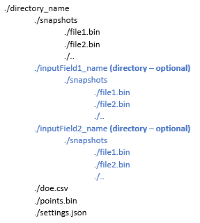

.. _static_rom_data_generation:

================================================================
Creating training data for a 3D Static reduced order model (ROM)
================================================================

This example how a parametric sweep may be run on and MAPDL model and the output displacement and
stress data exported into the format required to build a Static ROM with Ansys Twin Builder.

The general data structure for the ROM building is shown in Figure 1.

    
    **Figure 1: Organization of files and directories for static ROM creation.**

The specific files output by the example are shown below::
    
    ansys_pymadl_Static_ROM
    │
    ├───displacement
    │   │   doe.csv
    │   │   points.bin
    │   │   settings.json
    │   │
    │   └───snapshots
    │           file0.bin
    │           file1.bin
    │           file2.bin
    │           file3.bin
    │
    └───stress
        │   doe.csv
        │   points.bin
        │   settings.json
        │
        └───snapshots
                file0.bin
                file1.bin
                file2.bin
                file3.bin

MAPDL notch model
=================
This example uses the model created in :ref:`ref_3d_plane_stress_concentration` as a base. That
example was modified to add a nodal component, ``load_node``, to which the force is a applied. This
makes is simple to retrieve and modify the force scoping for parametric runs.

The model uses load force in Newtons as the input that is parametrically varied.

Additional packages used
========================

In addition to PyMAPDL, the example requires the following packages that should be installed be
running:

* `NumPy <https://numpy.org>`_ is used for using NumPy arrays.
* `PyPDF <dpf_core_docs_>`_ is used to efficiently manipulate result data.
* `PyTwin <pytwin_docs_>`_ is used convert result data to binary snapshots.

Core functions
==============

Solving the MAPDL parametric variations
---------------------------------------
The :func:`run_mapdl_variations` function solves the MAPDL model for a set of parameter variations.
It loads a saved MAPDL database and loops through a list of force values. For each value, it applies
that force to nodal component, solves the model and records the location of the result file, along
with the parameter names and values.

.. literalinclude:: static_rom_data_generation.py
    :language: python
    :pyobject: run_mapdl_variations

Exporting ROM data for the solved variations
--------------------------------------------
The :func:`export_static_ROM_data` function is used to export the ROM data from a set of solved
parametric variations. The function loads each results file into DPF and gets the scoping. It then
calls the :func:`export_static_ROM_variation` function to export the ROM data for that result file.
The ``new_metadata`` Boolean is set to ``True`` on the first loop to trigger the creation of the
``points.bin`` and ``settings.json`` files and a new ``doe.csv`` file.

The :func:`pytwin.write_binary` function is used to write the result field data a ROM binary file.

.. literalinclude:: static_rom_data_generation.py
    :language: python
    :pyobject: export_static_ROM_data

Exporting ROM data for a specific variation
-------------------------------------------
The :func:`export_static_ROM_variation` function is used to export ROM snapshot data for a specific
parametric variation. The function exports a snapshot for ``displacement`` and for ``stress`` to 
correspondingly named folders and records the snapshot name and parameter data to the ``doe.csv``
file in that folder. 

The results are sorted by the scoping IDs to ensure consistent ordering of results and points.

The ``new_metadata`` Boolean controls the creation of the ``points.bin`` and ``settings.json`` files
and a new ``doe.csv`` file. If it is ``False``, the first two files are not written and parameter
data is appended to the existing ``doe.csv`` file.

.. literalinclude:: static_rom_data_generation.py
    :language: python
    :pyobject: export_static_ROM_variation

Additional functions
====================

Setting the export scope
------------------------
The ROM data is exported on all nodes connected to elements. The :func:`get_scoping` function gets
the nodes that are connected to all the elements in the mesh. This avoids including any unconnected
nodes, with null values, in the scoping.

The returned scoping initially contains duplicate node IDs, since a node can be connected to
multiple elements and is included once for each one. Creating a Python :type:`set` of node IDs removes the
duplicates.

.. literalinclude:: static_rom_data_generation.py
    :language: python
    :pyobject: get_scoping

Write points coordinates file
-----------------------------
:func:`write_points` writes the x,y,z coordinates of the scoped nodes to the ROM ``points.bin`` file
using :func:`pytwin.write_binary`.

.. literalinclude:: static_rom_data_generation.py
    :language: python
    :pyobject: write_points

Write ROM settings
------------------
:func:`write_settings` writes the ROM ``settings.json`` file. This records information about the
field dimensionality (scalar, vector, tensor), result name, unit, whether it represent a deformation
etc. The full file specification is available in the Twin Builder Static ROM Builder documentation.

The original node numbers from export scoping are compressed and stored in the ``ids`` field.

.. literalinclude:: static_rom_data_generation.py
    :language: python
    :pyobject: write_settings

Compress ID list
----------------
The ``settings.json`` specification allows the storage of lists of consecutive integers in a
compressed fashion. :func:`compress_id_list` implements this compression.

Runs of three or more incrementally increasing values are replaced by a sequence of
``start, -1, end``.

.. literalinclude:: static_rom_data_generation.py
    :language: python
    :pyobject: compress_id_list

Running the script
====================

To run the script, install PyMAPDL and the additional dependencies listed in
`Additional packages used`_, then download and run
:download:`static_rom_data_generation.py <static_rom_data_generation.py>`. The ROM data is stored in
a folder called ``ansys_pymadl_Static_ROM`` in the system temporary folder.

Script assumptions and modification ideas
=========================================

Local execution
---------------
The scripts assumes that both the MAPDL solving and DPF export are performed locally on the same 
machine as the Python script execution.

See :ref:`ref_dpf_basic_example` for potential modification options.

Additional result types
-----------------------
The script exports ``stress`` and ``displacement`` results. Additional result types may be included
or excluded by modifying :func:`export_static_ROM_variation`.

For example elastic strain could be added by making these changes to
:func:`export_static_ROM_variation`:

.. code-block:: python
   :lineno-start: 180

    # Modify this section to export additional result types
    is_deformation = False
    if name == "displacement":
        result = model.results.displacement
        is_deformation = True
    elif name == "stress":
        result = model.results.stress
    # Add additional quantities here
    elif name == "elastic_strain":
        result = model.results.elastic_strain
    else:
        raise ValueError(f"Unsupported result type: {name}")

Modifying result scoping
------------------------
The script exports results on all nodes that are connected to elements. This does not account for
nodes that are connected to elements, but do not have results associated with them. For example
MPC184 pilot nodes would not usually have a stress result. The script also does not allow scoping 
component.

The :func:`get_scoping` could be modified to allow broader scoping options.

Modifying settings
------------------
The ``settings.json`` files generated by :func:`write_settings` implicitly assume SI units
(``unitFactor`` is a scaling factor from SI units) and do not include any information about unit
dimensions. For example, for displacement use:

.. code-block:: python

    "unitDimension": {"length": 1.0}

or for stress use:
    
.. code-block:: python

    "unitDimension": {"mass": 1.0, "length": -1.0, "time": -2.0}

Logic could be added to check the model units and change the ``unitDimension`` and ``unitFactor``
fields accordingly. This information is not used to build the ROM, but may be used when consuming
it in downstream applications.

If results are included on nodal components, these can be referenced in the ``namedSelections``
field. Each entry consists of a name and the indices of the scoped nodes in the overall scoping (not
node IDs). :func:`compress_id_list` can be used to compress long lists of nodes.

For example to add a named selection called ``first_nodes`` on the first one hundred scoped nodes
and another called ``second_nodes`` to the fiftieth to one hundred and fiftieth nodes, you would add
this:

.. code-block:: python

    namedSelections: {"first_nodes": [0, -1, 99], "first_nodes": [49, -1, 149]}
