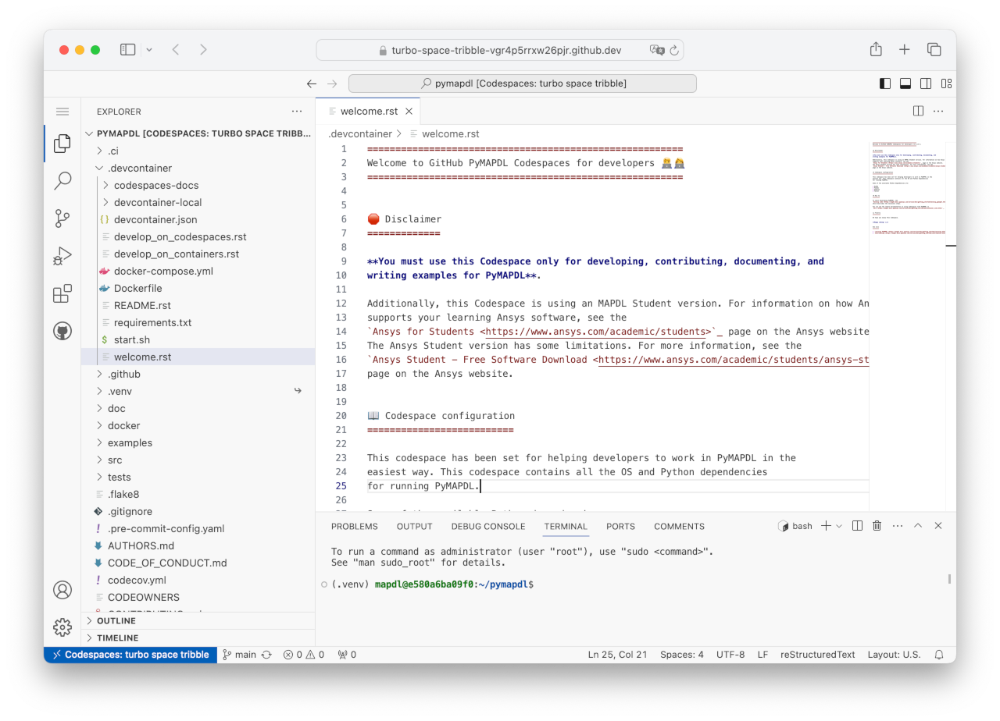

.. _develop_on_codespaces:

Develop on Codespaces
=====================

`Codespaces <codespaces_features_>`_ is a virtual development environment provided by GitHub.
You can launch a container with all the required tools and start to work
in couple of minutes.
This is an easy way to get started with PyMAPDL development without going
through the process of setting up your environment.

.. warning::
   `Codespaces <codespaces_features_>`_  are not free, but they have a generous
   free allowance per month.
   After that, you must pay according to `GitHub pricing <github_pricing_>`_.
   You can see your billing details in your *GitHub account settings* under
   *Billing and plans* and *Plans and usage*.

How to start
------------

To start a Codespace environment, go to the
`PyMAPDL repository <pymapdl_repo_>`_, click the green **Code** button,
and select the **Codespaces** tab.
Then, click the **+** button to open a default Codespace environment.

Alternatively, you can click the menu button and then select
**New with options**.

The next window shows you the configuration form. You can set these options: **Branch**,
**Dev container configuration**, **Region**, and **Machine type**.

The **Branch** option sets the PyMAPDL GitHub branch to load the configuration from.
The **Dev container configuration** option sets the Codespaces configuration.

Currently, there are three main configurations:

* :ref:`PyMAPDL-Codespaces-Developer <ref_codespaces_dev_welcome>`.
  This is the default configuration. It contains the OS and Python dependencies
  to develop and test PyMAPDL. For instance, it has ``xvfb``
  and ``pytest`` packages installed for testing.

  |Open a GitHub Codespaces for developers-light|
  |Open a GitHub Codespaces for developers-dark|
  

* :ref:`PyMAPDL-Codespaces-Documentation <ref_codespaces_docs_welcome>`.
  This configuration is specially set for people working with the documentation or examples. Thus,
  it includes the appropriate OS and Python dependencies.
  For instance, it includes ``sphinx`` and ``latex`` packages for building the documentation
  as HTML and PDF outputs.

  |Open a GitHub Codespaces for documentation-light|
  |Open a GitHub Codespaces for documentation-dark|

* `PyMAPDL-DevContainer (Local) <pymapdl_codespaces_welcome_local_>`_ **[NOT RECOMMENDED]**. This is the
  configuration for launching a development container locally.
  This container is similar to the preceding configurations,
  but it is for use locally together with Visual Studio Code. Thus,
  you **must not** select it when creating your Codespaces environment.
  To get more information on how to launch a development container locally,
  see :ref:`develop_on_remote_containers`.

Lastly, the **Machine type** option allows you to choose the specifications of
the machine hosting the Codespace. The amount of your Codespace allowance
(free or paid) that consumed is proportional to the power of your machine.

.. warning::

   If you choose **New with options**, building the Codespaces environment
   might take longer (up to five minutes) than if you choose the default configuration.

How to use
==========

The usage of a in-browser Codespaces is very simple if you are
familiar with Visual Studio Code.
For example, you can create, edit, and delete files, or you can install extensions.
You can do many of the things you can do in a Visual Studio Code instance
installed locally. However, there are some limitations which are detailed in
:ref:`Limitations <codespaces_limitations>`.

   PyMAPDL GitHub Codespaces environment

How to connect to an already existing instance
==============================================

You can go to the PyMAPDL repository, click the **Code** button and **Codespaces** tab,
and then select the machine that you want to connect to.

You can access to the full list of your Codespaces (PyMAPDL or not) in your 
`personal Codespaces page <codespaces_personal_page_>`_.
There you can start, stop, delete, or configure each Codespace, independently of the repository
that created that Codespace.

You can also connect to your Codespaces from your local IDE by opening the Codespace
**Command palette** (:kbd:`Ctr/⌘` + :kbd:`Shift` + :kbd:`P`) and selecting
**Open in** and the name of your IDE.

How to stop or delete an instance
=================================

When you are not working with the Codespace virtual machine, you should stop it so you are not billed
for that time. You can stop the Codespace from the **Command palette**
(:kbd:`Ctr/⌘` + :kbd:`Shift` + :kbd:`P`) and then search for ``Stop current Codespace``.

.. warning:: If you close your browser window (by mistake or not), **your Codespace is still running**.
   You can access it again from the PyMAPDL repository, by clicking the green **Code**
   button and then the **Codespaces** tab. You should see a list of your current (active and stopped)
   PyMAPDL Codespace machines, where you can select the one that you want to connect to, stop or delete.

When you have finished to work with the Codespace virtual machine and you want to delete it, you can do it from 
your `personal Codespaces page <codespaces_personal_page_>`_, clicking on the more button (**. . .**) of
the machine you want to dispose, and then clicking on **Delete**.
Alternatively, you can delete them from the **Codespaces** tab under the **Code** button
in PyMAPDL repository. There you can see the running virtual machines and stop or delete
the one you prefer.

.. _codespaces_limitations:

Limitations
===========

* Codespaces does not allow opening windows for plotting. However, you can plot to a file
  and then open it from the **File explorer** tab.

* Rendering HTML pages can be a bit difficult in Codespaces. For that reason,
  :ref:`PyMAPDL-Codespaces-Documentation <ref_codespaces_docs_welcome>` includes some script
  helpers that start and stop a web server for the built documentation.
  For more information visit, :ref:`PyMAPDL-Codespaces-Documentation <ref_codespaces_docs_welcome>`.

* When you open a Codespace from your local IDE, you might lose some configuration.
  For instance, you might find yourself in a different working directory, or you might see that the
  Python virtual environment is not properly activated.

.. Images

.. |Open a GitHub Codespaces for developers-light| image:: https://img.shields.io/badge/-Open%20GitHub%20Codespace-333?style=flat-square&logo=github
   :target: https://codespaces.new/ansys/pymapdl?quickstart=1&devcontainer_path=.devcontainer%2Fdevcontainer.json
   :class: only-light

.. |Open a GitHub Codespaces for developers-dark| image:: https://img.shields.io/badge/-Open%20GitHub%20Codespace-ffffff?style=flat-square&logo=github&logoColor=000000
   :target: https://codespaces.new/ansys/pymapdl?quickstart=1&devcontainer_path=.devcontainer%2Fdevcontainer.json
   :class: only-dark

.. |Open a GitHub Codespaces for documentation-light| image:: https://img.shields.io/badge/-Open%20GitHub%20Codespace-333?style=flat-square&logo=github
   :target: https://codespaces.new/ansys/pymapdl?quickstart=1&devcontainer_path=.devcontainer%2Fcodespaces-docs%2Fdevcontainer.json
   :class: only-light

.. |Open a GitHub Codespaces for documentation-dark| image:: https://img.shields.io/badge/-Open%20GitHub%20Codespace-ffffff?style=flat-square&logo=github&logoColor=000000
   :target: https://codespaces.new/ansys/pymapdl?quickstart=1&devcontainer_path=.devcontainer%2Fcodespaces-docs%2Fdevcontainer.json
   :class: only-dark
