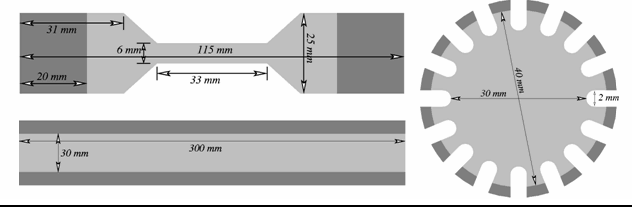
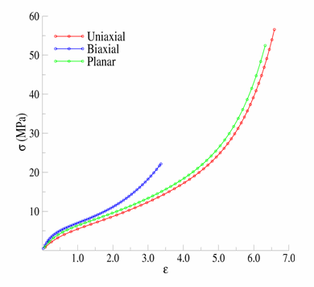
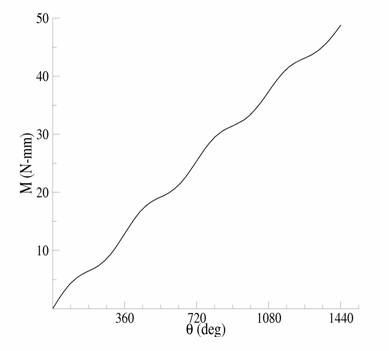
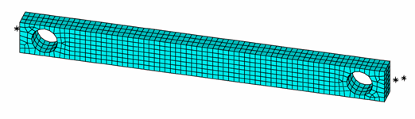
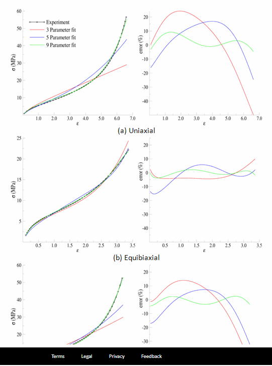
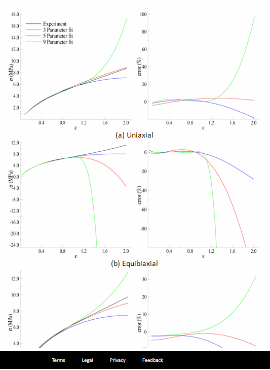
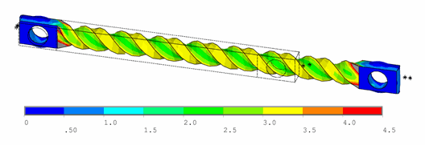
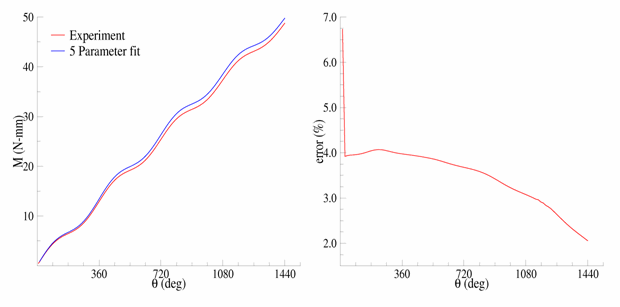

Technology Showcase Example 15: Calibrating and Validating a Hyperelastic Constitutive Model
----------------------------------------------------------------------------------------------

This example problem demonstrates the hyperelastic curve-fitting capabilities used to select constitutive model
parameters to fit experimental data. Several issues that influence the accuracy of the curve fit are discussed.
Validation of the resulting constitutive model is demonstrated by comparison with a
tension-torsion experiment.

The following topics are available:

*  `15.1. Introduction`_
*  `15.2. Problem Description`_
*  `15.3. Material Properties`_
*  `15.4. Analysis and Solution Controls`_
*  `15.5. Results and Discussion`_
*  `15.6. Recommendations`_
*  `15.7. References`_
*  `15.8. Input Files`_
   You can also perform this example analysis entirely in the Ansys
   Mechanical Application. For more information, see _Calibrating and Validating a Hyperelastic Constitutive Model in the Workbench Technology Showcase: Example Problems.

15.1. Introduction
------------------

Several hyperelastic constitutive models can be used to model the large deformation
behavior of elastic materials; however, it is sometimes difficult to select parameters
to adequately match the behavior of the material. The curve-fitting process fits the hyperelastic
constitutive model parameters to a set of experimental data using a least-squares
minimization. 

Curve-fitting is relatively simple, but certain conditions can affect the accuracy of
the resulting constitutive model. The constitutive model should therefore be compared
with experimental data to ensure that it adequately reproduces the material behavior
over the actual range of deformation.

15.2. Problem Description
-------------------------

A constitutive model is needed that matches the behavior of a vulcanized natural
rubber material up to 100 percent engineering strain in a variety of deformation modes. 

In this problem, the experimental data are obtained from a simulation of a
hyperelastic test suite (uniaxial, biaxial, and planar tension tests) using common
experimental test specimens. Using this data, parameters for a constitutive model are
determined using hyperelastic fitting capabilities that focus on use of the three-,
five-, and nine-parameter Mooney-Rivlin hyperelastic models. 

After demonstrating the fitting procedure and selecting a suitable constitutive model,
a tension-torsion experiment is simulated and compared to the experimental data to
validate the predictions for the model.

15.3. Material Properties
-------------------------

Material properties for the calibration and validation experiments follow:

*  `15.3.1. Calibration Experiments`_
*  `15.3.2. Validation Experiment`_

15.3.1. Calibration Experiments
^^^^^^^^^^^^^^^^^^^^^^^^^^^^^^^

Experimental data was obtained via a simulation of a hyperelastic test suite with
an Ogden hyperelastic material. The test suite specimens are shown here, with the
dark areas indicating locations of the clamps:

    
    **Figure 15.1: Hyperelastic Test Suite: Test Specimens**

The engineering-stress vs. engineering-strain results are as follows:

    
    **Figure 15.2: Hyperelastic Test Suite: Experimental Data**

The uniaxial specimen is similar to ASTM D412-C (ASTM Standard D412, 2006). 

The crosshead is displaced by 396 mm, giving a measured engineering strain in the
gage section of 662 percent and a calculated engineering stress of 58.1 MPa. 

The equibiaxial specimen is disc-shaped, with 16 equally spaced tabs about the
circumference. The tabs are stretched 127.3 mm, resulting in a measured engineering
strain in the gage section of 336 percent and a calculated engineering stress of
22.1 MPa. 

For the planar specimen, the crosshead is displaced by 191.6 mm, giving a
calculated engineering strain of 639 percent and a calculated engineering stress of
54.7 MPa. 

15.3.2. Validation Experiment
^^^^^^^^^^^^^^^^^^^^^^^^^^^^^

A simulated tension-torsion experiment was performed on a thin strip. The specimen
is similar to that specified in ASTM D1043 (ASTM Standard D1043, 2006) and is shown
here:

.. figure:: graphics/gtec_calvalhyper_fig3.gif
    :align: center
    :alt: Tension-Torsion Test Specimen
    :figclass: align-center
    
    **Figure 15.3: Tension-Torsion Test Specimen**

The experiment consists of clamping each end of the specimen into the test
apparatus, then stretching the specimen by 50 percent of its original gage length
and twisting one end of the specimen for four complete revolutions. Following is the
resulting moment-vs.-rotation data:

    
    **Figure 15.4: Tension-Torsion Experimental Data**

15.4. Analysis and Solution Controls
------------------------------------

Analysis and solution-control information for calibration and validation
follow:

*  `15.4.1. Calibrating Parameters`_
*  `15.4.2. Validating Parameters`_

15.4.1. Calibrating Parameters
^^^^^^^^^^^^^^^^^^^^^^^^^^^^^^

Material parameter calibration occurs using the curve-fitting
tool.

**Example 15.1: Fitting a Hyperelastic Constitutive Model to a Set of Uniaxial Stress-Strain
Data**

The command input shown here is for illustration only. While curve-fitting is
possible via command input, Ansys, Inc. recommends using the graphical user
interface (GUI) to perform the curve-fitting, or at least visually validating
the results using the GUI to ensure a sound fit.

.. code::

    /PREP7
    TBFT,FADD,1,HYPER,MOONEY,3
    TBFT,EADD,1,UNIA,UNIAX.LOG
    TBFT,SOLVE,1,HYPER,MOONEY,3
    TBFT,FSET,1,HYPER,MOONEY,3
    
    

The [**TBFT**],FADD command initializes the curve-fitting procedure
for a hyperelastic, three-parameter, Mooney-Rivlin model assigned to
material identification number 1. 

[**TBFT**],EADD reads the uniaxial experimental data in the
**uniax.log** file as the fitting data for material number 1.
The experimental data in the file is a set of engineering-strain vs.
engineering-stress input: 

.. code::

    0.819139E-01  0.82788577E+00
    0.166709E+00  0.15437247E+01
    0.253960E+00  0.21686152E+01
    0.343267E+00  0.27201819E+01
    0.434257E+00  0.32129833E+01
    0.526586E+00  0.36589498E+01
    0.619941E+00  0.40677999E+01
    0.714042E+00  0.44474142E+01
    0.808640E+00  0.48041608E+01
    0.903519E+00  0.51431720E+01
    0.998495E+00  0.54685772E+01
    0.109341E+01  0.57836943E+01

[**TBFT**],SOLVE determines the three constitutive parameters for the
Mooney-Rivlin model, minimizing the difference between the model and the
experimental data. 

[**TBFT**],FSET assigns the fitted constitutive parameters to
material number 1.

For this problem, the fitted parameters for the three-parameter Mooney-Rivlin
model are:

+----------------------------+
| *`C`*10 =1.338856          |
+============================+
| *`C`*11 = - 1.648364 x10-2 |
+----------------------------+

15.4.2. Validating Parameters
^^^^^^^^^^^^^^^^^^^^^^^^^^^^^

Following is a mesh developed to simulate the torsion experiment to validate the
fitted constitutive model parameters obtained in  `15.4.1. Calibrating Parameters`_: 

    
    **Figure 15.5: Tension-Torsion Test Specimen Mesh**

The mesh consists of 1,332 SOLID186 elements using the
default formulation (a mixed-displacement pressure formulation with reduced
integration). 

The attachment of the test specimen
to the test apparatus is simulated by boundary conditions applied to the specimen in
the region of the clamps, as described here:

* The back-left clamp region is fully restrained.
* The back-right clamp region is attached to a rigid-contact surface and
  fixed in place.
* The front-left clamp region is attached to a rigid-contact surface and
  displaced in the z direction to simulate a clamping displacement equal
  to 25 percent of the specimen thickness. The same is true for the
  front-right clamp region.
  The stretching to 50 percent engineering strain is simulated by displacing the
  rigid-contact surfaces attached to the right clamp regions while holding left clamp
  regions fixed.

The torsion of the specimen is simulated by holding the left clamp region in place
and twisting the keypoints attached to the right contact surfaces about the
longitudinal axis.

15.5. Results and Discussion
----------------------------

Results for the calibration and validation operations are discussed below:

*  `15.5.1. Calibration Results`_
*  `15.5.2. Validation Results`_

15.5.1. Calibration Results
^^^^^^^^^^^^^^^^^^^^^^^^^^^

Using all of experimental data shown in Figure 15.2: Hyperelastic Test Suite: Experimental Data 
to fit the three-, five-, and nine-parameter Mooney-Rivlin models results in the
following parameters, fit to the entire range of experimental data:

+---------+-------------------+------------------+------------------+
|         | Three-Parameter   | Five-Parameter   | Nine-Parameter   |
+=========+===================+==================+==================+
| *`C`*10 | 1.8785            | 1.4546           | 1.7095           |
+---------+-------------------+------------------+------------------+
| *`C`*01 | -5.7759 x 10-2    | 7.6677 x 10-2    | 5.6365 x 10-2    |
+---------+-------------------+------------------+------------------+
| *`C`*20 | ---               | 1.3484 x 10-2    | -1.2088 x 10-2   |
+---------+-------------------+------------------+------------------+
| *`C`*11 | 1.9589 x 10-3     | -4.4337 x 10-3   | 3.7099 x 10-5    |
+---------+-------------------+------------------+------------------+
| *`C`*02 | ---               | 2.3997 x 10-4    | -4.6858 x 10-4   |
+---------+-------------------+------------------+------------------+
| *`C`*30 | ---               | ---              | 3.5202 x 10-4    |
+---------+-------------------+------------------+------------------+
| *`C`*21 | ---               | ---              | 6.0562 x 10-6    |
+---------+-------------------+------------------+------------------+
| *`C`*12 | ---               | ---              | 1.9666 x 10-5    |
+---------+-------------------+------------------+------------------+
| *`C`*03 | ---               | ---              | -8.9997 x 10-7   |
+---------+-------------------+------------------+------------------+
| μ       | 3.6415            | 3.0625           | 3.5318           |
+---------+-------------------+------------------+------------------+

The following figure is a comparison of the models to the experimental data: 

    
    **Figure 15.6: Comparison of the Data and Fits Over the Entire Range of Data**

Thus far, it is obvious that none of the models provide a suitable fit to the
entire range of experimental data. The reason is that the least-squares fitting
procedure is minimizing the error over the entire range of data; therefore, it can
be detrimental to include data that is not representative of the *actual range of use*. 

If the experimental data range is limited to about 100 percent strain, however,
the fitted parameters shown in the following table are obtained:

+---------+-------------------+------------------+------------------+
|         | Three-Parameter   | Five-Parameter   | Nine-Parameter   |
+=========+===================+==================+==================+
| *`C`*10 | 1.6540            | 1.7874           | 1.8904           |
+---------+-------------------+------------------+------------------+
| *`C`*01 | 1.2929 x 10-1     | 5.7229 x 10-2    | -3.6352 x 10-2   |
+---------+-------------------+------------------+------------------+
| *`C`*20 | ---               | -5.8765 x 10-2   | -2.3484 x 10-1   |
+---------+-------------------+------------------+------------------+
| *`C`*11 | -1.2726 x 10-2    | 2.6843 x 10-2    | 2.6511 x 10-1    |
+---------+-------------------+------------------+------------------+
| *`C`*02 | ---               | -5.1127 x 10-3   | -6.8670 x 10-2   |
+---------+-------------------+------------------+------------------+
| *`C`*30 | ---               | ---              | 5.1742 x 10-2    |
+---------+-------------------+------------------+------------------+
| *`C`*21 | ---               | ---              | -8.3262 x 10-2   |
+---------+-------------------+------------------+------------------+
| *`C`*12 | ---               | ---              | 3.6204 x 10-2    |
+---------+-------------------+------------------+------------------+
| *`C`*03 | ---               | ---              | -4.3754 x 10-3   |
+---------+-------------------+------------------+------------------+
| μ       | 3.5665            | 3.6892           | 3.7081           |
+---------+-------------------+------------------+------------------+

The following figure is a comparison of the models with the parameters fit to the
modified experimental data: 

.. figure:: graphics/gtec_calvalhyper_fig7.gif
    :align: center
    :alt: Parameters Fit to Experimental Data to About 100 Percent Strain
    :figclass: align-center
    
    **Figure 15.7: Parameters Fit to Experimental Data to About 100 Percent Strain**

For the equibiaxial and planar experiments, any of the three models might be
acceptable; however, the comparison with the uniaxial data might indicate that
*none* of the three models are acceptable. 

The behavior of the model outside the fitted range can significantly differ from
the actual response of the material. For example, the model parameters fit to the
experimental data to 100 percent strain have been used to simulate the hyperelastic
test suite to strains of about 200 percent, as shown in the following comparisons: 

    
    **Figure 15.8: Comparison of the Data and Fits Showing Predictions Outside the Range of Fitted Data**

Beyond 100 percent strain, it becomes apparent that some of the predictions
quickly deteriorate. In all three comparisons, the nine-parameter model quickly
loses accuracy, and it appears that the three- and nine-parameter Mooney-Rivlin
models have lost stability for the biaxial deformation case. 

15.5.2. Validation Results
^^^^^^^^^^^^^^^^^^^^^^^^^^

The five-parameter Mooney-Rivlin model, fit to the experimental data up to 100
percent strain, is selected as an adequate representation of the material response.
The constitutive model is specified via the following input: 

.. code::

    C10 = 1.787381e+00  
    C01 = 5.722875e-02  
    C20 =-5.876502e-02  
    C11 = 2.684331e-02  
    C02 =-5.112790e-03  
    TB,HYPER,1,,5,MOONEY
    TBDATA,1,C10,C01,C20,C11,C02 

The following figure shows a contour plot of the strain energy density at the end
of simulation. The plot offers a general idea of the overall deformation of the
specimen. 

    
    **Figure 15.9: Strain-Energy Density Contours of the Tension-Torsion Test**

With the exception of the clamp regions, the deformation shows a uniform pattern
in the gage region along the axis of twisting. Perpendicular to the axis of twisting
is a large strain-energy density near the outside edge of the specimen, decreasing
toward the center. 

The following figure shows a comparison of the model with the experimental moment
vs. theta data:

    
    **Figure 15.10: Comparison of Tension-Torsion Experiment to the Five-Parameter Mooney-Rivlin Model**

After a seemingly anomalous first data point, the error between the simulation and
experiment is in the range of 2 to 4 percent. Throughout the entire simulation, the
five-parameter Mooney-Rivlin model predicts a higher moment for an equivalent twist,
which is not entirely expected by the error plots for the hyperelastic test suite
comparisons; nevertheless, a maximum four percent error appears to be a reasonable
margin of error for this simulation. 

15.6. Recommendations
---------------------

When performing a similar type of calibration and validation, consider the following
recommendations:

* Obtain test data from at least two (and preferably all three) of the
  experiments in the hyperelastic test suite.
* Ensure that the test data covers the range of deformation over which the
  constitutive model will be used.
* If the error between the experimental data and the constitutive model is too
  great, try limiting the experimental data to the range of deformation over which
  the constitutive model will be used.
* Use the constitutive model within the range of fitted data only.
* Use an independent experiment to validate that the constitutive model
  adequately matches the material behavior.

15.7. References
----------------

The following references were consulted when creating this example problem:

1. ASTM International. (2006). (http://www.astm.org/Standards/D1043.htm).
*Standard Test Method for Stiffness Properties of Plastics as a Function of Temperature by Means of a Torsion Test*.
West Conshohocken.
2. ASTM International. (2006). [ASTM Standard D412](http://www.astm.org/Standards/D412.htm).
*Standard Test Methods for Vulcanized Rubber and Thermoplastic Elastomers-Tension*. 
West Conshohocken.

15.8. Input Files
-----------------

The following files were used in this problem:

* **tension\_torsion.dat**  -- Tension-torsion simulation input file.
* **tension\_torsion.cdb** -- The common database file containing the model information for this problem (called by
**tension\_torsion.dat** ).

+-------------------------------------------------------------------------------------------------------------------------------------------+
| `Download file set <https://storage.ansys.com/doclinks/techdemos.html?code=td-15-DLU-N2a />`_                                             |
+===========================================================================================================================================+
| `Download all td-nn file sets in a single zip file. <https://storage.ansys.com/doclinks/techdemos.html?code=td-all-DLU-N2a />`_           |
+-------------------------------------------------------------------------------------------------------------------------------------------+
