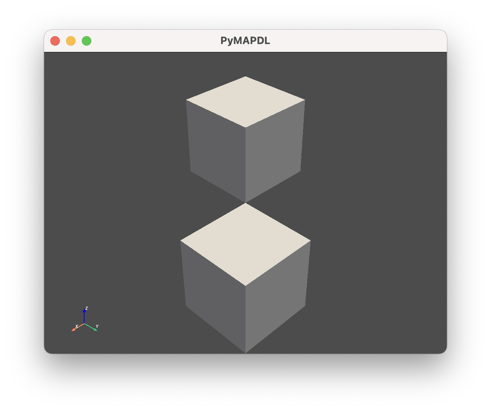
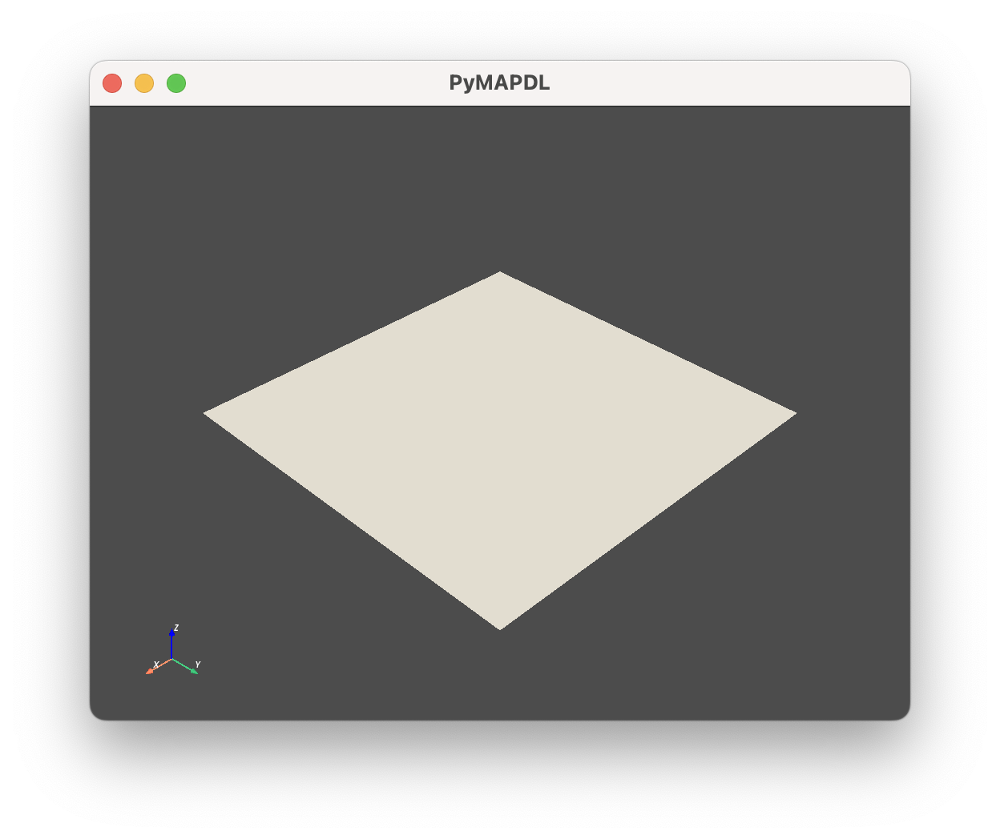
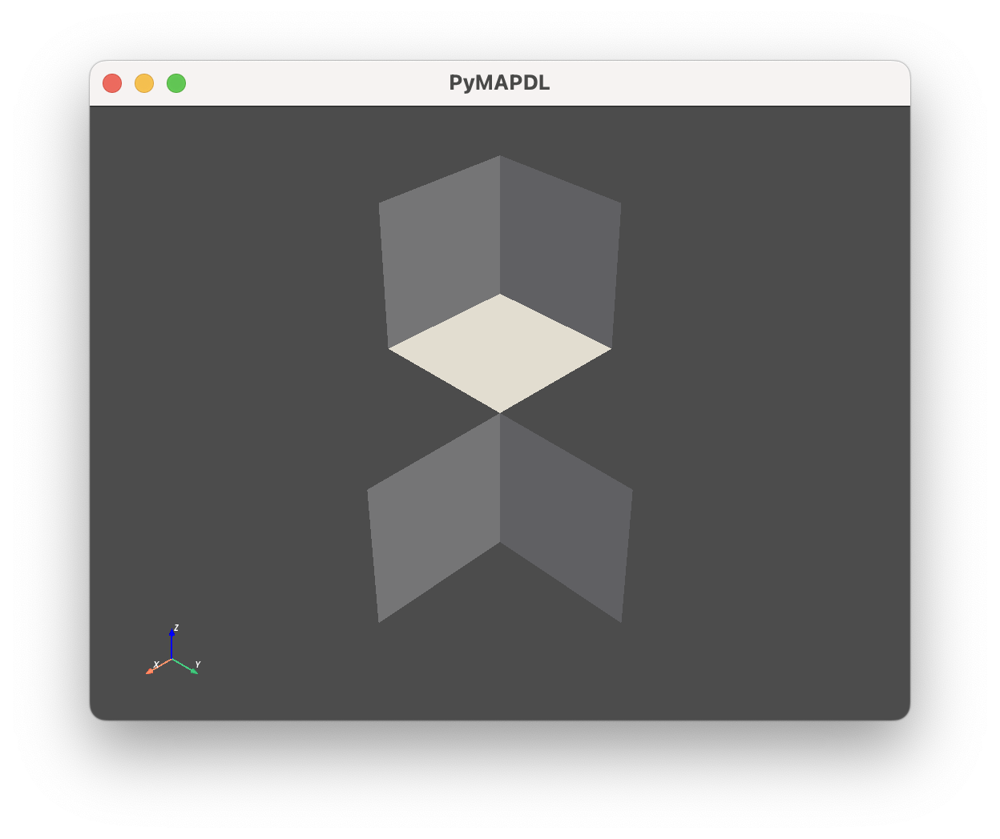

.. role:: py(code)
   :language: python

.. |np-array| replace:: :class:`Numpy.array <numpy.array>`

.. |pv-polydata| replace:: :class:`pyvista.PolyData <pyvista.PolyData>`
.. |pv-multiblock| replace:: :class:`pyvista.MultiBlock <pyvista.MultiBlock>`

.. |get_keypoints| replace:: :meth:`Geometry.get_keypoints() <ansys.mapdl.core.mapdl_geometry.Geometry.get_keypoints>`
.. |get_keypoints-return_as_array| replace:: :meth:`Geometry.get_keypoints(return_as_array=True) <ansys.mapdl.core.mapdl_geometry.Geometry.get_keypoints>`
.. |get_lines| replace:: :meth:`Geometry.get_lines() <ansys.mapdl.core.mapdl_geometry.Geometry.get_lines>`
.. |get_areas| replace:: :meth:`Geometry.get_areas() <ansys.mapdl.core.mapdl_geometry.Geometry.get_areas>`
.. |get_volumes| replace:: :meth:`Geometry.get_volumes() <ansys.mapdl.core.mapdl_geometry.Geometry.get_volumes>`

.. |list-pv-polydata| replace:: :class:`List[pyvista.PolyData] <pyvista.PolyData>`
.. |list-pv-unstruc| replace:: :class:`List[pyvista.UnstructuredGrid] <pyvista.UnstructuredGrid>`

.. |geo-key| replace:: :attr:`Geometry.keypoints <ansys.mapdl.core.mapdl_geometry.Geometry.keypoints>`
.. |geo-lines| replace:: :attr:`Geometry.lines <ansys.mapdl.core.mapdl_geometry.Geometry.lines>`
.. |geo-areas| replace:: :attr:`Geometry.areas <ansys.mapdl.core.mapdl_geometry.Geometry.areas>`
.. |geo-volumes| replace:: :attr:`Geometry.volumes <ansys.mapdl.core.mapdl_geometry.Geometry.volumes>`

.. |leggeo-keypoints| replace:: :meth:`LegacyGeometry.keypoints() <ansys.mapdl.core.mapdl_geometry.LegacyGeometry.keypoints>`
.. |leggeo-lines| replace:: :meth:`LegacyGeometry.lines() <ansys.mapdl.core.mapdl_geometry.LegacyGeometry.lines>`
.. |leggeo-areas| replace:: :meth:`LegacyGeometry.areas() <ansys.mapdl.core.mapdl_geometry.LegacyGeometry.areas>`

Mesh and geometry
=================
The :class:`Mapdl <ansys.mapdl.core.mapdl._MapdlCore>` class allows you to access
the mesh and geometry without writing to an intermediate file or
interpreting the text output from various MAPDL commands. For
example, to access the nodes and elements of a model, normally you
would list the nodes within MAPDL using the 
:func:`Mapdl.nlist() <ansys.mapdl.core.Mapdl.nlist>` method. 
However, this generates a string.
Array access requires either cumbersome MAPDL GET commands or that the
nodes be written to an archive file and then read in with other
software:

.. code:: output

    NLIST

    LIST ALL SELECTED NODES.   DSYS=      0

    NODE        X             Y             Z           THXY     THYZ     THZX
        1   0.0000        0.0000        0.0000          0.00     0.00     0.00
        2   1.0000        0.0000        0.0000          0.00     0.00     0.00
        3   0.2500        0.0000        0.0000          0.00     0.00     0.00

However, with the :attr:`Mapdl.mesh <ansys.mapdl.core.mesh_grpc.MeshGrpc>` class,
you can interface with a current instance of the 
:class:`Mapdl <ansys.mapdl.core.mapdl._MapdlCore>` class and access the current nodes coordinates
with this code:

.. code:: pycon

   >>> mapdl.mesh.nodes
   [[0.0, 0.0, 0.0],
     [1.0, 0.0, 0.0],
     [0.25, 0.0, 0.0],
     [0.75, 0.5, 3.5],
     [0.75, 0.5, 4.0],
     [0.75, 0.5, 4.5]]

Both the :attr:`Mapdl.geometry <ansys.mapdl.core.mapdl_geometry.Geometry>` and
:attr:`Mapdl.mesh <ansys.mapdl.core.mesh_grpc.MeshGrpc>` attributes support
additional, lower-level access to MAPDL data. You can use this code
to access them:

.. code:: pycon

    >>> mapdl.mesh
    >>> mapdl.geometry

To view the current mesh status, you can use this code:

.. code:: pycon

   >>> mapdl.mesh
    ANSYS Mesh
      Number of Nodes:              7217
      Number of Elements:           2080
      Number of Element Types:      2
      Number of Node Components:    0
      Number of Element Components: 0

Geometry
--------

In PyMAPDL 0.66.0 and later, by default, all geometry entities are returned
as a |pv-multiblock|  object.

**Example 1**

.. code:: pycon

   >>> mapdl.geometry.areas
   MultiBlock (0x147ca7640)
     N Blocks    28
     X Bounds    -0.016, 0.016
     Y Bounds    -0.008, 0.018
     Z Bounds    -0.003, 0.015

**Example 2**:

.. code:: pycon

   >>> mapdl.geometry.keypoints
   MultiBlock (0x147a78220)
     N Blocks    26
     X Bounds    -0.016, 0.016
     Y Bounds    -0.008, 0.018
     Z Bounds    -0.003, 0.015

As you can see, you do not need to call the entities in the new API.

For more differences between the new Geometry API and the old one, see
:ref:`migration_geometry_api_066`. 

The selection now is easier.

You can use indexing:

.. code:: pycon

   >>> volume0 = mapdl.geometry.volumes[0]
   >>> volume0
   UnstructuredGrid (0x149107340)
     N Cells:    34
     N Points:   36
     X Bounds:   0.000e+00, 1.588e-02
     Y Bounds:   -7.620e-03, 1.778e-02
     Z Bounds:   -3.180e-03, 0.000e+00
     N Arrays:   3

You can use the entity name:

.. code:: pycon

   >>> volume1 = mapdl.geometry.volumes["volume 1"]
   >>> volume1
   UnstructuredGrid (0x149107340)
     N Cells:    34
     N Points:   36
     X Bounds:   0.000e+00, 1.588e-02
     Y Bounds:   -7.620e-03, 1.778e-02
     Z Bounds:   -3.180e-03, 0.000e+00
     N Arrays:   3

You can plot different entities by calling the :meth:`plot() <ansys.mapdl.core.mapdl_geometry.Geometry.keypoints.plot>` method:

.. code:: pycon

   >>> mapdl.geometry.areas.plot()

You can plot a single entity:

.. code:: pycon

   >>> mapdl.geometry.areas["area 1"].plot()

You can plot multiple entities using slices:

.. code:: pycon

   >>> mapdl.geometry.areas[2:12:2].plot()

Furthermore, the following methods are provided to return the geometry entities as other Python objects:

.. _Table-1:

**Table 1. Get_ENTITY methods.**

+------------------------+--------------------------+-------------------------------+---------------------------------+-------------------------------------+
|                        | **Default output**       | :py:`return_as_list=True`     | :py:`return_as_array=True`      | :py:`return_ids_in_array=True`      |
+========================+==========================+===============================+=================================+=====================================+
| |get_keypoints|        | |pv-polydata|            | |list-pv-polydata|            | |np-array|                      | |np-array|                          |
+------------------------+--------------------------+-------------------------------+---------------------------------+-------------------------------------+
| |get_lines|            | |pv-polydata|            | |list-pv-polydata|            | **Not Applicable**              | **Not Applicable**                  |
+------------------------+--------------------------+-------------------------------+---------------------------------+-------------------------------------+
| |get_areas|            | |pv-polydata|            | |list-pv-unstruc|             | **Not Applicable**              | **Not Applicable**                  |
+------------------------+--------------------------+-------------------------------+---------------------------------+-------------------------------------+
| |get_volumes|          | |pv-polydata|            | |list-pv-unstruc|             | **Not Applicable**              | **Not Applicable**                  |
+------------------------+--------------------------+-------------------------------+---------------------------------+-------------------------------------+

.. _migration_geometry_api_066:

Migration to the new Geometry API
---------------------------------

Several changes must be addressed in older scripts to update them
from the old API to the new API.

One of the most important is that you no longer need to call the entities like you did in the old API.

**Old API**

.. code:: pycon

   # Old API
   >>> mapdl.geometry.areas()
   [UnstructuredGrid (0x7f14add95040)
     N Cells:	12
     N Points:	20
     X Bounds:	-2.000e+00, 2.000e+00
     Y Bounds:	0.000e+00, 1.974e+00
     Z Bounds:	0.000e+00, 0.000e+00
     N Arrays:	4,
   UnstructuredGrid (0x7f14add95ca0)
     N Cells:	12
     N Points:	20
     X Bounds:	-2.000e+00, 2.000e+00
     Y Bounds:	0.000e+00, 1.974e+00
     Z Bounds:	5.500e-01, 5.500e-01
     N Arrays:	4,
   ...

**New API**

.. code:: pycon

   >>> mapdl.geometry.areas
   MultiBlock (0x147ca7640)
     N Blocks    28
     X Bounds    -0.016, 0.016
     Y Bounds    -0.008, 0.018
     Z Bounds    -0.003, 0.015

In addition, the type of entities returned by those methods are different.
This table compares the objects returned by the old and new APIs:

.. _Table-2:

**Table 2. Comparison between objects returned by both APIs.**

+--------------------+------------------------------------------+--------------------------------------------------+
| **Function**       | **Old API**                              | **New API**                                      |
|                    | (Function based - Must be called)        | (Property based - Doesn't need to be called)     |
+====================+==========================================+==================================================+
|  |geo-key|         | |np-array|                               | |pv-multiblock|                                  |
+--------------------+------------------------------------------+--------------------------------------------------+
| |geo-lines|        | |pv-polydata|                            | |pv-multiblock|                                  |
+--------------------+------------------------------------------+--------------------------------------------------+
| |geo-areas|        | |pv-polydata|                            | |pv-multiblock|                                  |
+--------------------+------------------------------------------+--------------------------------------------------+
| |geo-volumes|      | **Not existent**                         | |pv-multiblock|                                  |
+--------------------+------------------------------------------+--------------------------------------------------+

This table shows the equivalence between the old and new APIs:

.. _Table-3:

**Table 3. Equivalence between both API methods.**

+-------------------------------+--------------------------------------+
| **Old API**                   | **New API** equivalent               |
+===============================+======================================+
| |leggeo-keypoints|            | |get_keypoints-return_as_array|      |
+-------------------------------+--------------------------------------+
| |leggeo-lines|                | |get_lines|                          |
+-------------------------------+--------------------------------------+
| |leggeo-areas|                | |get_areas|                          |
+-------------------------------+--------------------------------------+
| **Not existent**              | |geo-volumes|                        |
+-------------------------------+--------------------------------------+

MAPDL geometry commands
~~~~~~~~~~~~~~~~~~~~~~~
For additional MAPDL commands for creating geometries, see the
:ref:`ref_prep_commands` commands.

API reference
~~~~~~~~~~~~~
For a full description of the ``Mesh`` and ``Geometry`` classes,
see :ref:`ref_mesh_api` and :ref:`ref_geometry_api`.
