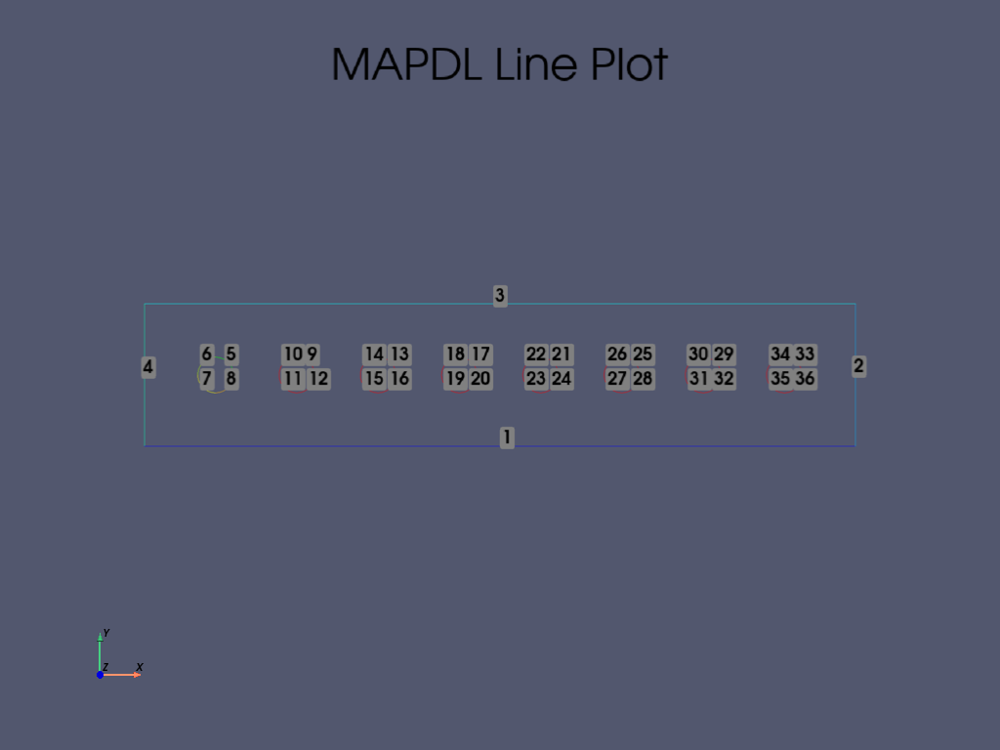

********************
Interactive Plotting
********************
When generating geometry from scratch within MAPDL, it is often
necessary to plot the geometry (e.g. keypoints, lines, areas,
volumes), and ``PyMAPDL`` supports plotting basic CAD using VTK.  The
``mapdl`` class leverages the existing MAPDL commands (e.g.
``KPLOT``, ``LPLOT``, ``APLOT``) and transfers the geometry to Python
to visualize it.  Combined with the MAPDL geometry commands, you can
generate and visualize geometry from scratch without opening the GUI
using ``open_gui``.

Line Plotting
~~~~~~~~~~~~~
Plot lines within Python using ``lplot``.

.. code:: python

    from ansys.mapdl.core import launch_mapdl
    mapdl = launch_mapdl()

    # create a rectangle with a few holes
    mapdl.prep7()
    rect_anum = mapdl.blc4(width=1, height=0.2)

    # create several circles in the middle in the rectangle
    for x in np.linspace(0.1, 0.9, 8):
        mapdl.cyl4(x, 0.1, 0.025)

    # Generate a line plot
    mapdl.lplot(color_lines=True, cpos='xy')

    Line Plot from MAPDL using ``PyMAPDL`` and ``vtk``

Area and Volume Plotting
~~~~~~~~~~~~~~~~~~~~~~~~
More complex geometry can be obtained using boolean operations and can
be visualized using ``mapdl.vplot``.  In this example, we cut the
initial area with the 8 circles and then extrude it.

.. code:: python

    plate_holes = mapdl.asba(rect_anum, 'all')

    # extrude this area
    mapdl.vext(plate_holes, dz=0.1)
    mapdl.vplot()

.. figure:: ../images/vplot_vtk.png
    :width: 400pt

    Volume Plot from MAPDL using ``PyMAPDL`` and ``vtk``

Node and Element Plotting
~~~~~~~~~~~~~~~~~~~~~~~~~
Nodes and elements can also be plotted directly from the ``mapdl``
instance.  We continue the example by defining some element types,
meshing, and displaying the mesh.

.. code:: python

    >>> mapdl.et(1, 'SOLID186')
    >>> mapdl.vsweep('ALL')
    >>> mapdl.esize(0.1)
    >>> mapdl.eplot()

.. figure:: ../images/eplot_vtk.png
    :width: 400pt

    Volume Plot from MAPDL using ``PyMAPDL`` and ``vtk``

Plotting Non-Interactively using MAPDL
--------------------------------------
You can also plot using MAPDL's native plotting tools.  To use the
native tools, set ``vtk=False`` when running plotting commands such as
``aplot``, ``eplot``, etc..  Plots will be generated within MAPDL and
then shown using ``matploblib``.

.. code:: python

    from ansys.mapdl.core import launch_mapdl

    # run ansys with interactive plotting enabled
    mapdl = launch_mapdl()

    # create a square area using keypoints
    mapdl.prep7()
    mapdl.k(1, 0, 0, 0)
    mapdl.k(2, 1, 0, 0)
    mapdl.k(3, 1, 1, 0)
    mapdl.k(4, 0, 1, 0)    
    mapdl.l(1, 2)
    mapdl.l(2, 3)
    mapdl.l(3, 4)
    mapdl.l(4, 1)
    mapdl.al(1, 2, 3, 4)

    # sets the view to "isometric"
    mapdl.view(1, 1, 1, 1)
    mapdl.pnum('kp', 1)  # enable keypoint numbering
    mapdl.pnum('line', 1)  # enable line numbering

    # each of these will create a matplotlib figure and pause execution
    mapdl.aplot(vtk=False)
    mapdl.lplot(vtk=False)
    mapdl.kplot(vtk=False)

.. figure:: ../images/aplot.png
    :width: 400pt

    Area Plot from MAPDL displayed using ``matplotlib``

For more details on the plotting functions, see :ref:`ref_plotting_api`.

Plotting Keyword Options
~~~~~~~~~~~~~~~~~~~~~~~~
When using ``vtk=True`` (default True), all the MAPDL plotting methods
allow you to enter in additional keyword arguments to better control
the plot.  For example, you can automatically generate a screenshot of
an area plot or element plot with:

.. code:: python

    >>> mapdl.aplot(screenshot('aplot.png'))
    >>> mapdl.eplot(screenshot('eplot.png'))

You can also control the camera position with the ``cpos`` when you
want to view from a standard viewing direction (for example view the
XY plane with ``cpos='xy'``.

.. code:: python

    >>> mapdl.eplot(cpos='xy')

For all general plotting options, see :ref:`ref_general_plotter`.

