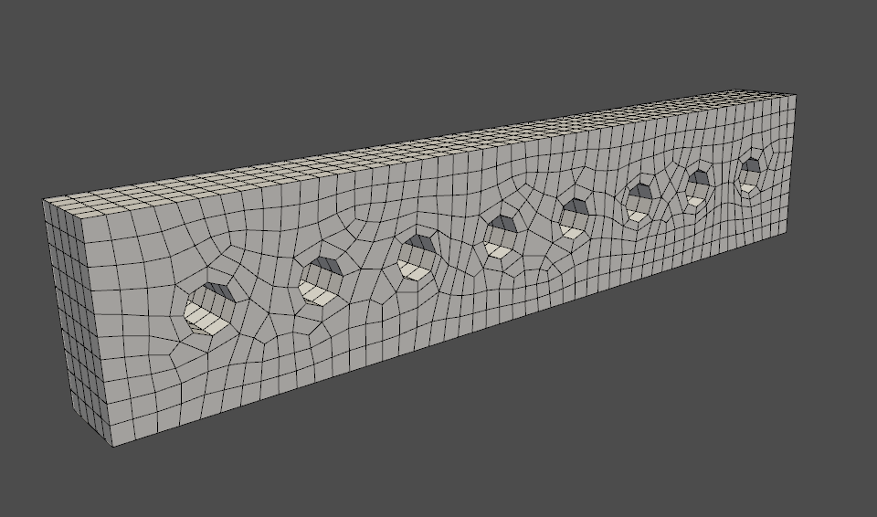

********************
Interactive Plotting
********************
When generating geometry from scratch within MAPDL, it is often
necessary to plot the geometry (e.g. keypoints, lines, areas,
volumes), and PyMAPDL supports plotting basic CAD using VTK.  The
:class:`Mapdl <ansys.mapdl.core.mapdl._MapdlCore>` class leverages the
existing MAPDL commands (e.g. :func:`Mapdl.kplot()
<ansys.mapdl.core.Mapdl.kplot>`, :func:`Mapdl.vplot()
<ansys.mapdl.core.Mapdl.vplot>`, :func:`Mapdl.eplot()
<ansys.mapdl.core.Mapdl.eplot>`) and transfers the geometry to Python
to visualize it. 
These commands rely on the function 
:func:`ansys.mapdl.core.plotting.general_plotter`.
Combined with the MAPDL geometry commands, you can
generate and visualize geometry from scratch without opening the GUI
using :func:`open_gui() <ansys.mapdl.core.Mapdl.open_gui>`.

Line Plotting
~~~~~~~~~~~~~
Plot lines within Python using :func:`Mapdl.lplot() <ansys.mapdl.core.Mapdl.lplot>`.

.. code:: python

    >>> from ansys.mapdl.core import launch_mapdl
    >>> mapdl = launch_mapdl()

    Create a rectangle with a few holes

    >>> mapdl.prep7()
    >>> rect_anum = mapdl.blc4(width=1, height=0.2)

    Create several circles in the middle in the rectangle

    >>> for x in np.linspace(0.1, 0.9, 8):
    ...    mapdl.cyl4(x, 0.1, 0.025)

    Generate a line plot

    >>> mapdl.lplot(color_lines=True, cpos='xy')

.. figure:: ../images/lplot_vtk.png
    :width: 400pt

    Line Plot from MAPDL using PyMAPDL and `Pyvista <https://docs.pyvista.org/>`__

Area and Volume Plotting
~~~~~~~~~~~~~~~~~~~~~~~~
More complex geometry can be obtained using boolean operations and can
be visualized using :func:`Mapdl.vplot()
<ansys.mapdl.core.Mapdl.vplot>`.  In this example, we cut the initial
area with the 8 circles and then extrude it.

.. code:: python

    >>> plate_holes = mapdl.asba(rect_anum, 'all')

    Extrude this area

    >>> mapdl.vext(plate_holes, dz=0.1)
    >>> mapdl.vplot()

.. figure:: ../images/vplot_vtk.png
    :width: 400pt

    Volume Plot from MAPDL using PyMAPDL and `Pyvista <https://docs.pyvista.org/>`__

Node and Element Plotting
~~~~~~~~~~~~~~~~~~~~~~~~~
Nodes and elements can also be plotted directly from the instance of
:class:`Mapdl <ansys.mapdl.core.mapdl._MapdlCore>`.  We continue the
example by defining some element types, meshing, and displaying the
mesh.

.. code:: python

    >>> mapdl.et(1, 'SOLID186')
    >>> mapdl.vsweep('ALL')
    >>> mapdl.esize(0.1)
    >>> mapdl.eplot()

    Element Plot from MAPDL using PyMAPDL and `Pyvista <https://docs.pyvista.org/>`__

Plotting Non-Interactively using MAPDL
--------------------------------------
You can also plot using MAPDL's native plotting tools.  To use the
native tools, pass ``vtk=False`` when running plotting commands such
as :func:`Mapdl.aplot <ansys.mapdl.core.Mapdl.aplot>`,
:func:`Mapdl.eplot <ansys.mapdl.core.Mapdl.eplot>`, etc..  Plots will
be generated within MAPDL and then shown using `matploblib
<https://matplotlib.org/stable/contents.html>`__.

Start PyMAPDL

.. code:: python

    >>> from ansys.mapdl.core import launch_mapdl
    >>> mapdl = launch_mapdl()

Create a square area using keypoints

.. code:: python

    >>> mapdl.prep7()
    >>> mapdl.k(1, 0, 0, 0)
    >>> mapdl.k(2, 1, 0, 0)
    >>> mapdl.k(3, 1, 1, 0)
    >>> mapdl.k(4, 0, 1, 0)    
    >>> mapdl.l(1, 2)
    >>> mapdl.l(2, 3)
    >>> mapdl.l(3, 4)
    >>> mapdl.l(4, 1)
    >>> mapdl.al(1, 2, 3, 4)

Set the view to "isometric"

.. code:: python

    >>> mapdl.view(1, 1, 1, 1)
    >>> mapdl.pnum('kp', 1)  # enable keypoint numbering
    >>> mapdl.pnum('line', 1)  # enable line numbering

Each of these will create a matplotlib figure and pause execution

.. code:: python

    >>> mapdl.aplot(vtk=False)
    >>> mapdl.lplot(vtk=False)
    >>> mapdl.kplot(vtk=False)

.. figure:: ../images/aplot.png
    :width: 400pt

    Area Plot from MAPDL displayed using `matploblib <https://matplotlib.org/stable/contents.html>`__

For more details on the plotting functions, see :ref:`ref_plotting_api`.

Plotting Keyword Options
~~~~~~~~~~~~~~~~~~~~~~~~
When using ``vtk=True`` (default ``True``), all the MAPDL plotting
methods allow you to enter in additional keyword arguments to better
control the plot.  For example, you can automatically generate a
screenshot of an area plot or element plot with:

.. code:: python

    >>> mapdl.aplot(savefig='aplot.png')
    >>> mapdl.eplot(savefig='eplot.png')

You can also control the camera position with the ``cpos`` when you
want to view from a standard viewing direction (for example view the
XY plane with ``cpos='xy'``.

.. code:: python

    >>> mapdl.eplot(cpos='xy')

For all general plotting options, see
:func:`ansys.mapdl.core.plotting.general_plotter`.

Plotting Boundary Conditions
~~~~~~~~~~~~~~~~~~~~~~~~~~~~

.. warning::
   This feature is still on beta so its functionalities and stability are
   limited.  Please check the documentation regarding the allowed boundary
   conditions and targets.

It is possible to plot the boundary conditions applied on the model by
specifying ``plot_bc=True`` in the plotting functions such as
:func:`Mapdl.nplot() <ansys.mapdl.core.Mapdl.nplot>`.

.. code:: python

    >>> mapdl.nplot(
    ...     plot_bc=True,
    ...     plot_labels=True,
    ...     savefig=f'bc_plot.png',
    ...     bc_labels="mechanical"
    ... )

.. figure:: ../images/bc_plot.png
    :width: 500pt

    **Mechanical boundary conditions**
    Forces (arrows) and displacements (cones)

.. note::
    Since the boundary conditions can only target nodes at the moment, you can
    only use ``plot_bc`` as an argument in the function :func:`Mapdl.nplot()
    <ansys.mapdl.core.Mapdl.nplot>`.

.. figure:: ../images/bc_plot_2.png
    :width: 500pt

    **Boundary conditions demonstration**
