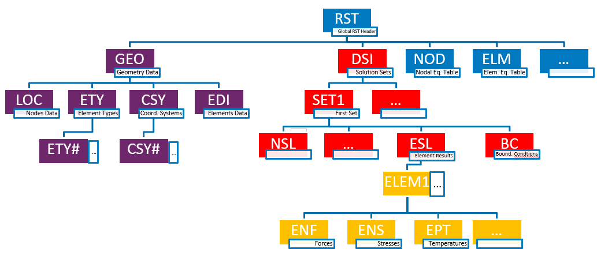

.. _mapdl_xpl_class_ref:

File Explorer Overview
======================
A specific property under the mapdl class is dedicated for XPL. It's
based on the APDLMath ``*XPL`` command and can be used to explore binary
files generated from APDL.

All APDL Files are organized the same way, as a tree or records.  For
example, a binary result file has the structure outlined in the
:ref:`ref_rst_structure` Figure.

.. _ref_rst_structure:

    Structure of an APDL Result

You can find a detailed example of the APDL file explorer at the
:ref:`ref_xpl_example` example.

For a a full API description please see :ref:`ref_xpl_api`.
