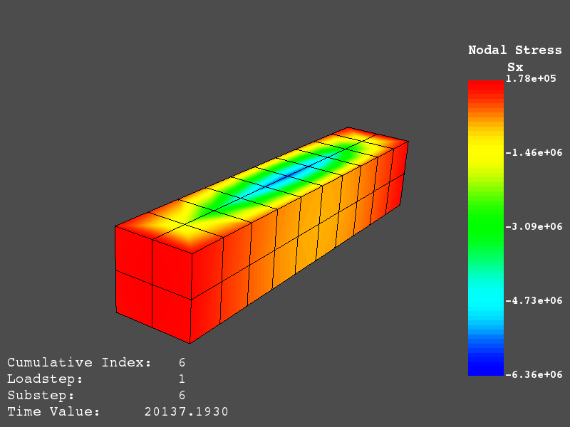

Archive and Result File Examples
================================
These examples show how ANSYS binary and ASCII files can be read and displayed using pyansys.  These examples are meant to demonstrate the capabilities of pyansys.  For more details see the other reference pages.

Loading and Plotting an ANSYS Archive File
------------------------------------------

.. _examples_ref:

ANSYS archive files containing solid elements (both legacy and modern) can be loaded using Archive and then converted to a vtk object.

.. code:: python

    import pyansys
    from pyansys import examples
    
    # Sample *.cdb
    filename = examples.hexarchivefile
    
    # Read ansys archive file
    archive = pyansys.Archive(filename)
    
    # Print raw data from cdb
    for key in archive.raw:
       print("%s : %s" % (key, archive.raw[key]))
    
    # Create a vtk unstructured grid from the raw data and plot it
    grid = archive.parse_vtk(force_linear=True)
    grid.Plot()
    
    # write this as a vtk xml file 
    grid.Write('hex.vtu')

.. image:: ./images/hexbeam.png

You can then load this vtk file using vtki or another program that uses VTK.
    
.. code:: python

    # Load this from vtk
    import vtki
    grid = vtki.UnstructuredGrid('hex.vtk')
    grid.Plot()

Loading and Plotting Results from an ANSYS Result File
------------------------------------------------------

Loading the Result File
~~~~~~~~~~~~~~~~~~~~~~~

This example reads in binary results from a modal analysis of a beam from ANSYS.  This section of code does not rely on ``VTK`` and can be used with only numpy installed.

.. code:: python

    # Load the reader from pyansys
    import pyansys
    from pyansys import examples
    
    # Sample result file
    rstfile = examples.rstfile
    
    # Create result object by loading the result file
    result = pyansys.ResultReader(rstfile)
    
    # Beam natural frequencies
    freqs = result.GetTimeValues()

.. code:: python

    >>> print(freq)
    [ 7366.49503969  7366.49503969 11504.89523664 17285.70459456
      17285.70459457 20137.19299035]
    
    # Get the 1st bending mode shape.  Results are ordered based on the sorted 
    # node numbering.  Note that results are zero indexed
    nnum, disp = result.nodal_solution(0)
    
.. code:: python

    >>> print(disp)
    [[ 2.89623914e+01 -2.82480489e+01 -3.09226692e-01]
     [ 2.89489249e+01 -2.82342416e+01  2.47536161e+01]
     [ 2.89177130e+01 -2.82745126e+01  6.05151053e+00]
     [ 2.88715048e+01 -2.82764960e+01  1.22913304e+01]
     [ 2.89221536e+01 -2.82479511e+01  1.84965333e+01]
     [ 2.89623914e+01 -2.82480489e+01  3.09226692e-01]
     ...

Plotting Nodal Results
~~~~~~~~~~~~~~~~~~~~~~
As the geometry of the model is contained within the result file, you can plot the result without having to load any additional geometry.  Below, displacement for the first mode of the modal analysis beam is plotted using ``VTK``.

.. code:: python
    
    # Plot the displacement of Mode 0 in the x direction
    result.plot_nodal_solution(0, 'x', label='Displacement')

.. image:: ./images/hexbeam_disp.png

Results can be plotted non-interactively and screenshots saved by setting up the camera and saving the result.  This can help with the visualization and post-processing of a batch result.

First, get the camera position from an interactive plot:

.. code:: python

    >>> cpos = result.plot_nodal_solution(0)
    >>> print(cpos)
    [(5.2722879880979345, 4.308737919176047, 10.467694436036483),
     (0.5, 0.5, 2.5),
     (-0.2565529433509593, 0.9227952809887077, -0.28745339908049733)]

Then generate the plot:

.. code:: python

    result.plot_nodal_solution(0, 'x', label='Displacement', cpos=cpos,
                             screenshot='hexbeam_disp.png',
                             window_size=[800, 600], interactive=False)

Stress can be plotted as well using the below code.  The nodal stress is computed in the same manner that ANSYS uses by to determine the stress at each node by averaging the stress evaluated at that node for all attached elements.  For now, only component stresses can be displayed.

.. code:: python
    
    # Display node averaged stress in x direction for result 6
    result.plot_nodal_stress(5, 'Sx')

Nodal stress can also be generated non-interactively with:

.. code:: python

    result.plot_nodal_stress(5, 'Sx', cpos=cpos, screenshot=beam_stress.png,
                           window_size=[800, 600], interactive=False)

Animating a Modal Solution
~~~~~~~~~~~~~~~~~~~~~~~~~~
Mode shapes from a modal analsyis can be animated using ``animate_nodal_solution``:

.. code:: python

    result.animate_nodal_solution(0)

If you wish to save the animation to a file, specify the movie_filename and animate it with:

.. code:: python

    result.animate_nodal_solution(0, movie_filename='/tmp/movie.mp4', cpos=cpos)

.. image:: ./images/beam_mode_shape.gif

Built-In Examples
-----------------
The following examples can be run naively from pyansys by importing the examples sub-package.

Plot Cell Quality
~~~~~~~~~~~~~~~~~
This built-in example displays the minimum scaled jacobian of each element of a tetrahedral beam:

.. code:: python

    from pyansys import examples
    examples.DisplayCellQual()

.. image:: ./images/cellqual.png

This is the source code for the example:

.. code:: python

    import pyansys

    # load archive file and parse for subsequent FEM queries
    from pyansys import examples
    # archive = pyansys.Archive(examples.hexarchivefile)
    archive = pyansys.Archive(examples.tetarchivefile)
            
    # create vtk object
    grid = archive.parse_vtk(force_linear=True)

    # get cell quality
    qual = grid.CellQuality()
    
    # plot cell quality
    grid.Plot(scalars=qual, stitle='Cell Minimum Scaled\nJacobian', rng=[0, 1])

Plot Nodal Stress
~~~~~~~~~~~~~~~~~
This built in example plots the x component stress from a hexahedral beam.
    
.. code:: python

    from pyansys import examples
    examples.DisplayStress()

This is the source code for the example:

.. code:: python

    import pyansys
    from pyansys import examples
    filename = examples.rstfile
    
    # Create rsult object
    result = pyansys.ResultReader(filename)
    
    # Plot node averaged stress in x direction for result 6
    result.plot_nodal_stress(5, 'Sx')
